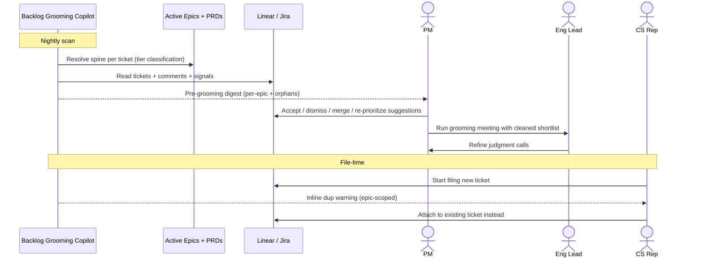

# Backlog grooming copilot — Spec

- **Horizon:** Next
- **Stage:** 3 — Execution
- **Theme:** backlog-delivery
- **Owner:** TBD
- **Status:** Draft

## Why this tool, why now

Unlike PRD drafting (kickoff-bound), story writing (refinement-bound), or release notes (ship-bound), backlog grooming is a continuous tax the backlog levies every week, on every active project, regardless of where individual features sit in their lifecycle. The cost compounds linearly with backlog size — and backlogs only grow. A copilot here has phase-independent ROI and produces the cleanest weekly signal on whether PMs will trust AI-generated judgment calls, which de-risks every later tool on the roadmap.

## What we mean by "grooming"

"Grooming" means different things in different PM shops, so the scope here is explicit. This tool covers **maintenance hygiene on the existing backlog** — keeping the database tidy, accurate, and ranked so that human prioritization happens on a clean foundation.

**In our definition:**
- De-duplication (detect, suggest merges, prevent new dups at file time)
- Stale-item pruning (surface what's gone cold and likely dead)
- Priority drift detection (flag rank that no longer matches the parent epic's PRD weight or customer signal)
- Pre-meeting synthesis (turn the raw backlog into a focused shortlist for the actual grooming session)
- Spine-compliance surfacing (flag orphan tickets that should be linked to an active epic + PRD)

**The tool is spine-first.** Per the roadmap's lifecycle principle, the unit of work is the **active Jira epic + linked Confluence PRD** wherever one exists. Project-level scanning is the *fallback* for orphan tickets, not the default. See [Spine scoping policy](#spine-scoping-policy) below for the tiered behavior.

**Adjacent activities others sometimes call grooming, handled by other roadmap tools:**
- Refinement to "Ready" — acceptance criteria, story format, sizing → *Story & ticket writer* (Now)
- Breaking epics into sprint-shaped tickets → *Spec → sprint decomposer* (Next)
- Running the grooming meeting itself — facilitation, notes, action items → *Meeting → artifact pipeline* (Next)
- Generating new tickets / discovery — out of scope across the roadmap horizon
- Making the actual priority call — the copilot proposes drift, the PM decides; the tool never re-prioritizes autonomously

The framing principle: this tool treats the backlog as a **database** (records, relationships, freshness), not as a **plan** (sequencing, scope, sizing). Cleaning the data is a precondition for the planning work but a distinct job.

## Problem

Backlogs decay. Duplicates accumulate as different stakeholders file the same complaint in different words. Tickets go stale when the reporter loses interest or the world moves on. Priority drifts from stated goals because no one re-reads the backlog top-to-bottom. PMs spend 2–4 hours a week on grooming that is mostly pattern matching, not judgment — and they do it badly because the cognitive load of reading hundreds of tickets is real.

## Users & jobs-to-be-done

**Primary:** PMs/POs owning a Linear or Jira project with >100 active tickets, typically across 2–8 active epics.
**Secondary:** Eng leads who want to walk into grooming with a pre-cleaned list.

1. *Before grooming*, tell me what's redundant, stale, or mis-prioritized **within each active epic**, so I review judgments, not raw lists.
2. *When I file a new ticket*, warn me if it's a likely duplicate before it hits the backlog — prefer matches within the same epic.
3. *Show me* which open items no longer link to any active epic or customer signal, and propose where they should attach.

## Spine scoping policy

Tickets fall into one of three tiers; the tool's behavior degrades gracefully across them.

| Tier | Spine state | Tool behavior |
|---|---|---|
| **Full spine** | Linked parent epic + linked Confluence PRD, PRD active | Full grooming, epic-scoped. Priority drift uses PRD-derived weight. Dup detection scoped to the epic's open tickets. |
| **Partial spine** | Parent epic present, no linked PRD (or PRD archived) | Dup detection epic-scoped. Drift falls back to goal/OKR links. Surfaces a "PRD missing — should this epic be retired?" prompt to the PM. |
| **Orphan** | No parent epic | Project-level fallback (the original scan). Surfaced in the digest's *orphans* section with a "should this attach to epic X?" suggestion. |

Grooming legacy backlogs is itself a grooming activity. Bringing orphans into spine compliance is a first-class output of the tool — not a precondition for using it.

## In scope (v1)

- **Spine resolution** — for every ticket, identify the parent epic and linked PRD (if any) and classify into the tier table above. This is the first operation; all others are scoped by it.
- Duplicate detection — semantic match scoped to the parent epic's open tickets for full/partial-spine tickets; falls back to project-scope for orphans. Cross-epic matches surfaced separately with lower confidence.
- Stale detection — open items with no comment/update in N days **and** whose parent epic is archived or absent. Hard floor: never flag <30d old or in-progress.
- Priority drift — items whose stated priority disagrees with the parent epic's PRD-derived weight × customer-signal volume. Goal/OKR weight is the fallback for partial-spine and orphans.
- Orphan surfacing — open tickets without a parent epic, with a proposed epic attachment (highest-similarity active epic) for the PM to confirm.
- Re-rank suggestions — ranked list of "items to look at" before each grooming session, ordered by confidence × impact, **grouped by epic**.
- Pre-grooming digest — markdown report **scoped per active epic**, with an *orphans* section as the project-level remainder.
- File-time duplicate warning at ticket creation — prefers same-epic matches when the new ticket is being filed under an epic.

## Out of scope (v1)

- Auto-closing, auto-merging, or auto-re-prioritizing without human approval.
- Cross-project deduplication — one project at a time keeps the trust bar tractable.
- Discovery / new-idea generation — this tool only operates on tickets already filed.
- Direct Slack or Zoom ingestion — use already-linked customer-signal sources only.

## Capabilities

| Capability | Scope | Output | Trust gate |
|---|---|---|---|
| Spine resolution | All tickets | Tier classification (full / partial / orphan) + resolved epic + PRD references | None — internal to other operations |
| Duplicate suggestion | Epic-scoped (orphans: project) | Ticket pairs with similarity score + rationale + cited lines + scope label | PM clicks merge / dismiss |
| Stale flag | Epic-scoped (status drives signal) | Items with last-activity date + reason (incl. "parent epic archived") | PM clicks keep / close / snooze |
| Priority drift | Epic-scoped (PRD weight) → goal-scoped fallback | Item + current priority + suggested priority + driving signal | PM accepts / edits / rejects |
| Orphan surfacing | Project-wide | Orphan ticket + proposed parent epic + similarity rationale | PM accepts attachment / dismisses |
| Pre-grooming digest | Per-epic + orphans remainder | Markdown summary grouped by epic, delivered day-before grooming | PM edits before sharing |
| File-time dup warning | Epic-scoped (if creating under an epic) | Inline panel in ticket create flow | PM proceeds / merges into existing |

## Integrations

- **The spine** (primary navigation): Confluence PRD + Jira epic. The tool resolves spine for every ticket via:
  1. The ticket's parent epic field (Linear parent / Jira epic-link).
  2. The epic's linked Confluence page — the PRD.
  3. The PRD's active/archived state and its priority/weight signal.
- **Linear** (primary store) and **Jira** (parity by v1.1) — read tickets, comments, links, labels, priority, hierarchy.
- **Confluence** — read-only on linked PRD pages: status, priority signal, in-scope list. Used to compute expected-priority for drift detection.
- **Linked goals / OKRs** — read-only fallback for partial-spine and orphan tickets only. When the epic-level PRD signal is available, that takes precedence.
- **Customer signal** — Zendesk / Intercom / Productboard *linkages already present on tickets*. Do not crawl raw conversations.
- **Slack** — output only (digest delivery). No Slack ingest in v1.

## UX surfaces

1. **Plugin panel** in the Linear/Jira ticket sidebar — duplicate + drift suggestions on the open ticket.
2. **Pre-grooming digest** posted to a configurable Slack channel or DM the day before grooming.
3. **Bulk review view** — web view (auth via Linear/Jira) listing all open suggestions, batch-actionable.

No standalone app surface (per operating principle 5).

## Trust & safety

- Every suggestion ships with at least one cited source (linked ticket IDs, epic ID, PRD section, goal IDs, signal source). Spine references are surfaced explicitly so the PM can see *why* the tool grouped tickets the way it did.
- Confidence score visible on every suggestion; PM can set per-epic and per-project thresholds. Cross-epic dup matches require a higher confidence bar than within-epic.
- Dismissals are sticky and feed back into per-epic tuning (with per-project fallback for orphans).
- Audit log of every accepted action, queryable by PM.
- PII scrubbing on ticket bodies before any model call (operating principle 4).
- No writes without PM confirmation in v1. v2 may consider "auto-merge on >0.95 confidence" gated by per-epic opt-in.
- Spine resolution is non-blocking. If the parent epic or PRD can't be resolved, the ticket degrades to the appropriate tier (partial / orphan) and is still groomed — never silently dropped.

## Success metrics

| Metric | Target |
|---|---|
| Stale/duplicate tickets in backlog (rolling 30-day) | -40% (matches roadmap goal) |
| PM hours/week spent on grooming | -50% |
| Suggestion acceptance rate | >40% (lower = too noisy) |
| Dismiss-without-review rate | <15% (higher = low trust) |
| Active projects with the tool enabled | >70% within a quarter of GA |

## Rollout phasing

1. **Alpha (internal):** Read-only digest emailed to 3 friendly PMs. No plugin yet. Validates signal quality before we ship surface area.
2. **Beta:** Linear plugin with duplicate + stale flags. Jira parity not required. 10 PMs.
3. **GA:** Full capability set, Jira parity, bulk review view, configurable thresholds.

## Dependencies & open questions

- **Depends on** the *PRD drafting assistant* (Now). Spine-aware grooming is only as good as the spine itself — if PRDs don't exist or aren't structured with the in-scope list / priority signal, the tool degrades to the partial-spine tier for everything and we lose most of the lift over the original project-scan design.
- **Depends on** the *Story & ticket writer* (Now). Grooming signal is only as good as the structure of the tickets it reads, and the story writer is what makes tickets spine-linked on creation.
- **Open:** Does customer-signal weighting need per-team config, or can we infer it from existing linkage patterns?
- **Open:** Cold start on legacy backlogs — what fraction of tickets do we expect to land in the orphan tier? If >50%, the project-scan fallback gets exercised more than the epic-scoped path and we should invest there equally.
- **Open:** Orphan-attachment confidence threshold — we don't want to suggest attaching every old ticket to an epic it only weakly relates to. Where's the bar?
- **Open:** Data residency on customer-signal text — re-confirm with privacy review before reading Zendesk fields.
- **Risk:** Eng leads may read this as "PM offloading their job onto eng review." Frame the digest as PM-owned output, not eng-facing.
- **Risk:** Spine assumption may not hold for teams that don't use Confluence + Jira epics (e.g., Linear-only shops with project-as-PRD). v1 ships Confluence-first; we'll need a Linear-native spine adapter for full coverage.

## Detection mechanics

### Spine resolution (runs first)
For each open ticket:
1. Look up the parent epic field. If missing → orphan tier.
2. If epic present, look up its Confluence-linked PRD. If missing or archived → partial-spine tier.
3. If PRD present and active → full-spine tier. Cache the PRD's priority signal and in-scope list.

Spine resolution runs at the start of every scan and is the lookup other operations rely on. It's intentionally cheap — no LLM calls — and is the single failure point where the policy in [Spine scoping policy](#spine-scoping-policy) takes effect.

### Duplicate detection
- Embed title + body + label set with a sentence-embedding model.
- **Scope:** cosine similarity over the *parent epic's* open ticket set for full/partial-spine tickets; project-wide set for orphans.
- **Cross-epic candidates** (high similarity, different parent epics) are surfaced separately at a higher confidence bar (≥0.85) — these usually indicate a missed epic split or a misfiled ticket.
- Top-K candidates pass a re-rank step comparing requester overlap, label overlap, linked-customer overlap, and a short LLM rationale ("is B a duplicate of A?") returning a confidence scalar.
- Final score = 0.6 × embedding similarity + 0.25 × overlap features + 0.15 × LLM confidence.
- Surface within-epic suggestions ≥0.7; cross-epic ≥0.85; auto-hide <0.5 (configurable per epic).

### Staleness scoring
`score = w1·days_since_last_comment + w2·parent_epic_archived_or_absent + w3·no_recent_customer_signal + w4·priority_decay`

- The `parent_epic_archived_or_absent` term replaces the prior `no_active_goal` — epic state is the primary freshness signal under the spine model. Goal links remain a tertiary input for orphans.
- Weights tuned per-epic from accept/dismiss feedback (per-project fallback for orphans).
- Hard floors: never flag items <30 days old or with an in-progress assignee.

### Priority drift
For each open ticket with priority P:
1. Determine the priority anchor by tier:
   - **Full spine:** anchor = parent epic's PRD-derived weight.
   - **Partial spine:** anchor = parent epic's labels/priority (no PRD signal available).
   - **Orphan:** anchor = `linked_goal_weight` (legacy behavior).
2. Compute *expected* priority from `anchor × customer_signal_volume × age_decay`.
3. If `|P − expected| ≥ 1` priority band, emit a drift suggestion with the gap, the anchor source, and contributing reasons.
4. Ignore items the PM has manually re-prioritized in the last 14 days — respect the human override.

### Orphan attachment
For each orphan ticket:
1. Embed title + body + labels.
2. Compute cosine similarity against the embedding of each active epic's PRD + epic description.
3. If top match ≥0.65 (TBD — see open question), surface as an attachment suggestion with the candidate epic + rationale.
4. If no match ≥0.65, the orphan stays orphaned but is still surfaced in the digest's orphans section.

## Evaluation criteria & metrics

We measure on three independent layers. Hitting one without the others is a known failure mode — a 95%-precision model that PMs never look at, or high acceptance on suggestions that don't actually shrink the backlog. All three must move.

### Layer 1 — Output quality

What the model produces, measured against ground truth, independent of whether a PM acts on it.

#### Duplicate detection

| Metric | Definition | Alpha | Beta | GA |
|---|---|---|---|---|
| Precision @ 0.7 threshold | True dups / suggested dups | >0.80 | >0.85 | >0.90 |
| Recall @ 0.7 threshold | Suggested true dups / all true dups in set | >0.50 | >0.60 | >0.70 |
| Brier score (calibration) | MSE of confidence vs. outcome | <0.15 | <0.12 | <0.10 |
| Adversarial pass rate | Paraphrased dup pairs the model must catch | >0.60 | >0.75 | >0.85 |

**Datasets:**
- **Hand-labeled golden set** — 200 ticket pairs per pilot project labeled by that project's PM. Refreshed quarterly.
- **Historical ground truth** — items the PM merged or closed-as-duplicate in the past 6 months. Free and large, biased toward easy cases.
- **Adversarial set** — ~50 manually constructed near-duplicates (same root cause, different wording, different customer surface) to test ceiling.
- **Synthetic negatives** — pairs from different projects (must never match) injected at 10% rate to catch over-eager matching.

#### Staleness

| Metric | Definition | Pass bar |
|---|---|---|
| False-stale rate | Flagged stale items the PM marks "active off-ticket" | <10% |
| Catch rate | Stale items flagged before PM finds them in grooming | >70% of items PM marks stale |
| Median age at flag | Days from staleness onset to surface | <14 days |

Precision dominates over recall here — flagging an active conversation as stale erodes trust fast; missing one is recoverable next week.

#### Priority drift

| Metric | Definition | Pass bar |
|---|---|---|
| Expert agreement | Drift suggestions a senior PM endorses on a blind 50-item audit | >65% |
| Override-respect rate | Suggestions violating the 14-day human-override cooldown | 0% (hard bar) |
| Reason fidelity | Suggestions whose stated rationale checks out against linked goals/signals | >90% |

### Layer 2 — Product behavior

What PMs actually do with the output. Telemetry, not labels.

| Metric | What it tells us | Pass bar |
|---|---|---|
| Digest open rate | Are PMs even looking? | >80% week 1, >60% week 8 (fatigue check) |
| Suggestion review rate | Of digest items, how many get clicked into | >70% |
| Acceptance rate | Of reviewed suggestions, how many get acted on | >40% |
| Dismiss-no-review rate | Suggestions dismissed without opening detail | <15% |
| Time-to-action | Median seconds from digest open → first action | <45s |
| In-product rating | useful / noisy / wrong, weighted | >60% useful, <10% wrong |

**Suggestion fatigue is the metric I'm most worried about.** Track digest open rate as a rolling 4-week window per PM; two consecutive down-weeks triggers a "tune your thresholds" prompt before that PM churns off the tool entirely.

### Layer 3 — Backlog outcomes

Whether the backlog actually gets healthier. The headline numbers — and the hardest to attribute.

| Metric | Target | Measurement |
|---|---|---|
| Stale/duplicate count (rolling 30d) | -40% vs. pre-tool baseline | Monthly snapshot per project |
| PM hours/week on grooming | -50% | Quarterly time survey + Linear/Jira activity proxy |
| Median backlog age | -25% | Auto-computed from open-ticket timestamps |
| Tickets resolved per active engineer | Flat-to-up (sanity: we're not just deleting work) | Linear/Jira |
| Backlog-health NPS (PM-reported) | +15 points | Quarterly survey |

**Counterfactual.** Shadow-mode beta gives one comparison point. For GA, hold one project per pilot org out of the tool for a quarter as a within-org control. Not a clean RCT, but better than self-reports alone.

### Guardrail metrics

Hard limits. Exceeding any of these blocks the next phase, regardless of how headline metrics look.

| Guardrail | Limit | Why |
|---|---|---|
| Revert rate (merge then unmerge within 7d) | <5% | High revert = false confidence in dup suggestions |
| PII regex matches in model output | 0 | Privacy floor; fail-closed redaction must hold |
| Override-violation incidents | 0 | Tool must respect human overrides absolutely |
| P0: bad write needing manual rollback | 0 | v1 has no autonomous writes — any incident is a bug |
| Cost per PM per month | <$15 (GA) | Margin sanity |

### Anti-metrics

Explicitly *not* optimized for:

- **Total suggestions generated.** Volume isn't value. Fewer better suggestions, not a noisier feed.
- **Acceptance rate alone.** Maximizing acceptance pushes us toward only-confident cases, killing recall on the hard dups PMs actually need help with.
- **Time-on-tool.** PMs want grooming faster, not longer. Lower time-to-action is the goal.
- **Suggestions-per-digest growth.** This number should *decline* over time as the backlog gets healthier.

### Measurement cadence & ownership

| Layer | Cadence | Owner | Source of truth |
|---|---|---|---|
| Output quality | Per-release on eval set | ML / model owner | Labeled datasets + offline harness |
| Product behavior | Real-time dashboard, weekly review | PM on this tool | In-product telemetry |
| Backlog outcomes | Monthly snapshot, quarterly review | PM + pilot project owner | Linear/Jira API + survey |
| Guardrails | Continuous alerting | On-call | Telemetry + log scan |

## Failure modes & mitigations

| Failure | What it looks like | Mitigation |
|---|---|---|
| False-positive duplicate | Two distinct customer requests merged | Per-epic confidence threshold; PM-only merge; "report bad suggestion" feeds eval set |
| Stale flag on active work | Item flagged because conversation lives in Slack, not the ticket | Stale check requires no-comment AND epic-archived/absent; PM can mark "active off-ticket" |
| Drift contradicts PM judgment | Tool keeps re-surfacing a deliberate deprioritization | 14-day human-override cooldown on drift suggestions |
| Cascading bad digest | First digest is noisy, PM disengages | Alpha is read-only with explicit PM rating before plugin ships |
| PII leakage | Customer name/email reaches the model | Pre-call redaction with a tested allowlist; fail closed on regex match in output |
| Eng frustration | Eng reads digest as a complaint list | Frame as PM-to-PM; eng-facing summary deferred to v2 |
| Wrong-spine resolution | Ticket assigned to the wrong parent epic by orphan attachment | Attachment suggestions are *proposals* the PM accepts/dismisses, never auto-applied; confidence ≥0.65 floor; per-ticket dismissal feedback |
| Cross-epic dup miss | Two genuinely duplicate tickets filed under different epics, scoped scan can't see across | Cross-epic candidates run as a separate pass at the higher confidence bar; weekly project-wide audit catches what epic-scoping hides |
| Stale-PRD anchoring | Drift suggestions derived from a PRD that's been quietly archived | Spine resolution refreshes PRD status on every scan; archived PRDs degrade the ticket to partial-spine immediately |

## Cost & latency envelope (rough)

Sizing target: project with ~500 open tickets, weekly full re-scan.

- **Embeddings:** ~500 vectors, incrementally refreshed → negligible after warm.
- **Re-rank LLM calls:** top-30 candidate pairs × 3 dimensions = ~90 short prompts. ~$0.05–$0.15 per scan.
- **Drift scoring:** deterministic, no model calls.
- **File-time dup warning:** 1 embedding + ≤5 re-rank prompts per ticket create. p95 latency target <800ms.
- **Per-PM monthly cost ceiling:** <$5 (alpha), <$15 (GA with file-time warnings live).

## User-flow walkthroughs

### Persona flow

### Flow A — Wednesday pre-grooming digest

Tuesday 5pm UTC the scheduler runs the scan, resolves the spine for every ticket, and groups by active epic. Wednesday 8am local the PM gets a Slack DM:

> *Backlog digest for Mobile-iOS — 3 active epics scanned.*
> • *Login-Refresh* (PRD active): 4 dup candidates, 6 stale, 2 drifts.
> • *Push-Notifications-v2* (PRD active): 1 dup, 3 stale, 1 drift.
> • *Tablet-UX* (PRD archived 11d ago): 1 dup, 3 stale — *consider retiring this epic.*
> • *Orphans:* 7 tickets with no parent epic; 4 have a proposed attachment.
> *[Open review →]*

PM clicks through. The bulk review view is grouped by epic. PM works the Login-Refresh epic first (the active sprint), accepts 1 dup merge and 1 drift, snoozes the rest. Then sweeps orphans: accepts 3 proposed attachments, closes 2 truly dead tickets. Total time: ~9 minutes. Grooming meeting starts with a per-epic shortlist instead of a 312-item project view, and the Tablet-UX epic gets flagged for an explicit "retire this?" conversation.

### Flow B — File-time dup warning

A CS rep files *"Login broken on iPad Pro after 17.4 update"*. As they save, the sidebar shows:

> *Possible duplicate (87%): MOB-2841 "iPad Pro login fails post-iOS-17.4". Filed 3 days ago, 4 customer reports linked.*

CS rep clicks "Add my customer to MOB-2841" instead. The duplicate never enters the backlog.

### Flow C — Drift suggestion the PM rejects

Tool suggests promoting MOB-3120 from P3 → P2 because three new Zendesk tickets link to it. The PM knows the team is mid-sprint on a higher-impact item and dismisses with "tracking, will revisit next planning." The 14-day cooldown engages; MOB-3120 doesn't re-surface until cooldown elapses.

## Anti-goals

Explicit non-features, to prevent scope drift:

- **Won't write tickets for the PM.** That's the Story & ticket writer's job. Grooming reads, judges, proposes — it doesn't author.
- **Won't post to customers.** Nothing this tool produces is customer-facing.
- **Won't make priority calls autonomously.** Drift suggestions are inputs to PM judgment, never replacements.
- **Won't cross project boundaries in v1.** Cross-project dedup is a harder problem with a different trust bar.
- **Won't cross epic boundaries silently.** Cross-epic dup matches surface at a higher confidence bar and are flagged as scope crossings, not blended in with within-epic suggestions.
- **Won't auto-attach orphans to epics.** Attachment is a *proposal* the PM confirms. Mis-attachment is more expensive than a missed attachment.
- **Won't refuse to operate without a spine.** Orphan-tier grooming is still grooming. Refusing legacy backlogs because they predate the spine principle would gut the tool's adoption.
- **Won't surface anything without a citation.** If we can't show the PM why, we don't show the suggestion.
