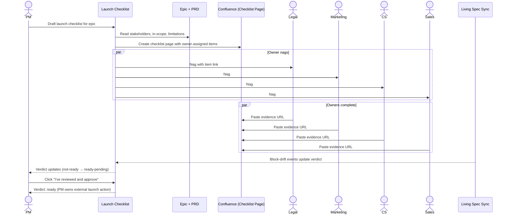

# Cross-functional launch checklist — Spec

- **Horizon:** Later
- **Stage:** 4 — Release
- **Theme:** backlog-delivery
- **Owner:** TBD
- **Status:** Draft

## Why this tool, why now

Launches fail in cross-functional gaps, not in implementation. The feature ships; legal hasn't reviewed the disclosures; marketing hasn't approved the copy; support docs are missing; the customer-comms timing collides with the sales-team training schedule. PMs run checklist exercises in spreadsheets that go stale by the second launch and never propagate the learnings between teams.

This tool exists because launches expose the maturity floor of the rest of the roadmap: the spine has to be resolved (epic + PRD), drift has to be surfaced (Living Spec Sync), release notes have to be drafted (Release Notes Generator), and cross-functional partners have to be in the loop (Stakeholder Comms Tailoring). The launch checklist is the **assembly point** for the rest of the Stage 4 / Stage 5 fleet.

We sequence it Later because:
- It composes Drift Detector + Rubric Scorer + Source Synthesizer + Audience Tailor — every upstream tool needs to be earning trust before this one inherits their outputs.
- Cross-functional partner buy-in is non-trivial. The checklist's nags reach legal, marketing, CS, sales — populations we haven't onboarded on PM-owned tools yet.
- The cost of a false "ready for launch" verdict is the highest in the fleet; trust bar is real.

## What we mean by "cross-functional launch checklist"

This tool **auto-generates a per-feature launch checklist** at the epic level, tracks cross-functional dependencies (legal, marketing, support, sales, engineering, PM), nags owners, and produces a "ready for launch" verdict gated by hard blockers (block-severity drift, missing review, unsigned legal).

**In our definition:**
- Per-epic launch checklist drafted from the team's launch-rubric template
- Cross-functional dependencies populated from PRD stakeholders + custom config
- Owner nagging on overdue items
- Evidence tracking: each checklist item carries a citation to the document/PR/Slack thread that proves completion
- Composite "ready for launch" verdict gated on hard rules

**Not what this tool does:**
- Approving or rejecting the launch itself — surfaces verdict, PM owns the decision.
- Authoring the legal disclosures, marketing copy, or support docs themselves — surfaces gaps, owners fill them.
- Replacing the team's launch-day runbook.
- Cross-launch portfolio management ("here's everything launching this quarter"). Per-launch in v1.

## Problem

Launches go sideways for predictable reasons that nobody catches in time. Three failure modes recur:

1. **The forgotten checklist item.** Marketing copy is approved; nobody noticed that legal hasn't signed off on the customer-data disclosure. Launch ships, customer-data complaint follows, escalation.
2. **Owner ambiguity.** "Sales training" was on the checklist, but the owner field said "TBD." Nobody actually owned it. The first sales-led demo crashes because the rep didn't know about the new flow.
3. **Evidence gaps.** The launch goes; six weeks later a postmortem asks "did legal sign off?" and nobody can find the email. Audit fails; trust frays.

The tool's job is to make a **complete, owned, evidence-backed** launch checklist the easy path, and to refuse "ready for launch" until the hard rules are satisfied.

## Users & jobs-to-be-done

**Primary:** PMs/POs preparing a feature for launch.
**Secondary:** Cross-functional partners (legal, marketing, CS, sales) who own checklist items; eng leads who own block-severity drift resolution.

1. *Draft a launch checklist for this epic* — populate items from the team's rubric and PRD context.
2. *Assign each item to the right owner* — pulled from PRD stakeholders + custom mapping.
3. *Nag overdue owners* — automated reminders before the launch date.
4. *Show me where the evidence is* — every completed item cites a doc/PR/thread.
5. *Tell me when we're ready* — composite verdict gated on hard rules.

## In scope (v1)

- Per-epic launch checklist generated from a team-configurable rubric (legal review, marketing copy, support docs, sales enablement, eng on-call rotation, customer comms, release notes published, etc.).
- Owner assignment per item from PRD stakeholders + custom owner-mapping per item class.
- Evidence tracking: each item accepts a URL (PR, doc, Slack permalink, email-archive link).
- Composite verdict: `not-ready` / `blockers-present` / `ready-pending-PM-sign-off` / `ready`.
- Hard rule: any `block`-severity drift from Living Spec Sync flips verdict to `blockers-present`.
- Hard rule: any item flagged "required for launch" and missing evidence flips verdict.
- Hard rule: for a feature transferring to Run-The-Business, the [handoff runbook](./handoff-runbook-generator.md) is a required item — a `blocked`-tier runbook (a missing REQUIRED section such as rollback or escalation) flips the verdict to `blockers-present`. The runbook generator owns the runbook's completeness; the checklist hosts it as a gate.
- Nagging: configurable per item — Slack DM to owner N days before launch, escalation to PM if unresolved.
- Audit log: full history of who completed what when, with evidence references.

## Out of scope (v1)

- Approving the launch itself. PM owns the call.
- Authoring the items' content (writing legal copy, support docs, etc.).
- Cross-launch portfolio views ("show all launches this quarter").
- Integration with marketing-asset systems (DAM) or sales-enablement platforms (Highspot, etc.) — v1 accepts URL evidence only.
- Real-time owner availability checks ("Bob is on PTO during launch week"). v1 nags; calendar-aware nagging is a v2.
- Multi-stage launches (beta cohort → wider rollout) as a single artifact. v1 ships one checklist per launch.

## Capabilities

| Capability | Output | Trust gate |
|---|---|---|
| Checklist generation | Per-epic checklist from team rubric + PRD context | PM reviews, edits items |
| Owner assignment | Owner per item from stakeholders + mapping | PM confirms each owner |
| Evidence capture | URL per completed item with verification | Citation Verifier ensures URL resolves |
| Composite verdict | Status: `not-ready` → `ready` | Hard rules gate transitions |
| Nagging | Owner reminders + PM escalation | Per-item schedule configurable |
| Audit log | Append-only history of completions | Read-only; PM cannot edit history |
| Block-drift integration | Living Spec Sync `block` drifts flip verdict | Hard rule; PM cannot override without explicit reason |

## Integrations

- **Rubric Scorer** ([agent](../governance/agent-library.md#11-rubric-scorer)) — launch-readiness rubric.
- **Spine Resolver** ([agent](../governance/agent-library.md#1-spine-resolver)).
- **Drift Detector** (via *Living spec sync*) — `block`-severity drifts gate verdict.
- **Source Synthesizer** ([agent](../governance/agent-library.md#5-source-synthesizer)) — populates evidence rows ("legal review found: [link]").
- **Citation Verifier** ([agent](../governance/agent-library.md#10-citation-verifier)) — verifies URL evidence resolves.
- **PII Scrubber** — on ingress.
- **Slack** — owner nags + PM escalation channel.
- **Confluence** — checklist lives as a Confluence page; owners can edit assigned items inline.
- **Jira/Linear** — read epic + PRD; tickets linked from checklist items where appropriate.

## UX surfaces

1. **Confluence "Launch Checklist" page** — generated from the epic; lives as a structured page with each item as a row and a status pill.
2. **Plugin panel on the epic** — at-a-glance verdict + outstanding items.
3. **Slack DM to owners** — N days before launch + on overdue + on escalation.
4. **Slack channel post** — daily checklist digest in `#launch-<epic-key>` channel during the final week.

No standalone app surface (operating principle 5).

## Trust & safety

- **PM owns the call.** Tool produces `ready` verdict; PM still clicks "launch" externally.
- **Hard rules are hard.** A `block` drift cannot be silently bypassed; PM-override requires written reason recorded in audit.
- **Evidence must resolve.** Citation Verifier on every evidence URL; broken URL flips item back to incomplete.
- **No auto-completion.** Items move to complete only when an owner provides evidence.
- **Audit log is immutable** in v1. Read-only history; edits create new entries with rationale.
- **PII Scrubber** on PRD content + checklist-item descriptions before any model call.
- **Owner notifications respect availability windows.** No Slack nags outside business hours per owner's timezone setting.

## Success metrics

| Metric | Target |
|---|---|
| Launches using the tool's checklist | >80% within 1 quarter of GA |
| "Forgotten item" launch incidents | -70% |
| Time-to-checklist-draft per epic | <5 minutes |
| Median time from `not-ready` to `ready` | -40% vs. spreadsheet workflow |
| Audit-trail completeness (sampled) | >0.95 |
| `ready`-but-actually-not incidents | 0 (hard bar) |

## Rollout phasing

1. **Alpha (internal):** Checklist generation + owner assignment + evidence capture. 2 launches. No nagging, no verdict logic.
2. **Beta:** Verdict logic + nagging + drift integration. 5 launches across 3 teams.
3. **GA:** Cross-functional partner onboarding (legal, marketing, CS, sales) on the inline-Confluence editing surface, audit-log query, calendar-aware nagging (deferred to v2 if blocked).

## Dependencies & open questions

- **Depends on:** *PRD drafting assistant* (Now). Stakeholders come from the PRD's structured field; legacy PRDs degrade.
- **Depends on:** *Living spec sync* (Later). Block-severity drifts are the most reliable launch-blocker signal.
- **Depends on:** *Release notes generator* (Now). "Release notes published" is a checklist item.
- **Depends on:** Rubric Scorer, Spine Resolver, Source Synthesizer, Citation Verifier, PII Scrubber.
- **Composes with:** *Stakeholder comms tailoring* (Next) — the customer-comms checklist item uses the tailored variants.
- **Hosts:** *Handoff runbook generator* (Later) — for RTB-bound features, the runbook is a gating item on this checklist; its completeness tier drives a hard launch-blocker rule (above).
- **Open:** Per-team launch rubric variance. Almost certainly per-team. How do we govern rubric quality? Lean on a shared baseline + per-team additions, reviewed at GA.
- **Open:** Cross-functional partner onboarding. Legal and marketing aren't licensed PMs, so they edit via Confluence inline — but we need their attention on launch-week nags. Slack DMs work; email fallback?
- **Open:** What's the "launch date" anchor? PM-set, but PRDs sometimes drift launch dates by weeks. Auto-update nag schedule when PM moves the date? Yes; surface "nag schedule rebased."
- **Open:** Multi-team launches (one feature, two epics across teams). v1 ships per-epic; multi-epic launches require manual stitching.
- **Risk:** False `ready` verdict. Tool says ready, launch goes, hidden gap surfaces. Mitigation: hard rules + PM final-click + post-launch audit feeds eval.
- **Risk:** Cross-functional fatigue. Legal/marketing tune out Slack nags. Mitigation: per-owner cadence config + escalation to PM rather than escalation-to-owner-spam.
- **Risk:** Audit log abuse. Someone marks items complete with thin evidence ("see Slack thread"). Mitigation: Citation Verifier on URLs + PM sampled audit before `ready`.

## Checklist mechanics

### Checklist generation

1. Spine Resolver returns epic + PRD.
2. PRD's structured fields read: stakeholders, in_scope, known_limitations.
3. Team launch-readiness rubric (versioned, in repo) loaded.
4. Per rubric item, the tool drafts a checklist row: item description + suggested owner (from PRD stakeholders + rubric's owner-class mapping) + required-for-launch flag.
5. PM reviews, edits, confirms.

### Owner assignment

1. Suggested owner from PRD stakeholders matching the item class.
2. Custom owner-mapping per team: "legal review → @legal-team alias," "marketing copy → marketing PM."
3. PM confirms or reassigns. Audit log captures the assignment.

### Evidence capture

1. Owner edits the checklist row in Confluence and pastes a URL.
2. Citation Verifier confirms the URL resolves.
3. Row status moves to complete; audit log records completion + URL + timestamp.
4. If URL becomes 404 later, row flips back to incomplete with a "evidence broken" flag.

### Verdict logic

1. Composite verdict computed from item states:
   - Any required-for-launch item incomplete → `not-ready`.
   - Any `block`-severity drift open → `blockers-present`.
   - All required items complete + no blockers → `ready-pending-PM-sign-off`.
   - PM explicitly clicks "I've reviewed and approve" → `ready`.
2. PM cannot move to `ready` without the explicit click.

### Nagging

1. Per-item schedule: N days before launch, owner gets a Slack DM with the item and the URL of the Confluence row.
2. Overdue: owner gets a follow-up nag + thread in `#launch-<epic-key>`.
3. Escalation: still unresolved → PM gets DM with owner + item + suggested action.
4. Calendar-aware nagging (avoid PTO) deferred to v2.

## Evaluation criteria & metrics

### Layer 1 — Output quality

| Metric | Definition | Alpha | Beta | GA |
|---|---|---|---|---|
| Checklist completeness | Items present that should be (vs. team rubric) | >0.90 | >0.97 | >0.99 |
| Owner-suggestion accuracy | PM accepts suggested owner | >0.70 | >0.80 | >0.90 |
| Evidence-URL verification pass rate | URLs that resolve | >0.97 | >0.99 | >0.99 |
| Verdict accuracy | `ready` verdicts that were truly ready (post-launch audit) | >0.90 | >0.95 | 1.0 (hard bar on `ready` precision) |
| Block-drift integration latency | Time from drift surfaced to verdict update | <5 min |

**Datasets:** historical launches with retrospectively-labeled checklist completeness (n>20), refreshed quarterly. A 10-case adversarial set with deliberately-incomplete launches the verdict must catch.

### Layer 2 — Product behavior

| Metric | Pass bar |
|---|---|
| Launches using the tool's checklist | >80% within 1 quarter of GA |
| Owner action-rate on first nag | >60% |
| PM escalation rate (item reaches PM) | <25% |
| Median time from `not-ready` to `ready` | -40% vs. baseline |
| Cross-functional partner satisfaction (qtly survey) | >70% |

### Layer 3 — Outcomes

| Metric | Target |
|---|---|
| "Forgotten item" launch incidents | -70% |
| Post-launch audit completeness | >0.95 |
| `ready`-but-actually-not incidents | 0 (hard bar) |
| Launch postmortem citing checklist gap | -80% |

### Guardrails

| Guardrail | Limit |
|---|---|
| `ready` verdict with open block-drift | 0 (hard bar) |
| `ready` verdict with required-item incomplete | 0 (hard bar) |
| Auto-launch (any post-verdict action) | 0 (hard bar) |
| Evidence URL accepted without verification | 0 (hard bar) |
| Owner notifications outside business hours | 0 (per-owner timezone enforced) |
| Cost per launch | <$2 (GA) |

### Anti-metrics

- **Items generated per checklist.** Long checklists nobody reads aren't value.
- **Time-on-tool.** PMs and partners want this faster, not engaged-longer.
- **`ready` verdicts issued.** Maximizing `ready` count by relaxing rules is a known failure mode.

## Failure modes & mitigations

| Failure | What it looks like | Mitigation |
|---|---|---|
| Missing item | Rubric had legal review, checklist didn't | Rubric-completeness check; PM-rated audit |
| Wrong owner | Suggested owner can't actually do it | PM confirms each; per-team owner mapping iterates |
| Thin evidence | URL pasted that doesn't actually prove completion | Citation Verifier + PM sampled audit |
| Stale evidence | URL went 404 between completion and launch | Re-verification N days before launch |
| Block-drift miss | Living Spec Sync misses a real drift; checklist says ready | Belt-and-suspenders: PM review before final ready click |
| Nag fatigue | Owners tune out Slack DMs | Per-owner cadence + escalation through PM, not spam |
| PM override abuse | PM bypasses block-drift with a thin reason | Audit log surfaces overrides; quarterly review |
| Multi-team confusion | Cross-team launch, two checklists, missed cross-team item | Per-epic in v1; multi-team is manual stitch; v2 prio |

## Cost & latency envelope (rough)

- **Checklist generation:** Rubric Scorer + small LLM for owner suggestion. ~$0.20.
- **Per-completion Citation Verifier:** ~$0.001.
- **Per-launch nag schedule:** ~10–30 Slack messages, no model calls. Negligible cost.
- **Drift integration:** event-driven, no extra LLM cost.
- **Per-launch total:** ~$0.50–$1 typical.
- **p95 latency:** checklist generation <8s; verdict updates <5 minutes from drift event.
- **Per-team monthly cost ceiling:** <$30 (GA, ~10 launches/team/month).

## User-flow walkthroughs

### Persona flow

### Flow A — Launch prep, three weeks out

PM opens the epic page for "Bulk Actions" launch, clicks *Draft launch checklist*. Tool generates 14 items: legal review of bulk-delete disclosure, marketing copy approval, support docs, sales-enablement, customer comms timing, release notes, etc. Owners auto-suggested from PRD stakeholders; PM confirms. Confluence page created; first nag-batch DMs go out to owners 21 days before launch. Status: `not-ready`, 14 outstanding.

### Flow B — Block-drift flips verdict

Two weeks before launch, Living Spec Sync surfaces a `block`-severity drift: implementation changed bulk-archive's retention from 30d to 90d without PRD update. Checklist verdict immediately flips to `blockers-present`. PM + eng lead get a Slack DM. They decide 90d is the right number, PM updates PRD, drift resolves, checklist returns to `not-ready` (still has outstanding items, but no longer blocked).

### Flow C — Final ready click

Launch day -1. All 14 items complete with evidence. Citation Verifier re-runs on every URL; one URL went 404 (the support-doc link rotated). Status flips to `not-ready` on that item. PM contacts CS, gets fresh URL, evidence updated. Verdict: `ready-pending-PM-sign-off`. PM reviews audit log, sees all 14 items completed with named owners and timestamps, clicks "I've reviewed and approve." Verdict: `ready`. PM launches the feature externally. Postmortem six weeks later confirms no gaps.

## Anti-goals

- **Won't launch the feature.** PM owns the external launch action.
- **Won't author item content.** Owners write legal copy, marketing copy, etc.
- **Won't auto-complete items.** Evidence is required; URL must resolve.
- **Won't bypass `block` drifts silently.** Override requires written reason in audit.
- **Won't span multiple launches.** Per-epic in v1.
- **Won't nag outside business hours.** Timezone-aware.
