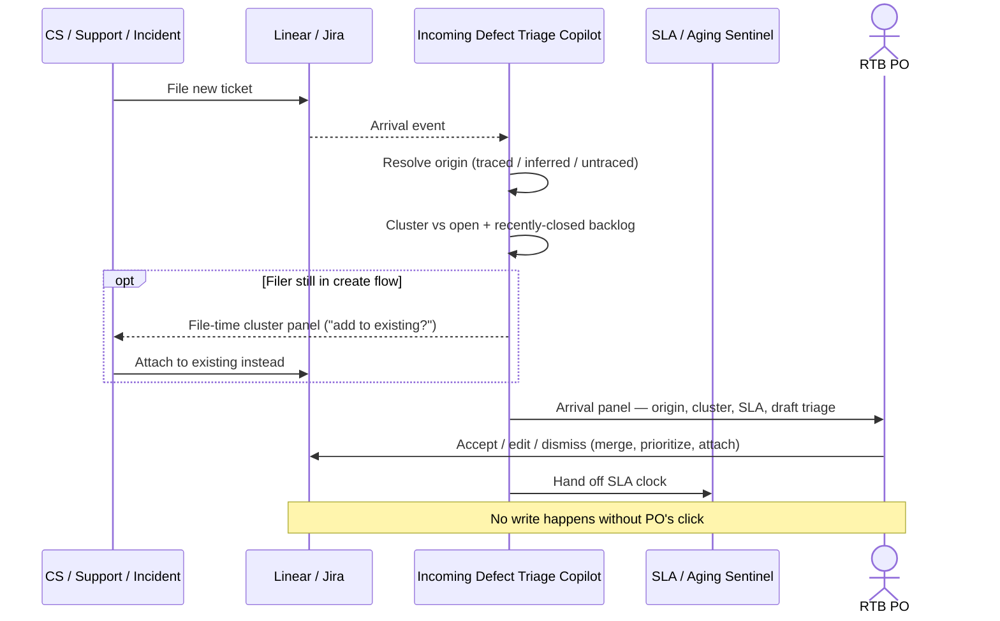

# Incoming defect triage copilot — Spec

- **Horizon:** Next
- **Stage:** 3 — Execution
- **Theme:** backlog-delivery
- **Owner:** TBD
- **Status:** Draft

## Why this tool, why now

The feature-PM tools on this roadmap assume a backlog that arrives on a plan: a PRD is written, an epic is cut, tickets are decomposed. The Run-The-Business backlog does not work that way. It is a **continuous arrival queue** — defects, customer-reported bugs, incident follow-ups, and small enhancements land daily from Customer Success, Support, and on-call, untied to any quarterly plan. The RTB PO ([Jordan](../personas/jordan-rtb-po.md)) spends the first hour of most days not triaging new tickets but deciding whether they are *new at all*: has anyone seen this? Did we decide not to fix it? Is there an open one already?

The Backlog grooming copilot ([spec](./backlog-grooming-copilot.md)) is the wrong shape for this job. It is **batch** (a pre-grooming digest), **epic-scoped** (its unit of work is the active Jira epic + linked PRD), and it treats spine-less tickets as the *orphan fallback*. For Jordan, orphan is not the fallback — it is the entire backlog. And his bottleneck is not the weekly grooming pass; it is the **moment a ticket arrives**, when the cheapest possible intervention is to catch a duplicate before it enters the backlog at all.

This tool exists because the data to answer "is this new?" is already on disk the instant a ticket is filed, and the value of answering it decays by the hour. A copilot that runs **per arrival** — tracing the ticket to its originating signal, surfacing the duplicate *cluster* (not just the nearest pair), assigning the SLA clock, and drafting a triage the PO can accept or edit — converts an hour of daily archaeology into a few minutes of review.

## What we mean by "triage"

"Triage" here means **deciding what a newly-arrived ticket is, before it costs anyone time** — not refining it to Ready, not prioritizing the whole backlog, not authoring net-new tickets.

**In our definition:**
- Origin trace — link the arrival to its originating CS ticket, incident postmortem, or customer report (the RTB spine; see [Origin-record policy](#origin-record-policy)).
- "Is this new?" — duplicate and recurring-cluster detection at arrival time, surfaced as a cluster with evidence, not a single suggested merge.
- SLA assignment — start the right SLA clock for the ticket's priority and surface the deadline.
- Draft triage — a proposed priority, severity, suspected-cluster link, and an acceptance-criteria stub that cites the origin record.

**Not what this tool does:**
- Refining tickets to Definition of Ready, writing full acceptance criteria → *Story & ticket writer* (Now).
- The weekly maintenance sweep — staleness, priority drift across the standing backlog → *Backlog grooming copilot* (Next).
- Watching SLA breach risk across the open backlog over time → *SLA / aging sentinel* ([spec](./sla-aging-sentinel.md), Now).
- Answering CS/Support "is this a known issue?" on demand → *Known-issue responder* ([spec](./known-issue-responder.md), Later).
- Deciding whether a recurring cluster warrants a real fix epic — the tool *surfaces* the cluster; the PO makes the call (see [open questions](#dependencies--open-questions)).
- Any autonomous write. Every output is a suggestion until the PO clicks.

## Problem

The arrival queue imposes a tax that has nothing to do with fixing bugs:

1. **Archaeology on every arrival.** Eleven CS reports land overnight; two are near-duplicates of a three-week-old ticket, one is the third recurrence of a bug class nobody has clustered. Finding that out takes longer than triaging the genuinely-new ones.
2. **The cluster is invisible.** A pairwise "this might duplicate MOB-2841" misses the point. The PO needs to see *all five* prior reports of the same class, filed under five different titles, to decide whether this is a one-off or a pattern worth a fix epic.
3. **The SLA clock starts silently.** A P2 defect arrives Friday evening; nobody starts the clock; CS opens a complaint Tuesday before anyone noticed it was aging.
4. **Origin gets lost.** A defect ticket that doesn't cite the CS report, the incident, or the affected customers is un-reproducible and un-prioritizable. Eng bounces it back; refinement stalls.

The tool's job is to make the **traced, cluster-aware, SLA-tagged, origin-citing** triage the easy path — at the moment of arrival, when it is cheapest to get right.

## Users & jobs-to-be-done

**Primary:** the RTB PO ([Jordan](../personas/jordan-rtb-po.md)) — owns a 250–350 ticket arrival queue across two adjacent product areas, no fixed sprint, mostly spine-less.
**Secondary:** CS/Support filers who want their report attached to the right existing ticket instead of creating a duplicate; on-call engineers filing incident follow-ups.

1. *When a ticket arrives*, tell me whether it is new — show me the **cluster** of prior related tickets with evidence, not just the nearest pair.
2. *Trace it to its origin* — link the CS ticket, incident, or customer report so the triage is reproducible and the impact is legible.
3. *Start the clock* — assign and surface the SLA deadline for its priority so it can't age silently.
4. *Draft the triage for me* — proposed priority, severity, suspected-cluster link, and an origin-citing AC stub — so I review judgment, not boilerplate.

## Origin-record policy

The roadmap's spine principle (Confluence PRD + Jira epic) is the reference a tool starts from; tools fail loudly rather than reconstruct context. RTB defects almost never have that spine. The **adapted spine for this tool is the origin record** — the upstream signal the defect came from:

- a **CS/Support ticket** (Zendesk/Intercom) the customer filed;
- an **incident postmortem** (the follow-up's parent incident);
- a **customer report** linked from an account manager or compliance.

The same fail-loud discipline applies: if the arrival cannot be traced to *any* origin record, the tool degrades it explicitly rather than inventing context.

| Tier | Origin state | Tool behavior |
|---|---|---|
| **Traced** | Arrival links to a CS ticket, incident, or customer report | Full triage. Origin cited in the AC stub; impact (affected customers, incident severity) pulled from the origin. Cluster + SLA + draft proposed. |
| **Inferred** | No explicit link, but a high-confidence origin candidate exists (matching customer, timestamp, surface) | Triage proceeds; origin shown as a *proposed* link the PO confirms. AC stub marks the origin as unconfirmed. |
| **Untraced** | No origin record found | Surfaced as **untraced** with a prompt: "no CS ticket / incident / customer report linked — confirm origin or mark internal." Cluster + SLA still run; the AC stub omits an origin citation and says so. Never silently treated as origin-clean. |

Tracing a defect to its origin is a first-class output of the tool — not a precondition for using it. An untraced arrival is still triaged; it is just flagged as missing the thing that makes it reproducible.

## In scope (v1)

- **Origin resolution** (runs first) — classify each arrival into the tier table above via linked CS/incident/customer references; cheap, no LLM on the happy path.
- Arrival-time duplicate + cluster detection — semantic match over the open *and recently-closed* RTB backlog, surfaced as a **cluster** (all related tickets, grouped by suspected class) with per-member evidence, not a single pair.
- Recurring-class surfacing — when the cluster spans N prior tickets under different titles, label it "looks like N prior reports of one class" with citations. (Surfacing only; the fix-epic decision is the PO's.)
- SLA assignment — map the triaged priority to the team's SLA policy, start the clock, surface the deadline, and hand the clock off to the *SLA / aging sentinel* for ongoing watch.
- Draft triage — proposed priority + severity + suspected-cluster link + acceptance-criteria stub that cites the origin record (repro steps, affected customers, incident link where present).
- Inline file-time panel — when a CS/Support filer is creating a ticket, show the cluster and offer "add to existing" before the duplicate enters the backlog.
- PO accept/edit/dismiss on every suggestion; dismissals feed per-area tuning.

## Out of scope (v1)

- Auto-merging, auto-closing, auto-prioritizing, or auto-filing anything. Every action is PO-gated. (Per the persona: a single autonomous merge is a same-day incident.)
- Full Definition-of-Ready refinement — the AC *stub* cites origin and repro; turning it into a complete, sized story is the *Story & ticket writer*'s job.
- The standing-backlog maintenance sweep (staleness, drift) — *Backlog grooming copilot*.
- Deciding to open a fix epic for a recurring class — surfaced, not decided.
- Cross-product-area dedup beyond Jordan's two adjacent areas — one PO's surface at a time.
- Direct raw-conversation crawling of Zendesk/Slack threads — use already-linked origin references only.

## Capabilities

| Capability | Scope | Output | Trust gate |
|---|---|---|---|
| Origin resolution | Every arrival | Tier (traced / inferred / untraced) + resolved origin reference(s) | None — internal; surfaces a confirm prompt for inferred/untraced |
| Duplicate + cluster detection | Open + recently-closed RTB backlog | A **cluster**: grouped related tickets + per-member similarity + cited evidence + "N prior under different titles" | PO clicks merge-into / dismiss / split |
| Recurring-class surfacing | Cluster spanning ≥3 prior tickets | Class label + citations + recurrence count | PO reviews; fix-epic decision is theirs |
| SLA assignment | Triaged arrival | Mapped SLA + deadline + handoff to sentinel | PO accepts / overrides priority→SLA mapping |
| Draft triage | Traced/inferred arrivals | Priority + severity + suspected-cluster link + origin-citing AC stub | PO accepts / edits / rejects |
| File-time cluster panel | CS/Support create flow | Inline cluster + "add to existing" action | Filer proceeds / attaches to existing |

## Integrations

- **Backlog Auditor** ([agent](../governance/agent-library.md#4-backlog-auditor)) — duplicate + cluster detection, run arrival-scoped rather than epic-scoped. Shared component with the grooming copilot; the trust earned there carries here.
- **Spine Resolver** ([agent](../governance/agent-library.md#1-spine-resolver)) — used in its `return_candidates` mode to resolve the **origin record** (CS ticket / incident / customer report) rather than a PRD+epic. Where a defect *does* have an epic, it resolves that too.
- **Source Synthesizer** ([agent](../governance/agent-library.md#5-source-synthesizer)) — assemble the AC stub (repro, affected customers, incident link) from the origin.
- **Citation Verifier** ([agent](../governance/agent-library.md#10-citation-verifier)) — verify every origin/cluster citation before surfacing.
- **PII Scrubber** ([agent](../governance/agent-library.md#9-pii-scrubber)) — on ingress; customer names/emails in CS reports are scrubbed before any model call.
- **Linear / Jira** — read arrivals, comments, labels, priority, hierarchy; the surface where triage suggestions land as drafts.
- **Zendesk / Intercom / Productboard** — read *linked* origin references only (no raw-thread crawl).
- **Incident tooling (PagerDuty / postmortems in Confluence)** — read-only, to resolve incident-follow-up origins.
- **SLA policy** — the team's priority→SLA table; the source for clock assignment. Handed to the *SLA / aging sentinel* for ongoing watch.
- **Slack** — output only (file-time confirmations, optional arrival summaries). No Slack ingest in v1.

## UX surfaces

1. **Arrival panel** in the Linear/Jira ticket sidebar — on a newly-arrived ticket: origin tier, the duplicate cluster, SLA deadline, and the draft triage, all PO-actionable inline.
2. **File-time cluster panel** in the CS/Support create flow — the cluster + "add to existing" before the duplicate is saved.
3. **Optional arrival summary** — a low-frequency digest of overnight arrivals already triaged into draft, for the morning pass. Off by default; the persona is allergic to ping volume.

No standalone app surface (operating principle 5).

## Trust & safety

- **No autonomous writes.** Merge, close, prioritize, and file are all PO actions. v1 has zero auto-write; the persona treats any auto-merge as a same-day incident, and we honor that absolutely.
- **Cluster, not silent pair.** Duplicate suggestions always surface as a cluster with every member's evidence shown side by side (repro steps, requester, origin). A merge is never proposed without the diff visible.
- **Citations on every suggestion.** Origin links, cluster members, and AC-stub claims all cite sources; the Citation Verifier runs before anything surfaces.
- **Freshness shown; refuse if stale.** Every arrival panel shows when the backlog index last refreshed. If the index hasn't seen recent arrivals (incl. the weekend's incidents), the tool says so and degrades rather than answering "no, this is new" from a stale view.
- **Confidence visible and tunable per area.** Cross-area cluster matches require a higher bar than within-area. Dismissals are sticky and feed per-area tuning.
- **Untraced is surfaced, never hidden.** An arrival with no origin is flagged, not silently passed as clean.
- **PII scrubbed pre-call.** Customer identifiers in CS reports are redacted before any model call; fail closed on a redaction regex hit in output.
- **Audit log** of every accepted action, queryable by the PO.

## Success metrics

| Metric | Target |
|---|---|
| Duplicate-on-arrival rate (new tickets attached to existing within 24h) | from ~20% to >60% (persona target) |
| Time per CS-filed ticket from arrival to triaged | from ~15 min to <5 min (persona target) |
| Recurring clusters surfaced before the 3rd recurrence | from "rare" to "default" (persona target) |
| Arrivals reaching the backlog with an origin citation | >85% of traceable arrivals |
| Cluster-suggestion acceptance rate | >40% (lower = too noisy) |
| Bad-merge revert rate (merge then split within 7d) | <5% (hard guardrail) |

## Rollout phasing

1. **Alpha (internal):** read-only arrival panel for one RTB PO. Origin tier + cluster view + SLA deadline. No file-time panel, no draft AC. Validates cluster precision and origin-trace accuracy before any write surface.
2. **Beta:** draft triage (priority/severity/AC stub) and the file-time cluster panel for CS/Support. 3–5 POs across RTB teams. Per-area confidence tuning live.
3. **GA:** full capability set, Jira + Linear parity, optional arrival summary, SLA handoff to the *SLA / aging sentinel* wired end-to-end.

## Dependencies & open questions

- **Depends on** the *Backlog grooming copilot* (Next). The Backlog Auditor's duplicate/cluster detection earns its trust in the batch grooming context first; this tool extends the same component to arrival-time, spine-less, cluster-shaped output. Shipping triage before the Auditor is trusted risks a bad first impression on the PO's highest-stakes workflow.
- **Depends on** the *Story & ticket writer* (Now) — the AC stub hands off to the story writer for full DoR refinement; the stub's shape must be a clean input.
- **Hands off to** the *SLA / aging sentinel* (Now) — triage assigns the clock; the sentinel watches it over time. The priority→SLA mapping must be shared, not duplicated.
- **Open:** the fix-epic decision. The tool surfaces "this is the 4th recurrence of one class." Should it go further and *draft* a fix-epic proposal, or is that over-reach into the PO's strategic call? Lean: surface + offer a one-click "draft a fix-epic brief" that the PO owns, deferred past v1.
- **Open:** an RTB-specific **Origin Resolver** agent. We are reusing the Spine Resolver in `return_candidates` mode for origin tracing. If origin resolution diverges enough from PRD+epic resolution, it may warrant its own agent contract in the [agent library](../governance/agent-library.md). Flagged as a follow-up, not built here.
- **Open:** recently-closed window. Dedup must search closed tickets (a recurrence often duplicates a *fixed* bug), but how far back before recall costs precision? Start at 90 days, tune.
- **Open:** cross-area scope. Jordan owns two adjacent areas. Within-area is the default; cross-area cluster matches need a higher bar. Where exactly?
- **Risk:** false-positive cluster merges. The persona's trust collapses if he nearly merges two unrelated defects once. Mitigation: cluster diff view at suggestion time, per-area dismissal learning, hard revert-rate guardrail.
- **Risk:** the file-time panel slows CS/Support filing. Mitigation: p95 latency budget on the create-flow path (see envelope); the panel is additive, never blocking.

## Triage mechanics

### Origin resolution (runs first)

For each arrival:
1. Look for a linked CS ticket / incident / customer report reference. If present and verifiable → **traced**.
2. If absent, look for a high-confidence origin candidate (matching customer + timestamp + product surface). If found → **inferred**, surfaced as a proposed link.
3. If neither → **untraced**, surfaced with a confirm-or-mark-internal prompt.

Origin resolution is the cheap first operation other steps scope by; it is the single point where the [Origin-record policy](#origin-record-policy) tiers take effect. No LLM on the traced happy path.

### Duplicate + cluster detection

- Embed title + body + label set; cosine similarity over the open **and** recently-closed RTB backlog (default 90-day closed window).
- Group matches into a **cluster** by suspected class rather than returning a single nearest pair: connected-component grouping over the similarity graph above the within-area threshold.
- Re-rank cluster members on requester overlap, label overlap, linked-origin overlap, and a short LLM "same root cause?" rationale returning a confidence scalar.
- Recurrence count = distinct prior tickets in the cluster; ≥3 under different titles triggers the recurring-class label.
- Within-area surface ≥0.7; cross-area ≥0.85; auto-hide <0.5 (configurable per area).

### SLA assignment

1. Map the triaged priority to the team's SLA policy table → deadline.
2. Surface the deadline on the arrival panel and hand the clock to the *SLA / aging sentinel*.
3. If priority is still in draft (PO hasn't accepted), show the *provisional* SLA for the proposed priority and mark it provisional.

### Draft triage

1. Source Synthesizer assembles the AC stub from the origin: repro steps, affected customers, incident link (where present).
2. Proposed priority/severity derived from origin signal (incident severity, customer count, SLA tier of the originating CS ticket) — never invented; always cited.
3. Suspected-cluster link attached if a cluster was found.
4. Untraced arrivals get a stub with no origin citation and an explicit "origin missing" note — the tool does not fabricate repro steps.

## Evaluation criteria & metrics

We measure on three layers; moving one without the others is a known failure (a precise cluster nobody acts on, or high acceptance that doesn't shrink duplicate-on-arrival).

### Layer 1 — Output quality

| Metric | Definition | Alpha | Beta | GA |
|---|---|---|---|---|
| Cluster precision @ 0.7 | Members that are true same-class | >0.80 | >0.85 | >0.90 |
| Cluster recall @ 0.7 | True class members surfaced / all in set | >0.50 | >0.60 | >0.70 |
| Recurring-class recall (vs. retro) | Recurring classes caught before 3rd recurrence | >0.50 | >0.65 | >0.80 |
| Origin-trace accuracy | Traced/inferred origins the PO confirms correct | >0.85 | >0.92 | >0.97 |
| False-origin rate (resolved + wrong) | Inferred origins the PO rejects | <0.05 | <0.03 | <0.01 |
| Brier score (cluster calibration) | MSE of confidence vs. outcome | <0.15 | <0.12 | <0.10 |
| Adversarial cluster pass rate | Same-root-cause, different-wording arrivals caught | >0.60 | >0.75 | >0.85 |

**Datasets:** historical RTB arrivals labeled with their true clusters and origins (the PO's past merges/attaches over 6 months — large, free, biased to easy cases); a hand-labeled golden set of ~150 arrivals per area refreshed quarterly; an adversarial set of ~50 same-class-different-title pairs; synthetic negatives (different-area arrivals injected at 10%) to catch over-eager clustering.

### Layer 2 — Product behavior

| Metric | What it tells us | Pass bar |
|---|---|---|
| Arrival-panel review rate | Are arrivals getting triaged via the tool | >70% |
| Cluster-suggestion acceptance | Of reviewed clusters, acted on | >40% |
| Dismiss-without-review rate | Clusters dismissed without opening the diff | <15% |
| File-time attach rate | CS/Support arrivals attached to existing via the panel | rising trend |
| Time-to-triaged (median) | Arrival → triaged | <5 min |
| In-product rating | useful / noisy / wrong | >60% useful, <10% wrong |

### Layer 3 — Outcomes

| Metric | Target |
|---|---|
| Duplicate-on-arrival rate | >60% (from ~20%) |
| Time/week on backlog archaeology (PO-reported) | <3h (from ~10h) |
| Recurring clusters caught before 3rd recurrence | "default," not "rare" |
| Arrivals reaching backlog with origin citation | >85% of traceable |

### Guardrails

| Guardrail | Limit | Why |
|---|---|---|
| Autonomous writes (merge/close/prioritize/file) | 0 (hard bar) | A single auto-merge is a same-day incident per the persona |
| Bad-merge revert rate (merge then split within 7d) | <5% | High revert = false confidence in cluster suggestions |
| False-origin incidents (acted-on wrong origin) | 0 | Wrong origin pollutes repro + impact downstream |
| Confident-and-stale answers (answered "new" from a stale index) | 0 (hard bar) | The persona's trust dies on a stale Monday view |
| PII regex matches in output | 0 | Privacy floor |
| Cost per arrival | <$0.05 | Margin sanity at queue volume |

### Anti-metrics

- **Arrivals auto-triaged without review.** This is not a metric to grow; the PO's review is the product.
- **Total clusters surfaced.** Fewer, better clusters — not a noisier feed.
- **Acceptance rate alone.** Maximizing it pushes toward only-obvious duplicates and misses the cross-title recurrences the PO most needs help seeing.
- **Tickets auto-closed.** Explicitly never a goal.

## Failure modes & mitigations

| Failure | What it looks like | Mitigation |
|---|---|---|
| False-positive cluster | Two arrivals with shared keywords, different root cause, grouped | Cluster diff view at suggestion time; per-area dismissal learning; LLM "same root cause?" re-rank; revert-rate guardrail |
| Missed cross-title recurrence | Same class under five titles, none grouped | Connected-component clustering over the closed window; recurring-class retro feeds the eval set |
| Wrong inferred origin | Arrival attached to the wrong CS ticket / incident | Inferred origins are *proposals* the PO confirms; never auto-applied; false-origin guardrail at 0 |
| Stale-index "this is new" | Index hasn't seen the weekend's incidents; answers "new" wrongly | Freshness shown on every panel; refuse/degrade above a staleness threshold |
| Untraced silently passed | Defect with no origin treated as clean | Untraced tier surfaced explicitly with a confirm prompt; AC stub omits and flags the missing origin |
| File-time panel latency | CS/Support filing slowed by the inline panel | p95 budget on the create path; panel additive, never blocking |
| AC stub fabricates repro | Stub invents repro steps the origin doesn't support | Source Synthesizer cites origin lines; untraced arrivals get no fabricated repro |
| Ping fatigue from arrival summary | Morning digest becomes another noisy feed | Summary off by default; ranked, top-N when on; the panel (pull) is the primary surface, not push |

## Cost & latency envelope (rough)

Sizing target: an RTB queue with ~50 arrivals/day, ~300 open + ~1,000 recently-closed tickets in the dedup window.

- **Origin resolution:** lookups, no LLM on traced path → negligible.
- **Cluster detection:** incremental embedding per arrival + re-rank LLM on top-K cluster candidates (~5–10 short prompts). ~$0.02–$0.04 per arrival.
- **Draft triage:** Source Synthesizer AC stub, one short call. ~$0.01 per arrival.
- **File-time panel:** 1 embedding + ≤5 re-rank prompts. **p95 latency <800ms** on the create path (hard product requirement — never block the filer).
- **Per-PO monthly cost:** <$10 at ~50 arrivals/day.

## User-flow walkthroughs

### Persona flow

### Flow A — Monday-morning arrival, caught as a recurrence

Monday 8:50am. Overnight, CS filed eleven defects. The arrival panel on the first one — "exports stall on large accounts" — shows: *Origin: traced to Zendesk #44102 (customer >50k rows). Cluster: looks like 4 prior reports of one class — MOB-2841 "export timeout >50k", OPS-1190 "CSV never completes", and two closed last quarter — all citing row-count limits. Recurring class: 4th recurrence. SLA: P2, due Wed 5pm. Draft triage: P2, severity-major, suspected cluster `export-timeout-large-accounts`, AC stub cites #44102 repro + 3 affected accounts.* Jordan attaches the new report to the cluster, accepts the draft priority, and flags the class for a "do we file a real fix epic?" conversation at the incident review — before he's triaged ticket two.

### Flow B — File-time attach, duplicate never enters

A Support manager starts filing "duplicate email on invite resend — still happening." As they type, the file-time panel surfaces: *Cluster (88%): SUP-3310 "invite resend sends 2 emails," filed 9 days ago, 3 customer reports linked, in progress.* The manager clicks "Add my customer to SUP-3310." The duplicate never enters the backlog, and SUP-3310's customer count ticks up — strengthening its priority signal.

### Flow C — Untraced arrival, surfaced not hidden

An on-call engineer files "retry storm on webhook delivery" with no incident link. The panel marks it **untraced**: *No CS ticket / incident / customer report linked. Confirm origin or mark internal. Cluster: no strong match. SLA: provisional P2.* Jordan links it to the right postmortem in two clicks; the AC stub re-renders with the incident's repro and severity. Nothing was fabricated in the gap.

## Anti-goals

- **Won't write to the backlog autonomously.** Merge, close, prioritize, attach, file — all PO-gated. A single auto-merge is a same-day incident.
- **Won't surface a pair when the truth is a cluster.** Duplicate suggestions are always cluster-shaped with evidence shown.
- **Won't answer "is this new?" from a stale index.** Freshness shown; degrade rather than confidently-wrong.
- **Won't fabricate origin or repro.** Untraced is surfaced, not papered over.
- **Won't decide to open a fix epic.** It surfaces the recurring class; the PO decides.
- **Won't refine to Ready.** The AC stub hands off to the Story & ticket writer.
- **Won't out-ping the PO.** The panel is pull; the optional summary is off by default and ranked when on.
