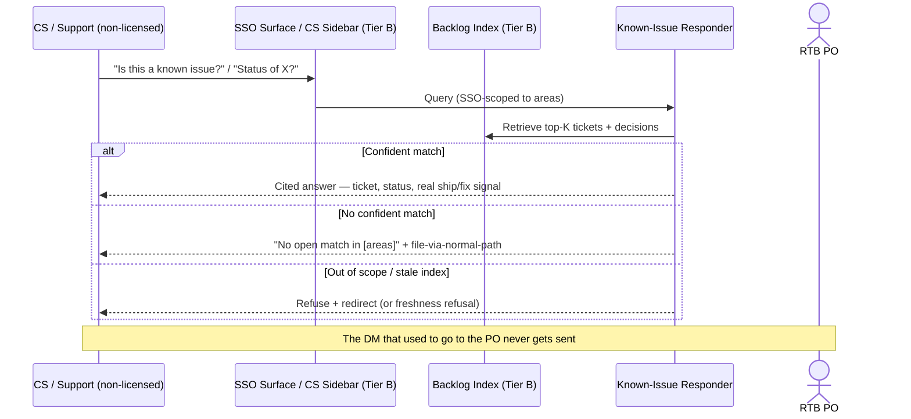

# Known-issue responder — Spec

- **Horizon:** Later
- **Stage:** 5 — Post-release
- **Theme:** backlog-delivery
- **Owner:** TBD
- **Status:** Draft — **Deferred pending Tier B investment**

> **Tier B note.** This tool is deferred for the same reason as the *PM knowledge agent* ([spec](./pm-knowledge-agent.md)): its primary audience is **non-licensed users** — CS reps and Support managers who do not hold a Claude Code seat (per [`strategy/licensed-seats.md`](../strategy/licensed-seats.md)). It requires:
> (1) an **SSO-gated surface** CS/Support can reach without a seat (the same surface investment the PM knowledge agent needs);
> (2) a persistent index over ticket status, decision history, and fix/ship state;
> (3) data-residency review on reading customer-derived ticket text, per the [security & data envelope](../governance/security-data-envelope.md).
> The spec exists to define the target so engineering can scope the investment, not because the tool is plannable today.

## Why this tool, why now (when Tier B lands)

The RTB PO ([Jordan](../personas/jordan-rtb-po.md)) is a human help desk for his own backlog. "CS/Support self-serve" is one of his four core motivations precisely because today it isn't: a Support manager DMs him "when does the duplicate-email fix ship?", a CS rep asks "is this a known issue?", and he stops what he's doing to do archaeology on his own backlog — *four times a day*. The answers exist in the tickets; they're just not reachable by the people asking.

This tool is the deflection surface. It answers two narrow, high-frequency questions for CS/Support — **"is this a known issue?"** and **"when does X ship / what's its status?"** — directly from ticket and decision history, with citations, so the PO isn't the lookup API. It is the RTB-shaped sibling of the *PM knowledge agent*: same Knowledge Retriever spine, same cite-or-refuse trust bar, but scoped tightly to **status and known-issue questions over the live backlog**, not open-ended "why did we decide X?" archaeology.

We sequence it Later, and Tier B, because it lives or dies on the SSO surface for non-licensed CS/Support users — without it, the people who need the answers can't reach the tool, and the PO is still the help desk.

## What we mean by "known-issue responder"

A **status and known-issue lookup for CS/Support** — it answers "is this filed already, and what's its state?" from the backlog, with citations, and refuses when it can't ground an answer.

**In our definition:**
- "Is this a known issue?" — match a CS/Support description against open + recently-resolved tickets and answer with the matching ticket(s) and their status, or an honest "no open match found."
- "What's the status / when does X ship?" — return a ticket's current state, priority, and any committed/estimated ship or fix signal *that actually exists on the ticket* — never an invented date.
- "Was this decided not-to-fix?" — surface a won't-fix / deferred decision with its rationale and source, so CS stops re-filing it.
- Cited answers only; refuse-when-ungrounded.

**Not what this tool does:**
- Triaging or filing the CS report — if it's genuinely new, the *Incoming defect triage copilot* ([spec](./incoming-defect-triage-copilot.md), Next) handles arrival; this tool answers the question *before* a new ticket gets filed.
- Open-ended decision archaeology ("why is our auth model like this?") → *PM knowledge agent* (Later). This tool is status/known-issue-scoped, not a general RAG surface.
- Promising ship dates the PO hasn't committed. It reports what's on the ticket; it does not forecast.
- Writing to the backlog, replying to the customer, or closing the loop in the CS tool. It answers the internal "is this known?" question; the human acts.
- Answering anything outside the known-issue/status scope (pricing, account, how-to). Refuse and redirect.

## Problem

The PO-as-help-desk pattern wastes the PO's scarcest resource — uninterrupted triage time — on questions the backlog already answers:

1. **"Is this known?" interrupts.** A CS rep about to file a report DMs the PO first; the PO searches, finds the existing ticket, replies. Multiply by a dozen a day.
2. **"When does X ship?" interrupts.** A Support manager needs to set a customer expectation; the PO is the only one who can read the ticket's current state and any commitment on it.
3. **Re-filing decided issues.** A won't-fix decision lives in a ticket comment nobody outside the PO has read; CS re-files the same issue quarterly, and the PO re-explains the same decision.
4. **The confident-wrong risk.** The one thing worse than the PO being the help desk is a tool that tells CS "no, that's not a known issue" when it is — producing a redundant ticket and a trust hit that spreads beyond the PO.

The tool's job is to make the **cited, status-accurate, refuse-when-unsure** answer self-serve for CS/Support — without ever inventing a ship date or a confident "no."

## Users & jobs-to-be-done

**Primary:** **CS reps and Support managers** (non-licensed) asking about Jordan's product areas — the audience the SSO surface exists for.
**Secondary:** the RTB PO ([Jordan](../personas/jordan-rtb-po.md)), who wants the DMs to stop; account managers setting customer expectations; on-call engineers checking whether an incident maps to a known defect.

1. *Is this a known issue?* — before I file or escalate, tell me if it's already tracked, and where.
2. *What's the status of X?* — current state, priority, and any real ship/fix signal on the ticket.
3. *Did we decide not to fix this?* — surface the won't-fix/deferred decision so I stop re-filing it.
4. *(PO)* Stop being the lookup API — let CS answer these without DMing me.

## Scope and grounding

The responder answers only from grounded backlog state and refuses outside its lane.

| Tier | Question + evidence state | Tool behavior |
|---|---|---|
| **Grounded match** | A known-issue/status question with a confident matching ticket | Full answer: matching ticket(s), current status, priority, any real ship/fix signal, won't-fix decision if present — all cited. |
| **Grounded no-match** | A known-issue question, but no confident match in the backlog | Honest "no open match found in [areas searched]" — explicitly *not* a confident "this is new," and a prompt to file via the normal path (where triage takes over). |
| **Out of scope** | Pricing, account, how-to, people, customer-data, or open-ended "why" questions | Refuse with reason and redirect (to docs, the PM knowledge agent, or a human), never a guess. |

The "no-match" tier is the critical one: a known-issue tool's worst failure is a confident "no" that produces a redundant ticket. No-match is reported as *absence of a found match*, with the search scope shown — never as a positive "this is new."

## In scope (v1)

- Natural-language known-issue lookup — match a CS/Support description against open + recently-resolved tickets via the Knowledge Retriever, return matches with status + citations.
- Status lookup — given a ticket reference or description, return current state, priority, and any *real* committed/estimated ship-or-fix signal present on the ticket.
- Won't-fix / deferred surfacing — return a documented not-to-fix decision with rationale and source.
- Cited answers only; every claim cites a ticket/decision URL with excerpt; uncited claims are not produced.
- No-match honesty — "no open match found in [scope]," never a confident "this is new."
- Refuse + redirect on out-of-scope questions (pricing, account, how-to, people, customer-data, open-ended why).
- Freshness surfaced on every answer; refuse if the index is too stale to trust a "known issue" claim.

## Out of scope (v1)

- Filing, triaging, merging, or writing anything to the backlog (that's the triage copilot's job once CS decides to file).
- Replying to the customer or acting in the CS tool. The responder answers the internal question; the human closes the loop.
- Forecasting ship dates the PO hasn't committed. It reports only signals present on the ticket.
- Open-ended decision archaeology → *PM knowledge agent*.
- Customer-account or PII-bearing answers (account status, customer-specific data). Out of envelope without T3 review.
- Cross-area answers beyond the PO's product areas; the surface is scoped to areas the responder is configured for.

## Capabilities

| Capability | Output | Trust gate |
|---|---|---|
| Known-issue match | Matching ticket(s) + status + citation, or honest no-match with search scope | Refuses to assert "new"; no-match is absence, not a claim |
| Status / ship lookup | Current state + priority + real ship/fix signal (cited) or "no committed date on this ticket" | Never invents a date |
| Won't-fix surfacing | Decision + rationale + source | Cited; surfaced, not re-litigated |
| No-match honesty | "No open match in [areas]" + prompt to file via normal path | Hard bar: never a confident "this is new" |
| Refuse + redirect | Out-of-scope reason + redirect target | Hard bar on out-of-scope topics |

## Integrations

- **Knowledge Retriever** ([agent](../governance/agent-library.md#8-knowledge-retriever)) — core component, scoped to the backlog (tickets + decision history) rather than PRDs/retros.
- **Citation Verifier** ([agent](../governance/agent-library.md#10-citation-verifier)) — mandatory post-step on every claim.
- **PII Scrubber** ([agent](../governance/agent-library.md#9-pii-scrubber)) — on ingress (CS-description input) and on output (ticket excerpts may carry customer identifiers).
- **Backlog Auditor** ([agent](../governance/agent-library.md#4-backlog-auditor)) — supplies the same duplicate/cluster matching the triage copilot uses, so "is this known?" and arrival-dedup share one notion of "same issue."
- **Persistent index store** (Tier B) — over ticket status + decision history.
- **SSO surface** (Tier B) — lets non-licensed CS/Support reach the tool without a seat.
- **Linear / Jira** — read tickets, status, priority, comments, decision history. Read-only.
- **Zendesk / Intercom** — the surface CS/Support live in; the responder is embedded here (see UX). Read linked references only.

## UX surfaces

1. **CS-tool sidebar widget** (SSO-gated) — embedded in Zendesk/Intercom: as a rep drafts a reply or before they escalate, "is this a known issue?" runs against the description and shows matches + status. The primary surface — it meets CS where they already work.
2. **Web surface** (Tier B, SSO-gated) — a lookup box for Support managers and account managers, shared with the PM knowledge agent's surface investment.
3. **Slack slash command** — `/known-issue <description>` in the CS/Support channels returns a cited answer in-thread, deflecting the DM that would otherwise go to the PO.

The SSO surface is the same standalone-surface investment justified for the *PM knowledge agent* — non-licensed CS/Support cannot reach the tool through seat-gated channels.

## Trust & safety

- **No uncited claims.** Hard bar. Every "known issue" / status answer cites the ticket; uncited claims are not produced.
- **No-match is absence, never a confident "new."** The single most important property: the tool reports "no match found in [scope]," not "this is a new issue." A confident-wrong "no" produces a redundant ticket and a cross-team trust hit.
- **Never invents a ship date.** Status answers report only signals present on the ticket; absent a committed date, the answer says "no committed date on this ticket," not an estimate.
- **Refuse + redirect out of scope.** Pricing, account, how-to, people, customer-data, and open-ended "why" questions get a refusal with a redirect, never a guess.
- **Freshness shown; refuse if stale.** "Known issue?" is a question about *current* state; a stale index can miss a just-fixed or just-filed issue. Freshness surfaces on every answer; refuse if the index is staler than the contract allows.
- **PII scrubbed on ingress and output.** CS descriptions and ticket excerpts both pass the scrubber; customer identifiers never reach the model or the answer.
- **No customer-account answers.** Account-specific or PII-bearing questions are out of envelope without T3 review.
- **Read-only.** The responder answers; it never writes, files, or closes anything.

## Success metrics

| Metric | Target |
|---|---|
| CS/Support known-issue + status questions self-served (no PO DM) | >60% |
| PO interrupts/day for "is this known?" / "when does X ship?" | -60% |
| Redundant tickets filed for already-known issues | -50% |
| Citation verification pass rate | >0.99 (hard bar) |
| Confident-wrong "no, that's new" answers (was known) | 0 (hard bar) |
| CS-rated answer usefulness | >70% useful |

## Rollout phasing

1. **Alpha (internal, PO + 2 CS reps):** Slack slash command only, single product area, known-issue match + status lookup. Validates no-match honesty and citation precision before any embedded surface.
2. **Beta:** CS-tool sidebar widget in Zendesk/Intercom, won't-fix surfacing, both of Jordan's areas. 1 CS team.
3. **GA (requires Tier B SSO surface):** web surface for Support/account managers, multi-area config, freshness-gated refusal wired to the index, full redirect taxonomy.

## Dependencies & open questions

- **Hard dependency:** Tier B infrastructure — the SSO surface for non-licensed CS/Support and a persistent index over ticket+decision state. Without the surface, the audience can't reach the tool and the PO is still the help desk. This is the same SSO investment the *PM knowledge agent* needs; the two should share it.
- **Shares matching** with the *Incoming defect triage copilot* (Next) via the Backlog Auditor — "is this known?" (asked by CS before filing) and arrival-dedup (run when a ticket is filed) must use one notion of "same issue," or CS and the PO get contradictory answers.
- **Composes with** the *PM knowledge agent* (Later) — shares the Knowledge Retriever spine and the SSO surface, but stays status/known-issue-scoped. Open-ended "why" questions are *redirected* to the knowledge agent, not answered here.
- **Open:** the "no committed date" UX. CS often wants a date the PO hasn't set. The honest answer ("no committed date on this ticket") risks frustrating the rep. Do we offer a "request an ETA from the PO" action instead of leaving them empty-handed? Lean yes, deferred past v1.
- **Open:** recently-resolved window for "is this known?" — a just-fixed issue is still a "known issue" CS should hear about ("fixed in the release shipping Thursday"). How far back? Align with the triage copilot's closed-window default (90 days) and tune.
- **Open:** won't-fix decisions are often buried in unstructured comments. Reliable surfacing may require a lightly-structured decision field on the ticket. Confirm whether that upstream convention is worth requiring.
- **Risk:** confident-wrong "no" — the headline risk. A rep trusts "not a known issue," files a duplicate, and the trust hit spreads beyond the PO. Mitigation: no-match is reported as absence with search scope shown; the bar for asserting *any* "new" is a hard 0.
- **Risk:** stale index misses a just-filed/just-fixed issue. Mitigation: freshness surfaced; refuse above the staleness threshold.
- **Risk:** customer-data leak via ticket excerpts in answers. Mitigation: scrubber on ingress and output; no account-specific answers; T3 review before any PII-bearing field is read.
- **Risk:** scope creep into "when will you fix it?" pressure on the PO. Mitigation: the tool reports state, never forecasts; date commitments stay a human decision.

## Retrieval mechanics

### Indexing

1. Batch + on-change index over open and recently-resolved tickets (status, priority, comments, decision fields) for the configured product areas.
2. Index metadata: ticket URL, status, priority, last-modified, resolution state, any committed-date field, won't-fix/deferred flag.
3. Customer-derived text scrubbed before embedding.

### Query

1. CS/Support submits a description or ticket reference (via sidebar, web, or slash command).
2. Embed + retrieve top-K from the backlog index, scoped to the configured areas.
3. Knowledge Retriever assembles a cited answer: matching ticket(s) + status + real ship/fix signal + won't-fix decision if present.
4. Citation Verifier runs (mandatory) on every claim.
5. Confidence + freshness computed.
6. Refusal/honesty paths:
   - No confident match → **grounded no-match**: "no open match found in [areas searched]," with a file-via-normal-path prompt. Never "this is new."
   - Out-of-scope topic (pricing/account/how-to/people/why) → refuse + redirect.
   - Index staler than contract → refuse with a freshness reason.
   - Status question with no committed date on the ticket → "no committed date on this ticket," never an invented estimate.

## Evaluation criteria & metrics

Three layers, with the no-match/confident-wrong axis as the trust bar — happy-path accuracy alone does not pass.

### Layer 1 — Output quality

| Metric | Definition | Alpha | Beta | GA |
|---|---|---|---|---|
| Citation verification pass rate | Verified-and-accurate citations | >0.97 | >0.99 | >0.99 |
| Known-issue match precision | "Known" answers where the cited ticket truly matches | >0.85 | >0.92 | >0.97 |
| Confident-wrong-"no" rate | "Not known/new" answers where it actually was known | <0.02 | <0.005 | 0 (hard bar) |
| Status-answer factuality | Status/ship claims that check out against the ticket | >0.90 | >0.95 | >0.98 |
| Invented-date rate | Answers asserting a date not on the ticket | 0 (hard bar) |
| Out-of-scope refusal rate | Out-of-scope questions correctly refused | >0.90 | >0.95 | >0.99 |

**Datasets:** golden CS questions paired with the correct ticket/status answer, built from real DMs the PO has fielded (n>200), refreshed quarterly; an adversarial set of ~40 "looks new but is a known issue under different wording" cases (the confident-wrong trap); a ~30-case out-of-scope set (pricing/account/how-to/why) the tool must refuse.

### Layer 2 — Product behavior

| Metric | Pass bar |
|---|---|
| CS self-serve rate (answered without PO DM) | >60% |
| Per-query time-to-answer | <5s p50 |
| Answer-rated useful (CS) | >70% |
| Answer-rated wrong (CS) | <5% |
| Sidebar-widget usage before filing | rising trend |
| Refusal-rated annoying | <30% (high = false refusal / no-match too often) |

### Layer 3 — Outcomes

| Metric | Target |
|---|---|
| PO interrupts/day for known-issue/status questions | -60% |
| Redundant tickets for already-known issues | -50% |
| CS time-to-customer-response on "is this known?" | -40% |
| Cross-team trust incidents from a wrong "no" | 0 |

### Guardrails

| Guardrail | Limit | Why |
|---|---|---|
| Confident "this is new" on a known issue | 0 (hard bar) | The headline failure; produces redundant tickets + cross-team trust loss |
| Invented ship/fix dates | 0 (hard bar) | The tool reports state, never forecasts |
| Uncited claims in any answer | 0 (hard bar) | Cite-or-refuse |
| Stale-index answers (past contract threshold) | 0 (hard bar) | "Known issue?" needs current state |
| Customer-account / PII answers without T3 review | 0 (hard bar) | Data envelope |
| Writes to the backlog or CS tool | 0 (hard bar) | Read-only responder |
| Cost per query | <$0.10 (GA) | Margin sanity |

### Anti-metrics

- **Questions answered.** A confident-wrong "no" is worse than a deflection to the PO. Refusal and honest no-match are features.
- **Self-serve rate alone.** Maximizing it pushes the tool to answer when it should refuse or report no-match.
- **CS engagement minutes.** The goal is faster customer responses, not time-on-tool.

## Failure modes & mitigations

| Failure | What it looks like | Mitigation |
|---|---|---|
| Confident-wrong "no" | Tool says "not a known issue"; it was; CS files a duplicate | No-match reported as absence with search scope; hard 0 bar on asserting "new"; adversarial "looks-new-but-known" eval set |
| Invented ship date | "Ships next Thursday" when no date is on the ticket | Status answers cite only on-ticket signals; "no committed date" is the honest default; invented-date guardrail at 0 |
| Hallucinated citation | Cited ticket doesn't say what the answer claims | Citation Verifier mandatory |
| Stale-index miss | Index didn't see a just-filed/just-fixed issue; answer is wrong about "known"/status | Freshness shown; refuse above the staleness threshold |
| Scope creep | Tool answers pricing/account/how-to questions it shouldn't | Out-of-scope classifier + refuse-and-redirect taxonomy |
| Customer-data leak | Ticket excerpt with a customer name reaches the answer | Scrubber on ingress + output; no account-specific answers; T3 gate on PII fields |
| Contradicts the triage copilot | CS told "not known," PO's triage flags it as a duplicate at filing | Shared Backlog Auditor matching so both use one "same issue" notion |
| Date-pressure on PO | "When will you fix it?" escalates via the tool | Reports state only; optional "request ETA from PO" action keeps the commitment human |

## Cost & latency envelope (rough)

- **Index maintenance:** embedding over open + recently-resolved tickets for the configured areas; incremental on change. ~$30–$60/month per area.
- **Per query:** retrieval + small synthesis + Citation Verifier. ~$0.05–$0.10.
- **p95 latency:** <4s per query (per the Knowledge Retriever contract); sidebar widget renders inline as the rep drafts.
- **Per-area monthly cost ceiling:** <$150 (GA).
- **Tier B infra:** SSO surface + persistent index — shared with the PM knowledge agent, not in this envelope.

## User-flow walkthroughs

### Persona flow

### Flow A — Deflected "is this known?"

A CS rep is about to file "customer says CSV export hangs forever on big accounts." In the Zendesk sidebar, the responder runs the description and answers in 3 seconds: *Known issue. DEF-2210 "export timeout >50k rows" — status: In Progress, P1, 6 customers linked. No committed ship date on the ticket. (cite: DEF-2210).* The rep attaches the customer to DEF-2210 instead of filing, tells the customer "it's a known issue we're actively working," and never DMs Jordan.

### Flow B — Honest no-match, not a confident "new"

A Support manager asks `/known-issue login loops after SSO logout on Safari`. The responder finds nothing confident: *No open match found in Payments + Exports for "SSO logout login loop on Safari." This may be new — please file via the normal path so it gets triaged. (Searched: 312 open + 1,040 resolved in the last 90 days.)* It does **not** say "this is a new bug." The manager files it; the triage copilot picks it up at arrival. If it later turns out to duplicate something the search scope missed, the honest framing ("may be new," scope shown) means no one was told a falsehood.

### Flow C — Won't-fix surfaced, re-filing avoided

A CS rep asks about "dark-mode flicker on the settings page." The responder returns: *Decided won't-fix. DEF-1904, closed 2025-11 as won't-fix — rationale: cosmetic, affects <0.1% sessions, fix risk outweighs impact (cite: DEF-1904 decision comment).* The rep sets the customer's expectation accurately instead of re-filing the issue for the third time this year.

## Anti-goals

- **Won't assert "this is new."** No-match is absence with scope shown, never a confident "new."
- **Won't invent a ship date.** Reports on-ticket signals only; "no committed date" is the honest default.
- **Won't answer without citations.** Cite-or-refuse, hard bar.
- **Won't answer out of scope.** Pricing, account, how-to, people, open-ended "why" — refuse and redirect.
- **Won't answer from a stale index.** Freshness shown; refuse above the threshold.
- **Won't write, file, or reply to the customer.** It answers the internal question; the human acts.
- **Won't ship without the Tier B SSO surface.** Non-licensed CS/Support are the audience; without the surface, the PO is still the help desk.
- **Won't become the decision archaeology surface.** Open-ended "why" goes to the PM knowledge agent.
