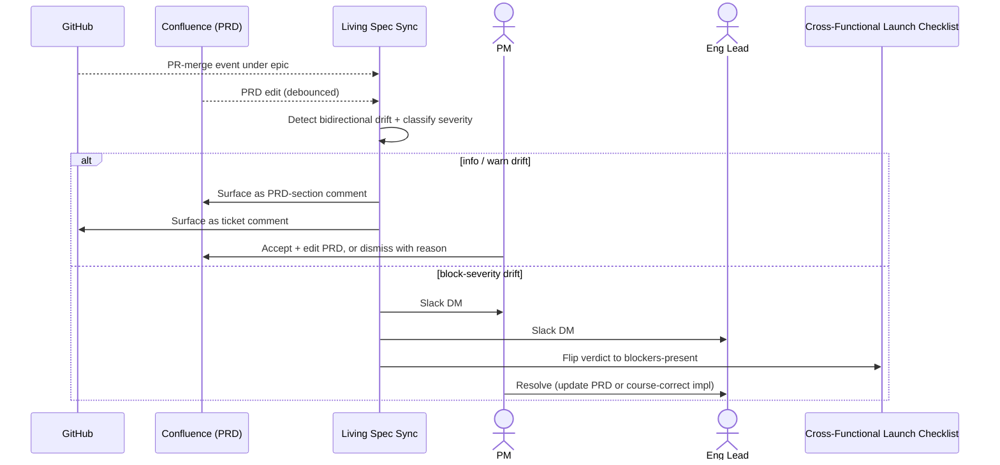

# Living spec sync — Spec

- **Horizon:** Later
- **Stage:** 5 — Post-release
- **Theme:** writing-docs
- **Owner:** TBD
- **Status:** Draft

## Why this tool, why now

The PRD assistant covers Stage 1 (greenfield drafting). Everything mid-flight — scope changes during sprint planning, last-minute eng pushback, a customer-signal spike that re-prioritizes a sub-feature — re-shapes the implementation without re-shaping the PRD. By the time the feature ships, the PRD and the actual implementation tell different stories. Release notes inherit the divergence; future PMs reading the PRD as "what shipped" get a wrong answer.

This tool is the **forcing function that closes the spine loop**. It runs over the lifetime of an active epic, comparing the PRD's stated intent against tickets and merged PRs, and surfaces drift the moment it happens — when it's cheap to either update the PRD or course-correct the implementation.

We sequence it Later because:
- **Drift detection is precision-sensitive.** False drift erodes trust faster than false dup in grooming. Building this before the upstream tools mature would produce noisy alerts on already-shaky PRDs.
- **Corpus density matters.** The drift detector reads structured PRD sections; only after the PRD assistant lands and adoption is wide does the structural prerequisite hold.
- **The implementation surface needs maturity.** Without consistent epic linkage on tickets and PRs (which the story writer + grooming copilot establish), the comparison is comparing noise to noise.

## What we mean by "living spec sync"

This tool **continuously compares an active PRD's intent against the current state of tickets and merged PRs under its epic**, and flags drift in both directions: PRD says something no ticket covers, ticket implements something the PRD didn't say.

**In our definition:**
- Bidirectional drift detection: PRD → implementation and implementation → PRD
- Severity classification: `info`, `warn`, `block` (the last gates release-readiness when composed with the launch checklist tool)
- Suggested resolutions: either "update PRD to match" or "course-correct implementation"
- Continuous: runs on PR merge events and PRD edits

**Not what this tool does:**
- Authoring PRD content. Surfaces "PRD should be updated" as comments; PM edits.
- Editing tickets or merging PRs. Drift findings are read-only.
- Greenfield PRD drafting (that's the PRD assistant).
- Approving or blocking PR merges autonomously. `block` severity surfaces; release readiness is composed downstream by Cross-Functional Launch Checklist.

## Problem

Specs and implementations drift, silently, in three ways:

1. **PRD-not-implemented drift.** PRD says "supports CSV and JSON export." Implementation ships CSV. Nobody updates the PRD; release notes claim both; CS gets tickets when customers expect JSON.
2. **Implementation-not-PRD drift.** PRD never mentioned tablet support; eng built it because a designer asked. Nobody updates the PRD; the feature lives in production as undocumented behavior.
3. **Intent-changed drift.** PRD says "rate limit at 100 req/sec." Implementation lands at 200 because a benchmark showed headroom. The intent was different from the final number, and nobody captured the change.

The tool's job is to make a **bidirectional, severity-graded, suggestion-bearing** drift surface the easy path, so PRDs stay live and implementations stay honest.

## Users & jobs-to-be-done

**Primary:** PMs/POs owning an active epic across its lifecycle.
**Secondary:** Eng leads who need to know when the spec moved; launch-checklist owners who gate release on block-severity drift.

1. *Tell me when the PRD and the tickets disagree* — surface bidirectional drift.
2. *Classify severity* — info, warn, block.
3. *Suggest resolution* — update PRD, or course-correct the ticket.
4. *Gate release-readiness on block drifts* — composed by the launch checklist tool.

## In scope (v1)

- Drift Detector agent runs on PR-merge events scoped to the epic.
- PRD → implementation scan: every in-scope item present in at least one ticket.
- Implementation → PRD scan: every merged PR / closed ticket maps to a PRD section.
- Severity classification per drift: `info` (refinement-level detail addition), `warn` (deviation but explainable), `block` (intent-change that requires a decision).
- Suggested resolutions per drift: text body the PM can paste into a PRD edit or a ticket comment.
- Surface as comments on the PRD (for PRD → impl drift) and as ticket comments (for impl → PRD drift).
- `block`-severity drifts pushed to PM, eng lead, and launch-checklist owner.

## Out of scope (v1)

- Auto-editing the PRD or tickets.
- Auto-blocking PR merges.
- Drift on legacy PRDs that lack the structured in-scope list. v1 requires PRD assistant output as input.
- Cross-epic drift detection.
- Real-time drift (sub-minute latency). Runs on event, not on every keystroke.
- Predicting drift before it happens. Backward-looking, not predictive.

## Capabilities

| Capability | Output | Trust gate |
|---|---|---|
| PRD → impl drift | List of in-scope items with no covering ticket | Surfaced as PRD comment; PM acts |
| Impl → PRD drift | List of merged work without PRD section | Surfaced as ticket comment; PM acts |
| Severity classification | Per-drift severity tag | Configurable threshold per epic |
| Suggested resolution | "Update PRD to add X" or "Update ticket to limit scope to Y" | Suggestion only; PM edits |
| Block-severity surfacing | Notification to PM + eng lead + launch-checklist owner | Hard gate composed downstream by launch checklist |
| Drift dismissal | PM marks a drift "won't fix"; reason recorded | Feeds per-spine allowlist |

## Integrations

- **Drift Detector** ([agent](../governance/agent-library.md#7-drift-detector)) — core component.
- **Spine Resolver** ([agent](../governance/agent-library.md#1-spine-resolver)).
- **Rubric Scorer** ([agent](../governance/agent-library.md#11-rubric-scorer)) — severity classification.
- **PII Scrubber** ([agent](../governance/agent-library.md#9-pii-scrubber)).
- **GitHub** — PR-merge webhooks scoped to repos under the epic.
- **Jira/Linear** — read tickets, write comments (not edits) on drift items.
- **Confluence** — read PRDs, write comments on sections; never edits.
- **Cross-functional launch checklist** (Later) — consumes `block`-severity drifts.

## UX surfaces

1. **PRD page comments** — drift surfaces as inline Confluence comments on relevant PRD sections.
2. **Ticket comments** — implementation-side drift surfaces as comments on the merged ticket / PR.
3. **Epic dashboard** — a Confluence sidebar widget on the epic page lists all open drifts grouped by severity.
4. **Notification on `block`** — Slack DM to PM + eng lead, plus a thread in the team's PM ops channel.

No standalone app surface (operating principle 5).

## Trust & safety

- **No auto-edits.** Drifts are comments. PM (or eng for ticket comments) edits.
- **No PR merge blocking.** v1 surfaces; doesn't gate. Release-time gating is the launch checklist's job, composed.
- **Severity calibration per epic.** Drift Detector's severity threshold is configurable; PM can tighten or loosen per epic.
- **Dismissal feeds allowlist.** A drift PM dismisses (with reason) won't re-surface; the dismissal trains the detector.
- **PRD must be structured.** Drift detection runs only on PRDs that have a typed in-scope list. Legacy PRDs are scoped out (v1).
- **Citation Verifier** runs on the drift's source claim. A drift surfaces only if the citation resolves.
- **PII Scrubber on ingress** (ticket bodies, PR descriptions, PRD content).

## Success metrics

| Metric | Target |
|---|---|
| Drift precision (PM-confirmed real / surfaced) | >0.75 |
| Drift recall vs. quarterly spot-check audit | >0.70 |
| `block`-severity false-positive rate | <0.10 |
| Median time-to-resolution for `block` drifts | <3 days |
| Epics with sync active across full lifecycle | >70% within 1 quarter of GA |
| Post-launch "PRD-implementation mismatch" CS tickets | -60% |

## Rollout phasing

1. **Alpha (internal):** PRD → impl drift only, info-only severity. 2 friendly epics. Validates Drift Detector precision.
2. **Beta:** Bidirectional drift + severity classification. PRD comments + ticket comments live. 10 epics across 3 teams.
3. **GA:** `block`-severity notification path, integration with cross-functional launch checklist, dismissal-feedback loop active.

## Dependencies & open questions

- **Depends on:** *PRD drafting assistant* (Now). Drift detection requires PRDs with structured in-scope lists; legacy PRDs are scoped out.
- **Depends on:** *Story & ticket writer* (Now) + *Backlog grooming copilot* (Next). Without consistently epic-linked tickets, the impl → PRD scan is comparing noise to noise.
- **Depends on:** Drift Detector, Spine Resolver, Rubric Scorer, PII Scrubber, Citation Verifier — agent-library components.
- **Composes with:** *Cross-functional launch checklist* (Later). `block`-severity drift gates "ready for launch."
- **Open:** What counts as `block` vs. `warn`? A clear-intent-change deserves `block`; an additive detail deserves `info`. The boundary is fuzzy and per-team variance is likely.
- **Open:** Notification fatigue. `info` drifts are interesting but cheap; `warn` is the dangerous-volume tier. Per-epic ceiling or per-PM digest mode?
- **Open:** Multi-PRD epics. Some epics have a primary PRD plus sub-PRDs. Sync per-PRD or per-epic? Lean per-PRD with explicit cross-PRD reconciliation.
- **Risk:** False `block` interrupts. If `block` mis-fires once, eng + PM disengage. Mitigation: hard precision bar; manual review of every `block` in alpha + beta.
- **Risk:** "PRD is the source of truth" stops being true when teams treat drift comments as nags. Mitigation: dismissal-with-reason path that PMs respect; "won't fix" allowlist persists.
- **Risk:** PRD-edit churn. Every PRD edit triggers a re-scan; if PMs edit frequently, the detector thrashes. Mitigation: debounce edits, batch re-scans on PR-merge events.

## Drift mechanics

### PRD → impl scan

1. Spine Resolver returns PRD + epic.
2. PRD's structured `in_scope` list extracted.
3. For each in-scope item, the detector looks for a covering ticket: title match, body semantic similarity, label overlap.
4. In-scope items with no covering ticket → drift candidate. Confidence score per drift.
5. Detail-addition vs. intent-change classifier: a covered-but-narrower implementation is `info`; a missing whole item is `warn` or `block`.
6. Surface as PRD-section comment with citation to the section text + the closest related tickets.

### Impl → PRD scan

1. On PR-merge event under the epic, the detector reads the PR description + linked ticket.
2. The PR's user-facing impact is summarized.
3. Detector looks for a matching PRD section: semantic match against in-scope items.
4. PRs with no matching section → drift candidate. Confidence per drift.
5. Severity classification: trivial refactor vs. real new behavior.
6. Surface as ticket comment with suggested PRD-section text to add.

### Severity classification

Per drift, a Rubric Scorer evaluates:
- Does it change a stated success metric? → `block`
- Does it change a stated user-facing behavior? → `block`
- Does it add a behavior the PRD didn't mention? → `warn`
- Does it refine a detail consistent with the PRD's spirit? → `info`

Severity threshold is per-epic configurable.

### Dismissal feedback

1. PM dismisses a drift with reason (free-text).
2. Dismissal added to per-spine allowlist.
3. Subsequent scans honor the allowlist.
4. Dismissal rationale feeds the eval set for severity-calibration.

## Evaluation criteria & metrics

### Layer 1 — Output quality

| Metric | Definition | Alpha | Beta | GA |
|---|---|---|---|---|
| Drift precision (overall) | PM-confirmed real / surfaced | >0.65 | >0.75 | >0.85 |
| Drift recall (vs. audit) | Real drifts caught / known drifts | >0.50 | >0.65 | >0.80 |
| `block`-severity precision | Block drifts that really were intent-changes | >0.85 | >0.92 | >0.97 |
| `block`-severity false-positive rate | False blocks / surfaced blocks | <0.15 | <0.10 | <0.05 |
| Intent-change vs. detail-addition classifier | Correct classification | >0.80 | >0.88 | >0.94 |
| Citation accuracy on drift evidence | Citations resolve | >0.97 | >0.99 | >0.99 |

**Datasets:** historical epic lifecycles with retrospectively-labeled drift (n>30), refreshed quarterly. A 30-case adversarial set with deliberately ambiguous drift (additive detail vs. real intent change) for severity calibration.

### Layer 2 — Product behavior

| Metric | Pass bar |
|---|---|
| Drifts acted on (PM updates PRD or ticket) | >50% |
| Drifts dismissed-with-reason | >30% (healthy — not every drift is real) |
| Drifts dismissed silently (no reason) | <10% (high = low trust) |
| Median time-to-resolution for `block` | <3 days |
| Notification fatigue (digest open rate trend) | Stable or improving over time |

### Layer 3 — Outcomes

| Metric | Target |
|---|---|
| Post-launch "PRD-implementation mismatch" CS tickets | -60% |
| PRDs PM rates "still accurate at launch" | >80% (baseline ~40%) |
| Time spent re-reconciling specs post-launch | -70% |

### Guardrails

| Guardrail | Limit |
|---|---|
| Auto-edit of PRD or tickets | 0 (hard bar) |
| Auto-block PR merges | 0 (v1) |
| `block`-severity false-positive rate | <0.10 (hard bar) |
| PII regex matches in any drift surface | 0 |
| Cost per epic per month | <$10 (GA) |

### Anti-metrics

- **Drifts surfaced.** Volume isn't value.
- **`block` count.** Maximizing block-grade catches over-fires the interrupt; precision dominates.
- **Drift "fixed" count.** Some drifts are correctly dismissed — not every drift is a bug.

## Failure modes & mitigations

| Failure | What it looks like | Mitigation |
|---|---|---|
| False drift (PRD says X, ticket implements reasonable X+1) | Detail-addition flagged as intent-change | Two-class classifier; allowlist on dismissal |
| Missed drift (real intent change unflagged) | Implementation diverged, no surfaces | Quarterly audit feeds eval set |
| Block-severity false positive | Non-issue surfaced as block, eng+PM interrupted | Hard precision bar; alpha + beta manual review of every block |
| Notification fatigue | PM disengages after wave of warn drifts | Per-epic ceiling; digest mode option |
| Stale-PRD anchoring | Drift surfaced against a PRD edited mid-flight | Spine Resolver returns `prd_last_modified`; debounce |
| PRD-edit thrash | Frequent PRD edits → constant re-scans | Debounce PRD edits; batch on PR-merge events |
| Dismissal allowlist drift | Allowlist grows huge, every PM has unique dismissals | Per-epic allowlists, not per-PM; reviewed at epic retirement |
| Cross-PRD epic confusion | Drift surfaced against wrong PRD when epic has sub-PRDs | Per-PRD sync mode at GA; explicit cross-PRD reconciliation |

## Cost & latency envelope (rough)

- **Per PR-merge event:** Drift Detector scan. ~$0.30 per scan.
- **Per PRD edit:** debounced scan. ~$0.30 per scan after debounce.
- **Per epic per month** (assuming ~50 PR-merge events + ~20 PRD edits, debounced to ~10 scans): ~$5–$10.
- **p95 latency:** <1 minute from event to drift surface.
- **Per-team monthly cost ceiling:** <$50 (GA).

## User-flow walkthroughs

### Persona flow

### Flow A — Mid-sprint scope change

PRD said "export CSV and JSON." Sprint 1 lands CSV; sprint 2 plan removes JSON because of effort. PR merges for CSV, no JSON ticket exists. Drift Detector fires PRD → impl: "JSON export listed in_scope but no covering ticket." Severity: `warn` (an in-scope item dropped). Surface as PRD-section comment with suggested resolution: "Update PRD to remove JSON from in_scope, or file a ticket to deliver it." PM accepts the descope, edits the PRD, drift resolves. PRD ships accurate.

### Flow B — Impl → PRD drift on tablet support

Eng landed a PR adding tablet-optimized UI because a designer asked at last week's sync. PRD never mentioned tablets. Drift Detector fires impl → PRD: "PR #1234 adds tablet UI; no PRD section covers tablet." Severity: `warn` (a new behavior not in spec). Surface as ticket comment with suggested PRD addition. PM realizes this is a real scope expansion, edits PRD's in_scope to include tablet, updates the upcoming release-notes draft accordingly.

### Flow C — `Block`-severity intent change

Sprint 3 PR lands a rate-limit change: PRD said 100 req/sec, implementation ships 200. Drift Detector classifies as `block` — a stated number changed. Notification: Slack DM to PM + eng lead + launch-checklist owner. PM and eng have a 10-minute conversation: 200 is correct because benchmark showed safety; PM updates the PRD; drift resolves. Without `block`, the rate limit ships, release notes say "100," customers complain about "false advertising," CS gets tickets.

## Anti-goals

- **Won't auto-edit PRDs or tickets.** Comments only.
- **Won't auto-block PR merges.** Surfacing only; gating is composed downstream.
- **Won't run on legacy PRDs.** Structured-in-scope is the floor.
- **Won't synthesize new content.** It compares; it doesn't author.
- **Won't predict drift.** Backward-looking only.
- **Won't fanout cross-epic.** Per-epic in v1.
