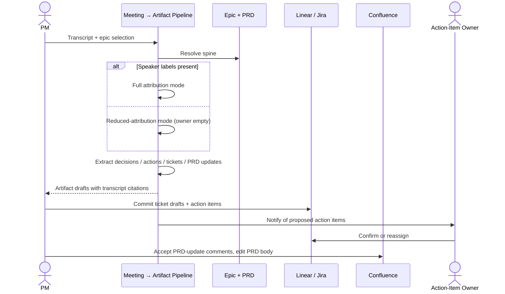

# Meeting → artifact pipeline — Spec

- **Horizon:** Next
- **Stage:** 3 — Execution
- **Theme:** writing-docs
- **Owner:** TBD
- **Status:** Draft

## Why this tool, why now

Sync meetings are the most-attributed and least-captured PM artifact source. Decisions get made in a 30-minute Zoom, are forgotten by Thursday, and reappear as "wait, didn't we decide that?" in standup the following week. Action items live in someone's notebook, ticket drafts get described verbally and never filed, PRD updates die between "Greg raised a good point" and the Confluence edit nobody made.

We schedule this for Next because attribution accuracy is hard and the trust bar is real. Misattributing a decision to the wrong person is worse than missing the decision entirely. Building on top of a proven Source Synthesizer (release notes shipping in Now, status synthesizer shipping in Now) gives us the synthesis engine; this tool extends it with **transcript-aware ingest + attribution**.

## What we mean by "meeting → artifact pipeline"

This tool takes a meeting transcript and produces three structured artifact drafts: **action items, ticket drafts, and PRD updates** — each with attribution back to who said what. The PM reviews, edits, and routes each artifact.

**In our definition:**
- Transcript → action items (with owners, where speaker labels permit)
- Transcript → ticket drafts (composes Story Formatter; flagged as "from meeting" with citation to the transcript span)
- Transcript → PRD update proposals (composes Drift Detector-adjacent logic; surfaced as "this section may need updating based on what was said")
- Decision capture: explicit decisions with attribution + a one-line rationale

**Not what this tool does:**
- Recording or transcribing the meeting itself. Assumes a transcript exists (Zoom, Google Meet, Otter, etc.).
- Running the meeting (no scheduling, no facilitation).
- Publishing artifacts to ticket / PRD surfaces without PM review.
- Inferring identities when speaker labels are absent — attribution requires labels; without them, items are surfaced without owner.

## Problem

Meetings produce decisions, action items, and ticket-shaped intentions; almost none of them land in the right surface. Three failure modes recur:

1. **Decision evaporation.** "We decided X" lives in attendees' memory until someone disputes it the next week. No durable record.
2. **Action-item loss.** Owners walk out with verbal commitments that never get tickets filed. Velocity assumed; not delivered.
3. **PRD drift.** A meeting changes scope ("we should also handle the tablet case"), and nobody updates the PRD. The story writer keeps generating tickets against a stale in-scope list.

The tool's job is to make a **attributed, source-cited, multi-artifact** capture the easy path — paste the transcript, get three review-ready artifact sets in under a minute.

## Users & jobs-to-be-done

**Primary:** PMs/POs who left a sync meeting with artifacts to file.
**Secondary:** Engineers and stakeholders named as owners of action items.

1. *Capture the decisions* — what was decided, who said it, what's the rationale.
2. *List the action items with owners* — only where speaker labels make attribution unambiguous.
3. *Draft the tickets* — bullets that sounded like work-items get Story Formatter treatment.
4. *Flag PRD updates* — sections the meeting discussion likely changes.

## In scope (v1)

- Transcript ingest (text paste or upload). Speaker-labeled preferred; unlabeled accepted with reduced attribution.
- Spine-scoped to an epic the PM selects (so ticket drafts and PRD-update proposals know where they belong).
- Action-item extraction with owners (when speaker labels permit).
- Decision capture with attribution + rationale.
- Ticket-draft generation for items that sound like work (composes Story Formatter).
- PRD-update proposal generation for scope-touching discussion (advisory; lands as a comment on the PRD, not an auto-edit).
- Per-artifact PM review + route: action items to Jira/Linear, tickets to the epic, PRD-update proposals as Confluence comments.

## Out of scope (v1)

- Live transcription. Assume the transcript exists.
- Voice diarization. If the transcript has no speaker labels, the tool runs in reduced-attribution mode.
- Calendar integration / scheduling.
- Posting decisions to Slack channels. PM copies the decision summary if they want.
- Multi-meeting compositing. One transcript per run.
- Auto-edit on PRD content. Updates are surfaced as comments; PM accepts and edits.

## Capabilities

| Capability | Output | Trust gate |
|---|---|---|
| Spine resolution | Epic + linked PRD for the meeting context | PM selects at start; fails loudly if absent |
| Decision capture | Decisions with attribution + rationale, source-line cited | PM reviews, edits, exports |
| Action item extraction | Owner + action + due-date inference, source-cited | Owner notified, PM commits to Jira/Linear |
| Ticket-draft generation | Story Formatter output for work-shaped items | PM reviews each before commit |
| PRD-update proposals | Per-section comments suggesting updates | Lands as Confluence comment; PM edits PRD if accepted |
| Reduced-attribution mode | When transcript has no speaker labels | Items surfaced; owner field empty; PM assigns |

## Integrations

- **Spine Resolver** ([agent](../governance/agent-library.md#1-spine-resolver)).
- **Source Synthesizer** ([agent](../governance/agent-library.md#5-source-synthesizer)) — template: `meeting_artifacts`.
- **Story Formatter** ([agent](../governance/agent-library.md#3-story-formatter)) — for ticket-draft generation.
- **Citation Verifier** ([agent](../governance/agent-library.md#10-citation-verifier)).
- **PII Scrubber** ([agent](../governance/agent-library.md#9-pii-scrubber)) — mandatory; transcripts often contain customer mentions.
- **Jira / Linear** — write (PM confirms each).
- **Confluence** — write comments on PRD sections; never edits PRD content directly.
- **No calendar / transcription integration in v1.** PM provides the transcript.

## UX surfaces

1. **Plugin panel inside Confluence** — "Process meeting transcript" button on an epic-linked page; opens a paste/upload modal.
2. **Slack slash command** — `/meeting-artifacts <epic-key>` opens a thread; PM pastes transcript; tool replies with links to artifact drafts.
3. **Browser extension** — paste from Zoom/Otter transcript page; routes to the Confluence/Slack flow.

No standalone app surface (operating principle 5).

## Trust & safety

- **Attribution requires speaker labels.** Without them, the tool runs in reduced-attribution mode (owner-empty, action-text-only). Guessing identity is forbidden.
- **PII Scrubber on ingress.** Transcripts often contain customer names, internal emails, and sensitive specifics. Scrubber runs before any model call; redaction map shown to PM.
- **No auto-edit of PRD content.** PRD-update proposals land as Confluence comments. PM accepts and edits the PRD body.
- **No auto-commit of tickets.** Every ticket draft requires PM confirmation.
- **No auto-assign of action items.** Even with speaker labels, the owner is marked "proposed: <name>"; the named person confirms or reassigns.
- **Citation Verifier** runs on every artifact's transcript-span citation. Failed citation = item flagged for PM to verify against the transcript.
- **Transcript retention** is opt-in. By default, the transcript is processed and not stored; the artifact drafts persist with span references to a transcript ID that expires.

## Success metrics

| Metric | Target |
|---|---|
| Time from "meeting ended" to all artifacts filed | -70% |
| Decisions captured per meeting | >90% of decisions present in retro-review |
| Action items filed within 24h | >85% (baseline ~40%) |
| Attribution accuracy (when speaker labels present) | >0.95 |
| PRD-update proposals accepted | >40% (lower = noisy; higher = the PRD was missing things) |

## Rollout phasing

1. **Alpha (internal):** Decision capture + action items only. Text-paste only. 2 PMs.
2. **Beta:** Ticket drafts + PRD-update proposals. Confluence plugin live. 8 PMs.
3. **GA:** Browser extension, Slack slash command, attribution-quality dashboard, transcript-retention controls.

## Dependencies & open questions

- **Depends on:** Source Synthesizer, Story Formatter, Spine Resolver, PII Scrubber, Citation Verifier — all Tier A agent-library components.
- **Depends on:** *PRD drafting assistant* (Now) and *Story & ticket writer* (Now). Without structured PRDs and a working story formatter, this tool is composing on shaky foundations.
- **Open:** What's the minimum-viable transcript format? Otter exports cleanly; Zoom cloud transcripts vary; Google Meet often lacks speaker labels. We support the cleanest formats first.
- **Open:** Multi-PM meetings. If two PMs attended, who runs the tool? Per-meeting policy; the runner is the artifact owner unless re-assigned.
- **Open:** Recurring-meeting context. Does the tool remember "every Tuesday backlog grooming" or treat each transcript independently? v1 treats each independently; cross-meeting context is a Knowledge Retriever job (Later).
- **Open:** PRD-update sensitivity. Surface every scope-touching mention or only high-confidence drifts? Lean toward high-confidence with a "see more candidates" expansion.
- **Risk:** Misattribution. Speaker labels are often noisy; "Speaker 2" might be two different people. Mitigation: require named labels (not "Speaker N") for full attribution mode.
- **Risk:** Transcript privacy. Internal-only conversations leak via the tool's pipeline. Mitigation: PII Scrubber as a hard gate; retention defaults to opt-in.
- **Risk:** PRD-comment noise. Tool surfaces 20 proposals per meeting, PM ignores all. Mitigation: per-meeting ceiling + per-section confidence threshold.

## Pipeline mechanics

### Ingest

1. PM provides transcript + epic.
2. Spine Resolver returns PRD + epic.
3. PII Scrubber on transcript. Redaction map surfaced.
4. Speaker-label detection: named labels (e.g., "Alice:", "@bob") → full mode; unlabeled or "Speaker N" → reduced-attribution.

### Decision capture

1. LLM pass over transcript identifying decision-shaped utterances ("Let's go with X," "Decided: Y," explicit votes).
2. Each decision tagged with attribution (speaker) + rationale (the surrounding context).
3. Source-line citation per decision.
4. PM reviews list, edits, accepts.

### Action item extraction

1. LLM pass identifying commitments ("I'll file the ticket," "Bob will email legal").
2. Owner attribution from speaker labels; if "I" → speaker; if named ("Bob will…") → named person + verification flag.
3. Due-date inference from explicit mentions ("by Friday"); otherwise empty.
4. PM commits each as a Jira/Linear ticket or owner notification.

### Ticket-draft generation

1. Items that sound like work-units (per a rubric: "user-facing action," "implementation noun," "bug-shape") routed to Story Formatter.
2. Story Formatter receives: the item text + the linked PRD section (where the discussion's context lives).
3. Output: Story Formatter draft tickets, marked "From meeting: <transcript-ref>."
4. PM reviews each, commits selectively.

### PRD-update proposals

1. LLM pass identifying scope-touching discussion: "we should also support X," "Y isn't in scope after all."
2. Each proposal mapped to the PRD section it likely updates.
3. Confidence threshold; high-confidence proposals surface as Confluence comments on the relevant section; low-confidence collected as "for PM to consider."
4. PM accepts → tool drafts the comment text; PM edits the PRD content (tool never edits PRD body).

## Evaluation criteria & metrics

### Layer 1 — Output quality

| Metric | Definition | Alpha | Beta | GA |
|---|---|---|---|---|
| Decision recall | Decisions present in retro / decisions in meeting | >0.75 | >0.85 | >0.92 |
| Decision precision | Captured decisions actually decided | >0.90 | >0.95 | >0.98 |
| Action-item recall | Action items captured / total | >0.70 | >0.80 | >0.90 |
| Attribution accuracy (full mode) | Owners correctly assigned (sampled) | >0.90 | >0.95 | >0.98 |
| Citation accuracy | Span citations resolving to right transcript line | >0.95 | >0.98 | >0.99 |
| PRD-update proposal precision | Proposals PM accepts as worth a comment | >0.40 | >0.55 | >0.70 |

**Datasets:** historical meeting transcripts paired with the artifacts that landed (tickets, decisions, PRD edits) — n>30 across 3 teams. A 20-case adversarial set with deliberately ambiguous attribution to test reduced-attribution mode.

### Layer 2 — Product behavior

| Metric | Pass bar |
|---|---|
| Action items committed unedited | <30% (high = rubber-stamping) |
| Time from transcript-in to artifacts ready | <60s p50 |
| PM time spent reviewing artifact drafts | <8 minutes p50 |
| Per-meeting PRD-update proposal count | ≤5 typical; ceiling at 10 |
| PM-rated meeting-to-artifact pipeline usefulness | >75% useful |

### Layer 3 — Outcomes

| Metric | Target |
|---|---|
| Time from meeting-end to artifacts-filed | -70% |
| Action items filed within 24h | >85% |
| Decisions retro-disputed ("did we actually decide that?") | -60% |
| Meetings producing artifacts via the tool | >70% within 1 quarter of GA |

### Guardrails

| Guardrail | Limit |
|---|---|
| Auto-edit of PRD body | 0 (hard bar) |
| Auto-commit of tickets without PM confirmation | 0 (hard bar) |
| Attribution without speaker labels | 0 (hard bar — runs in reduced mode) |
| PII regex matches in any artifact | 0 |
| Transcript retention beyond opt-in duration | 0 |
| Cost per meeting processed | <$0.50 (GA) |

### Anti-metrics

- **Action items extracted per meeting.** Volume isn't value; over-extraction generates noise.
- **PRD-update proposals per meeting.** A meeting shouldn't be re-PRDing things; high counts indicate the PRD was thin or the meeting scope-creeped.
- **Tickets committed unedited.** Especially worrying — meeting context is usually thinner than a refinement-session bullet.

## Failure modes & mitigations

| Failure | What it looks like | Mitigation |
|---|---|---|
| Misattribution | Decision credited to wrong person | Require named speaker labels; reduced-attribution mode when absent |
| Hallucinated decision | "Decided X" surfaces, but X was discussed not decided | Source-line citation; PM verifies in transcript view |
| Auto-edit drift | Tool edits PRD prose directly | Hard bar: comments only, never edits PRD body |
| Owner ambiguity | "Bob will look into it" — which Bob? | Require unambiguous name match; otherwise prompt "which Bob?" |
| Transcript leakage | Customer name surfaces in committed ticket | PII Scrubber on ingress; sample audit on outputs |
| Wrong-spine artifacts | Tickets filed under wrong epic | Spine Resolver as the only entry point; PM confirms epic at start |
| Noise overload | 12 action items from a 30-minute meeting | Per-meeting ceiling; rubric tightening on what counts as an action item |
| Reduced-attribution false-positive | Transcript has labels but tool fails to detect | Detection sanity check; ask PM to confirm mode if confidence is medium |

## Cost & latency envelope (rough)

- **Synthesis pass:** Source Synthesizer on a ~5000-word transcript. ~$0.10–$0.25.
- **Ticket drafting:** Story Formatter on N candidate items. ~$0.02 each.
- **PRD-update proposals:** small LLM calls per candidate. ~$0.05 total typical.
- **Per-meeting total:** ~$0.30 typical.
- **p95 latency:** <30s for full artifact set on a 5000-word transcript.
- **Per-team monthly cost ceiling:** <$30 (GA).

## User-flow walkthroughs

### Persona flow

### Flow A — Backlog grooming session → artifacts

The team's Tuesday backlog grooming wraps at 11am. PM has the Otter transcript open. Opens Confluence epic page, clicks *Process meeting transcript*, pastes the transcript, confirms epic. 25 seconds later: 3 decisions captured (each with speaker + rationale), 7 action items (5 with owners from speaker labels, 2 in PM-assign mode), 4 ticket drafts marked "From meeting," and 2 PRD-update proposals as Confluence comments. PM reviews, commits 3 ticket drafts as-is, edits one before commit, accepts 1 PRD-update proposal and edits the PRD section. All artifacts filed by 11:15am; in the old workflow, the same set landed Thursday after the followup ping.

### Flow B — Reduced-attribution mode

PM uploads a Zoom transcript that has only "Speaker 1," "Speaker 2," "Speaker 3" labels. Tool detects no named labels, switches to reduced-attribution mode, banner: "No named speakers detected. Action items surfaced without owners; you'll assign." PM reviews 6 action items, manually assigns owners. Decisions surface with attribution-empty placeholders; PM annotates the two that mattered. Slower than full mode, still ~10 minutes total — well under the 45+ the manual workflow would have taken.

### Flow C — PRD-update proposal accepted

In a planning meeting, the team realizes the "Bulk Actions" PRD doesn't account for the tablet experience. Tool surfaces a PRD-update proposal as a Confluence comment on the in-scope section: "Discussion at 14:32 suggests tablet support should be added to in-scope. Cite: transcript line 218." PM clicks through, accepts, edits the PRD's in-scope list to include "tablet (read-only initially)." Story writer (which reads in-scope) now picks up the tablet stories in the next breakdown.

## Anti-goals

- **Won't transcribe.** PM provides the transcript.
- **Won't run the meeting.** Scheduling and facilitation are out of scope.
- **Won't auto-edit PRDs.** Comments only.
- **Won't auto-commit tickets.** PM confirms each.
- **Won't guess attribution.** Speaker labels or reduced mode.
- **Won't retain transcripts by default.** Opt-in only.
- **Won't process meetings without a spine.** Epic required at start.
