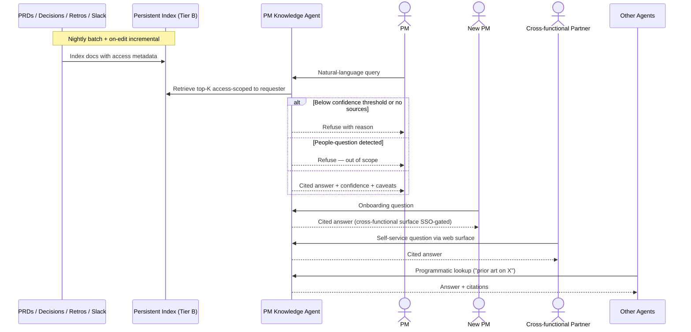

# PM knowledge agent — Spec

- **Horizon:** Later
- **Stage:** 5 — Post-release
- **Theme:** writing-docs
- **Owner:** TBD
- **Status:** Draft — **Deferred pending Tier B investment**

> **Tier B note.** This tool is explicitly deferred per the roadmap. It requires:
> (1) a persistent index store for embeddings across PRDs, decision logs, retros, and Slack;
> (2) an SSO-gated surface accessible to non-licensed PMs (per [`strategy/licensed-seats.md`](../strategy/licensed-seats.md));
> (3) provider-side data residency review on cross-source retrieval per the [security & data envelope](../governance/security-data-envelope.md).
> The spec exists to define the target so engineering can scope the investment, not because the tool is plannable today.

## Why this tool, why now (when Tier B lands)

PM knowledge decays fast. Decisions made 18 months ago — why we shipped X over Y, what we tried in onboarding, why the auth model is what it is — live in PRDs nobody re-reads, retros nobody indexes, and Slack threads no one can find. New PMs onboard by asking the same questions; senior PMs repeat themselves; the org learns slowly and re-learns expensively.

This tool exists because the spine principle has a corollary: **the spine doesn't just guide the work, it accumulates the org's memory**. A Knowledge Retriever agent answers "what did we decide last time?" with citations, and every other Stage 4–5 tool gets smarter when it can query that history.

We sequence it last because:
- The index needs **content density**. PRDs from the assistant + decisions from the meeting pipeline + retros, all structured, are the corpus. Without them, RAG over the existing chaos is low-quality.
- The trust bar is **higher than any other tool** — hallucinated history is worse than no history.
- The infrastructure cost (persistent index + SSO surface) is non-trivial and competes with engineering work elsewhere.

## What we mean by "PM knowledge agent"

This tool is a **RAG-backed question-answering surface** over the org's PRDs, decision logs, retros, and (opt-in) Slack. The agent answers with citations to source documents; it refuses to answer without sources.

**In our definition:**
- Natural-language question → cited answer
- Source scope: PRDs (Confluence), decision logs (output of meeting pipeline + manually filed), retros (Confluence), Slack (opt-in, access-scoped)
- Recency-aware retrieval (prefer recent over stale, configurable)
- Cross-tool composition: other agents (PRD Drafter, Drift Detector) can call this agent for prior-art lookup

**Not what this tool does:**
- Answering customer-data questions (PII / regulated). Out of envelope.
- Answering people-level questions (performance, identity).
- Writing new artifacts. It synthesizes prior work; it doesn't author new work.
- Replacing PM judgment. It surfaces prior decisions; the PM still decides today.

## Problem

PMs lose org memory continually, and three failure modes recur:

1. **Decision archaeology.** "Why did we pick X over Y in 2024?" requires re-reading 8 docs, 3 Slack threads, and one half-remembered conversation. 90% of PMs give up and re-decide.
2. **Re-litigation.** A decision made and forgotten is re-debated 6 months later, often landing somewhere different, creating drift between past and present.
3. **New-PM onboarding tax.** New PMs spend their first two months asking questions the org already answered. The answers exist; they're just not retrievable.

The tool's job is to make a **cited, recency-aware, refuse-when-unsure** answer the easy path, with the trust bar high enough that the answer is actionable.

## Users & jobs-to-be-done

**Primary:** PMs/POs investigating prior decisions, context, or analogous work.
**Secondary:** New PMs onboarding; cross-functional partners (eng leads, designers) asking PM-context questions; other agents querying programmatically.

1. *Why did we decide X?* — find the decision, the rationale, and the source.
2. *What did we try last time in this area?* — analogous-work lookup.
3. *Who owned this, and is it still active?* — provenance + status.
4. *Show me the PRDs that touched this surface* — broad-area surface lookup with citations.

## In scope (v1)

- Natural-language query → cited answer using the Knowledge Retriever agent.
- Source scope: Confluence (PRDs, decision logs, retros) + (opt-in, per-PM) Slack channels the PM has access to.
- Recency-bias options: `none`, `prefer_recent`, `only_last_N_months`.
- Citation-only answers: every claim cites a source URL with excerpt; uncited claims are not produced.
- Low-confidence handling: surfaces as "I found weak evidence" rather than confident answers.
- Refuse paths: people-questions ("who's better at X?"), regulated-data questions, and out-of-corpus topics.
- Cross-tool API: PRD Drafter, Drift Detector, others call this agent during their own runs.

## Out of scope (v1)

- Customer-data corpus (support tickets, customer interviews containing PII). Requires T3 review.
- Real-time answers from live Slack (no streaming ingest). Batch-indexed only.
- Synthesizing new positions from conflicting prior decisions. The tool surfaces the disagreement; PM resolves.
- Multi-org / cross-tenant retrieval.
- Answering questions about people.

## Capabilities

| Capability | Output | Trust gate |
|---|---|---|
| Cited answer to natural-language question | Answer text + per-claim citation + confidence + caveats | Refuses below confidence threshold |
| Recency-bias selection | Per-query recency control | Defaults to `prefer_recent`; PM overrides |
| Slack inclusion (opt-in) | Slack-sourced citations | Respect requesting PM's channel access |
| Refuse on out-of-scope | Out-of-scope reason returned, not a guess | Hard bar |
| Cross-tool API | Programmatic answer + citations | Callers handle confidence; downstream display gates apply |

## Integrations

- **Knowledge Retriever** ([agent](../governance/agent-library.md#8-knowledge-retriever)) — core component.
- **Citation Verifier** ([agent](../governance/agent-library.md#10-citation-verifier)) — mandatory post-step.
- **PII Scrubber** ([agent](../governance/agent-library.md#9-pii-scrubber)) — on ingress and on output (Slack-sourced excerpts).
- **Persistent index store** (Tier B) — vector store + metadata for source documents.
- **Confluence** — read PRDs, decision logs, retros (the cleanest, structured corpus).
- **Slack** — opt-in per PM; access-scoped to requester.
- **SSO surface** (Tier B) — enables non-licensed PMs to query the agent without a Claude Code seat.

## UX surfaces

1. **Web surface** (Tier B, SSO-gated) — primary surface for non-licensed PMs and cross-functional partners.
2. **Slack slash command** — `/recall <query>` returns the answer in-thread.
3. **Confluence sidebar widget** — context-sensitive: viewing a PRD prompts "related prior decisions?" answers.
4. **Programmatic API** — other agents query it during their own runs (e.g., PRD Drafter calls it for "prior work in this area").

The web surface is the only standalone surface on the roadmap — justified because non-licensed PMs cannot reach the tool through Slack/Confluence-licensed channels at scale.

## Trust & safety

- **No uncited claims.** Hard bar. Every sentence in an answer carries a citation; uncited claims are not produced.
- **Refuse, don't guess.** Out-of-corpus queries get a refusal with reason ("I found 0 sources in scope") rather than a hallucinated answer.
- **Confidence-aware surfacing.** Low-confidence answers (<0.6) are labeled "weak evidence" and explicitly say so.
- **PII Scrubber on ingress and output.** Especially important on Slack-sourced excerpts.
- **No people questions.** Performance, identity, opinions about individuals are refused with "out of scope."
- **Slack access respects requester.** The agent never returns citations from channels the requesting PM cannot access.
- **No customer-data corpus.** Tickets, support data, customer interviews are not in scope without T3 envelope review.
- **Index freshness shown alongside answer.** "Indexed N days ago" surfaces; refuse if index is >7 days stale (per the Knowledge Retriever agent's contract).
- **Conflicting sources are surfaced as conflicts.** The agent does not synthesize a winner when prior decisions disagree.

## Success metrics

| Metric | Target |
|---|---|
| Citation verification pass rate | >0.99 (hard bar) |
| Answer factuality (sampled audit) | >0.90 |
| Refusal-when-should-have-answered rate | <0.10 |
| PM-rated answer usefulness | >70% useful |
| Weekly active PMs (incl. non-licensed) | >50% within 1 quarter of GA |
| "I re-decided what we already decided" incidents (qtly retro signal) | -50% |

## Rollout phasing

1. **Alpha (internal, licensed PMs only):** Confluence corpus only. Slack slash command. 3 PMs. Validates citation precision and refusal behavior.
2. **Beta:** Slack opt-in ingest, programmatic API for other agents. 15 PMs.
3. **GA (requires Tier B SSO surface):** Web surface for non-licensed PMs and cross-functional partners. Confluence sidebar widget. Conflict-surfacing UI.

## Dependencies & open questions

- **Hard dependency:** Tier B infrastructure — persistent index store, SSO surface. Without these, this tool can run as an alpha-only internal toy but cannot reach the audience it's built for.
- **Hard dependency:** Corpus density. PRDs from the *PRD drafting assistant*, decisions from *Meeting → artifact pipeline*, structured retros. Without structured upstream content, RAG quality is low.
- **Depends on:** Knowledge Retriever, Citation Verifier, PII Scrubber.
- **Open:** Index update cadence. Real-time on PRD edit? Nightly batch? Lean toward batch with on-edit incremental updates for PRDs (the most-edited corpus).
- **Open:** Slack ingest scope. Per-PM opt-in (each PM enables which channels) vs. team-level opt-in. Per-PM is safer but slower to populate.
- **Open:** Retros are a goldmine for "what did we try" — but they're often unstructured. Do we require a structured retro template upstream? Probably yes for high-quality retrieval.
- **Open:** How to handle conflict surfacing in UI. List both sides? Show the more recent? Confluence-sidebar widget needs a tight UX here.
- **Risk:** Customer-data leak via Slack ingest. A PM enables a channel that contains support escalations. Mitigation: scrubber + per-channel pre-ingest scan for PII signature; refuse to ingest channels above threshold.
- **Risk:** Confident-wrong answer on a high-stakes decision. Mitigation: confidence threshold + caveat surfacing + hard refusal below 0.6 + sample audit of high-confidence answers.
- **Risk:** Index staleness erodes utility. Mitigation: agent contract requires refusal if index >7d stale.

## Retrieval mechanics

### Indexing

1. Nightly batch crawl of Confluence (PRD space, decision log space, retro space).
2. On-edit incremental update for PRDs (webhook → embed → upsert).
3. Slack ingest is per-PM opt-in: PM enables channels, scrubber runs, embeddings stored with access metadata.
4. Index metadata includes source URL, last-modified, source class (PRD / decision / retro / Slack), team owner, accessor allowlist (Slack only).

### Query

1. PM submits query + recency-bias choice.
2. Embed query, retrieve top-K from index, scoped to documents the requester can access.
3. Knowledge Retriever assembles answer with per-claim citations.
4. Citation Verifier runs (mandatory) on every claim.
5. Confidence computed; low-confidence answer is labeled.
6. Refusal paths: no sources retrieved → refuse with reason; sources retrieved but Citation Verifier fails on >50% of claims → refuse with reason; people-question detection → refuse.

### Conflict surfacing

1. If two sources contradict on the queried point, both are returned with their dates.
2. Tool labels the conflict explicitly ("Sources disagree: 2024 PRD says X; 2025 retro says Y").
3. No synthesized winner.

## Evaluation criteria & metrics

### Layer 1 — Output quality

| Metric | Definition | Alpha | Beta | GA |
|---|---|---|---|---|
| Citation verification pass rate | Verified-and-accurate citations | >0.97 | >0.99 | >0.99 |
| Answer factuality (sampled audit) | Claims that check out | >0.85 | >0.90 | >0.95 |
| Refusal precision | Refusals that were correct refusals | >0.85 | >0.90 | >0.95 |
| False-refusal rate | Refusals where the corpus had the answer | <0.20 | <0.15 | <0.10 |
| Conflict-surfacing recall | Surfaced conflicts / known conflicts in test set | >0.70 | >0.80 | >0.90 |
| People-question refusal rate | Refusals on people-questions | 1.0 (hard bar) |

**Datasets:** golden Q&A pairs hand-built from real PM questions (n>200), refreshed quarterly. A 30-case adversarial set with deliberately-out-of-corpus questions the tool must refuse. A 20-case conflict set with known-disagreeing sources.

### Layer 2 — Product behavior

| Metric | Pass bar |
|---|---|
| Weekly active PMs | >50% within 1 quarter of GA |
| Per-query time-to-answer | <5s p50 |
| Per-PM weekly queries | >3 |
| Answer-rated useful | >70% |
| Answer-rated wrong | <5% |
| Refusal-rated annoying | <30% (high = false refusal common; PMs need confidence we're refusing the right things) |

### Layer 3 — Outcomes

| Metric | Target |
|---|---|
| "I re-decided what we already decided" incidents | -50% |
| New-PM onboarding "ramp time to first PRD" | -40% |
| Cross-functional partner self-service rate (questions answered without PM ping) | >40% |

### Guardrails

| Guardrail | Limit |
|---|---|
| Uncited claims in any answer | 0 (hard bar) |
| People-question answer (anything other than refusal) | 0 (hard bar) |
| Stale-index answers (>7d) | 0 (hard bar, per agent contract) |
| PII leak in answer | 0 (hard bar) |
| Slack-citation from channel requester cannot access | 0 (hard bar) |
| Cost per query | <$0.10 (GA) |

### Anti-metrics

- **Queries answered.** Confident wrongness is more dangerous than refusal.
- **Confidence calibration alone.** Calibrating to "looks right" pushes the model to hedge instead of refuse.
- **PM engagement minutes.** This tool should reduce time-to-answer, not maximize time-on-surface.

## Failure modes & mitigations

| Failure | What it looks like | Mitigation |
|---|---|---|
| Hallucinated citation | URL exists but doesn't say the claim | Citation Verifier mandatory |
| Confident wrong | High-confidence answer that's actually wrong | Sample audit of high-confidence answers; conflict surfacing |
| False refusal | Tool refuses a question the corpus could answer | Tunable refusal threshold; false-refusal feedback loop |
| Stale-index answer | Source updated yesterday, agent answers from old version | 7-day staleness refusal per agent contract |
| Customer-data leak | Slack channel ingest includes PII | Pre-ingest PII scan; refuse channels above threshold |
| Access-bypass via citation | Answer cites a Slack message the requester can't read | Per-citation access check |
| People-question slip | "Is Alice's PRD work good?" gets a substantive answer | People-question classifier with hard refusal |
| Conflict synthesis | Two contradicting sources, agent picks one | Both surfaced with dates; no synthesized winner |
| Corpus narrowness | PM expects breadth, tool indexed only PRDs | Index-scope display alongside answer; "I searched X, Y, Z" prelude |

## Cost & latency envelope (rough)

- **Index maintenance:** dominated by embedding cost on initial ingest; incremental updates are cheap. ~$200 one-time per 10k documents; ~$30/month maintenance.
- **Per query:** embedding lookup + small LLM synthesis + Citation Verifier. ~$0.05–$0.10.
- **p95 latency:** <4s per query (per agent contract).
- **Per-org monthly cost ceiling:** <$500 (GA).
- **Tier B infra:** persistent index store + SSO surface — separate engineering investment, not in this cost envelope.

## User-flow walkthroughs

### Persona flow

### Flow A — Decision archaeology

A new PM joining the payments team types in the web surface: "Why did we ship 3DS only for EU, not US?" Answer in 3 seconds: "EU 3DS shipped in 2024 to comply with PSD2 (cite: PRD `3DS-EU-2024.md`, decision log entry 2024-11-12). US 3DS was descoped as fraud-loss data showed the cost outweighed the chargeback reduction (cite: retro `payments-q4-2024.md` section 'Decisions deferred')." PM clicks both citations, reads the source, ships the new feature with the right context.

### Flow B — Slack slash command in-context

PM is mid-PRD on a new auth flow and types `/recall what did we try last time on session timeouts` in Slack. Tool replies in-thread: "Two prior efforts: (1) 2023 attempt landed 4-hour sliding window, rolled back after CS spike (cite: retro `auth-2023-q2.md`); (2) 2024 attempt was descoped pre-implementation (cite: PRD `auth-session-2024.md`, status 'cancelled'). Caveat: weak evidence (<3 sources)." PM avoids re-running the rollback play.

### Flow C — Refusal-then-redirect

PM types: "Who's the best at writing PRDs?" Tool refuses: "I don't answer questions about people. If you're looking for PRD style examples, try: 'show me well-rated PRDs from the last quarter' or 'PRDs in the X area.'" PM rephrases, gets a useful answer.

## Anti-goals

- **Won't answer without citations.** Hard bar.
- **Won't answer about people.** Hard bar.
- **Won't synthesize a winner from conflicting sources.** Surfaces conflict.
- **Won't index customer PII.** Out of envelope.
- **Won't ingest live Slack.** Batch + opt-in.
- **Won't ship without Tier B SSO surface.** Non-licensed PMs are the primary audience; without the surface, this is internal-only.
- **Won't replace PM judgment.** It surfaces; it doesn't decide.
