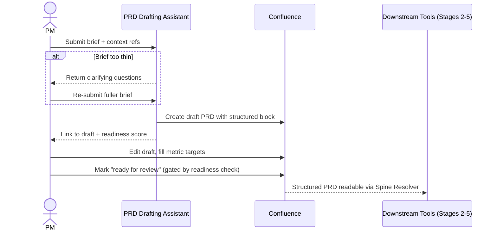

# PRD drafting assistant — Spec

- **Horizon:** Now
- **Stage:** 1 — Drafting
- **Theme:** writing-docs
- **Owner:** TBD
- **Status:** Draft

## Why this tool, why now

PRDs are the origin of the spine. Every Stage 2–5 tool on the roadmap (story writer, decomposer, grooming copilot, release notes, drift detector, knowledge agent) reads from a Confluence PRD — so the structural quality of PRDs is the upstream bottleneck on the entire fleet. Today PRDs ship in whatever shape the PM happens to write, which means downstream tools spend their first prompt re-extracting in-scope lists and success metrics from prose.

We build this first because it is the cheapest place to fix the spine. A 60-minute lift on PRD-to-first-draft is real PM time saved, but the larger payoff is that **every other tool on the roadmap gets easier** when the PRD ships with structured fields that downstream tools can consume verbatim.

## What we mean by "PRD drafting"

This tool takes a one-paragraph brief and produces a **structured first-draft PRD in Confluence** that the PM revises. The structure is non-negotiable: the in-scope list, success metrics, stakeholders, and open questions are typed fields downstream tools rely on.

**In our definition:**
- Brief → first-draft PRD using the team template
- Structured-field extraction (in-scope, out-of-scope, success metrics, stakeholders)
- Suggested problem framing and open questions
- Optional grounding from linked context (prior PRDs, Slack threads, customer signal) with citations

**Not what this tool does:**
- Updating PRDs already in flight — *Living spec sync* (Stage 5, Later) covers that gap. v1 is **greenfield-only**, per the roadmap.
- Deciding what to build — judgment stays with the PM; the tool drafts what they describe.
- Generating success-metric targets — suggests metric *shapes*, never invents numbers.
- Publishing the PRD — output lands as draft only.

## Problem

PMs put off PRDs because the blank page is expensive. They paste a Slack thread into a Confluence template, reshape it for an hour, leave the success-metrics section empty, and ship a narrative-only doc that downstream tools can't parse. Three failure modes recur:

1. **Time-to-first-draft is long.** A PM with a clear idea still spends 2–4 hours framing a PRD because formatting eats half the work.
2. **Structure decays.** Success metrics, stakeholders, and the in-scope list get omitted because they require thought the PM hasn't done yet — and there's no forcing function to come back.
3. **Downstream tools can't read it.** The story writer can't find "in scope" because the PRD has a paragraph called "What we're doing" instead. Every Stage 2–5 tool pays this cost on every read.

The tool's job is to make a **structured, citation-grounded, downstream-readable** first draft the easy path, not the heroic one.

## Users & jobs-to-be-done

**Primary:** PMs/POs drafting a new PRD from a brief, kickoff conversation, or Slack thread.
**Secondary:** Downstream-tool authors who depend on PRD structure (read indirectly via the spine).

1. *Turn this paragraph into a PRD draft* — give me a structured starting point in our template.
2. *Suggest the questions I haven't answered* — open-questions section pre-populated from gaps in the brief.
3. *Pull in what we already know* — ground the draft in linked prior PRDs and Slack threads, with citations.
4. *Stop me from publishing a draft missing the fields downstream tools need* — block publish if the structured block is incomplete.

## In scope (v1)

- Brief (1–3 paragraphs) → draft PRD in Confluence as **draft only**, never published.
- Team-template adherence: required sections present, headings match.
- Structured-field extraction populated: `problem`, `in_scope[]`, `out_of_scope[]`, `success_metrics[{metric, target}]`, `stakeholders[{name, role}]`, `open_questions[]`.
- Citations for any claim grounded in `context_refs` (prior PRDs, linked Slack threads, customer-signal sources).
- Clarifying-questions response: if the brief is too thin to draft, return a structured question list instead of a hallucinated draft.
- DoR-style readiness check on the structured block before the PM can mark the draft "ready for review."
- Confluence draft creation under the team's PRD space, with the agreed metadata (epic placeholder, owner, draft status).

## Out of scope (v1)

- Updates to existing PRDs (mid-flight changes). Covered by *Living spec sync* (Later).
- Direct publish to Confluence "active" status. v1 is draft only, always.
- Auto-creation of the Jira epic. Spine creation is a Stage-2 step; v1 stops at the PRD.
- Voice/audio input (defer until Meeting → artifact pipeline lands).
- Multi-PM collaborative drafting in real time. PM-by-PM in v1.
- Inventing success-metric targets. Metric shapes only.

## Capabilities

| Capability | Output | Trust gate |
|---|---|---|
| Brief → draft PRD | Confluence draft + structured block + citations | PM reviews, edits, manually publishes |
| Clarifying questions | Question list when brief is thin | PM answers, re-submits |
| Grounding from `context_refs` | Claims tied to source URLs in citations | Citation Verifier runs post-draft |
| Open-questions extraction | Section pre-populated from brief gaps | PM accepts/edits before publish |
| Stakeholder identification | Named people from org directory or context | Only names present in sources; PM confirms |
| Pre-publish readiness check | Structured-block completeness score | PM cannot mark "ready for review" if below threshold |

## Integrations

- **Confluence** (primary) — write draft pages in the team's PRD space; never publish.
- **Linked context sources** (read-only, optional): prior PRDs in the same space, Slack thread URLs the PM pastes, Productboard / Zendesk linkages the PM provides, Figma file / frame URLs the PM pastes (frame names and embedded comments only; no rendering, no design generation).
- **Org directory** — read-only for stakeholder name validation.
- **No Jira write in v1.** Epic creation is a Stage-2 act; the PRD stays a doc.

## UX surfaces

1. **Confluence page action** — "Draft a new PRD" button in the team's PRD space; opens a brief-input modal, returns to a draft page.
2. **Slack slash command** — `/draft-prd <brief>` in the PM's working channel; replies with a link to the Confluence draft.
3. **Plugin panel inside a draft** — once a draft exists, the panel shows missing structured fields, citation health, and the readiness score; PM iterates from there.

No standalone app surface (operating principle 5).

## Trust & safety

- Draft is created with Confluence "draft" status. The agent has **no publish permission**; only the PM publishes.
- Every grounded claim ships with a citation; uncited claims are flagged as "PM-supplied, no source."
- Success-metric **targets** are never invented. The tool suggests metric shapes (e.g., "Time to first response") and leaves the target field blank for the PM to fill.
- Stakeholders are only named when they appear in `context_refs` or the org directory. No fabrication.
- Brief-too-thin → clarifying questions, not a confident draft.
- PII scrubbing on the brief and any `context_refs` before model calls.
- Pre-publish readiness check blocks "ready for review" status if the structured block is incomplete; PM can override with a recorded reason.

## Success metrics

| Metric | Target |
|---|---|
| Time from brief to first reviewable draft | -60% (matches roadmap goal) |
| PRDs published with complete structured block | >90% within 1 quarter of GA |
| Downstream tool spine-resolution success rate against new PRDs | >95% |
| PM weekly active usage | >70% within 1 quarter of GA |
| Hallucinated stakeholder rate (sampled audit) | <0.005 |

## Rollout phasing

1. **Alpha (internal):** Brief → draft, no `context_refs`, no readiness check. 3 friendly PMs, 1 team. Validates structural quality of the output.
2. **Beta:** `context_refs` grounding + Citation Verifier + readiness check. Slack slash command. 10 PMs.
3. **GA:** All UX surfaces live, per-team template customization, downstream-tool spine-resolution telemetry feeding back into eval.

## Dependencies & open questions

- **Unblocks:** *Story & ticket writer* (Now), *Backlog grooming copilot* (Next), *Spec → sprint decomposer* (Next), *Release notes generator* (Now), *Living spec sync* (Later). All depend on the structured block this tool produces.
- **Depends on:** PRD Drafter agent ([governance/agent-library.md § 2](../governance/agent-library.md#2-prd-drafter)), PII Scrubber, Citation Verifier. No new infra — Tier A.
- **Open:** Per-team template variance. Do we ship one template with optional sections, or multi-template config? Single template + optional sections is cheaper but risks rejection from teams with strong existing conventions.
- **Open:** When the brief paraphrases an existing PRD, do we offer to "update that one instead" and route to Living Spec Sync, or always draft new? v1 always drafts new; the routing-to-update problem belongs to Living Spec Sync.
- **Open:** How aggressively to suggest metric *shapes*. Too few and the PM stares at an empty section; too many and the PRD ships with metrics no one tracks.
- **Risk:** PMs use the tool to skip the thinking. Mitigation: clarifying-questions mode for thin briefs, readiness check before "ready for review," edit-distance telemetry to spot rubber-stamping.

## Drafting mechanics

### Brief → draft

1. PII Scrubber on the brief and any `context_refs`.
2. Composability check on the brief: word count, presence of problem-framing language, presence of a target audience. Below threshold → clarifying-questions path.
3. PRD Drafter agent generates the draft against the team template with the structured-block schema enforced.
4. Citation Verifier runs across every grounded claim; failed citations marked, not removed.
5. Draft is written to Confluence under draft status with the structured block as a templated table at the top of the page.

### Clarifying-questions path

1. When the brief is too thin to draft, the tool returns a structured list of 3–8 questions: missing problem statement, missing target user, missing scope boundary, etc.
2. PM answers in the same modal; re-submission goes back to step 1 of the main path.
3. The clarifying-question list is itself a useful artifact — surfaces what the PM hasn't thought through yet.

### Pre-publish readiness check

1. Rubric Scorer agent reads the structured block.
2. Required fields scored individually: `in_scope` non-empty, `out_of_scope` non-empty, ≥1 `success_metric` with a non-null target, ≥1 named stakeholder.
3. Below threshold → "ready for review" status is gated; PM can override with a recorded reason that surfaces in the page's review-readiness banner.

## Evaluation criteria & metrics

Three layers, matching the rubric on the existing specs.

### Layer 1 — Output quality

| Metric | Definition | Alpha | Beta | GA |
|---|---|---|---|---|
| Structured-fields completeness | Fields populated correctly per audit | >0.85 | >0.95 | >0.98 |
| Citation verification pass rate | Citations that resolve to the claim | >0.95 | >0.98 | >0.99 |
| Hallucinated stakeholder rate | Named people not in sources | <0.05 | <0.02 | <0.005 |
| Hallucinated success-metric target | Targets the tool invented | 0 (hard bar) | 0 | 0 |
| Brief-too-thin detection accuracy | Thin briefs correctly routed to clarifying-questions | >0.80 | >0.90 | >0.95 |

**Datasets:** historical PRDs paired with the brief that preceded them (n>100), refreshed quarterly. A 30-brief adversarial set of deliberately thin briefs the tool must route to clarifying questions, not draft.

### Layer 2 — Product behavior

| Metric | Pass bar |
|---|---|
| Drafts published without any edit | <15% (high = rubber-stamping) |
| Edit distance per published PRD | Tracked; healthy non-zero |
| Median time-to-first-draft | <90s |
| PM-rated draft usefulness | >70% useful |
| Readiness-check override rate | <20% (high = check is too strict or PMs are bypassing) |

### Layer 3 — Outcomes

| Metric | Target |
|---|---|
| Time-to-first-reviewable-draft | -60% vs. pre-tool baseline |
| Downstream Spine Resolver success rate on PRDs from this tool | >95% |
| Story writer DoR pass rate on stories derived from this tool's PRDs | +10 points vs. baseline |
| PRDs published with all structured fields populated | >90% |

### Guardrails

| Guardrail | Limit |
|---|---|
| Auto-publish without PM action | 0 (never in v1) |
| Hallucinated success-metric targets | 0 (hard bar) |
| Hallucinated stakeholder rate | <0.02 (hard bar at GA) |
| PII regex matches in output | 0 |
| Cost per PM per month | <$5 (GA) |

### Anti-metrics

- **Drafts generated.** Volume isn't value.
- **Brief→draft time alone.** Optimizing for sub-30s drafts pushes the model toward generic templates; quality drops invisibly.
- **Published-without-edit rate.** High means PMs are rubber-stamping. Some non-zero edit distance is healthy.

## Failure modes & mitigations

| Failure | What it looks like | Mitigation |
|---|---|---|
| Hallucinated stakeholders | "Owner: Jane Doe" with no source | Only name from `context_refs` or org directory; sample audit |
| Invented success-metric targets | "Reduce churn by 25%" with no basis | Targets always blank; tool suggests metric shape only |
| Generic-template drafts | Every PRD reads the same | Tone variance + per-team grounding from prior PRDs |
| Brief-too-thin → confident draft | Tool guesses fields the brief didn't specify | Composability check routes thin briefs to clarifying-questions |
| Stale context grounding | Cited prior PRD has been deprecated | Grounding lookup checks `prd_last_modified`; >90-day docs flagged in the citation |
| Spine pre-creation drift | PRD published, epic never created, downstream tools fail to resolve | Pre-publish readiness check flags missing epic-link placeholder |
| PM rubber-stamping | Published-without-edit rate climbs | Edit-distance telemetry; nudge banner when PM's edit-distance trend goes flat |

## Cost & latency envelope (rough)

- **Brief → draft:** 1 long-context LLM call + ≤5 grounding lookups + Citation Verifier on N claims. ~$0.15–$0.30 per draft.
- **Clarifying questions:** small LLM call. ~$0.01.
- **Readiness check:** Rubric Scorer call. ~$0.005.
- **p95 latency:** <12s for full draft, <2s for clarifying-questions or readiness check.
- **Per-PM monthly cost ceiling:** <$3 (alpha), <$5 (GA).

## User-flow walkthroughs

### Persona flow

### Flow A — Brief in Confluence → first draft

PM opens the team PRD space, clicks *Draft a new PRD*, pastes a 2-paragraph brief about adding SSO for B2B customers. Within 10 seconds a draft page appears: problem framing, in-scope (SSO for SAML and OIDC providers, admin provisioning UI), out-of-scope (SCIM, custom IdPs), three suggested success-metric shapes with blank targets, two named stakeholders pulled from the org directory based on the linked prior SSO PRD, and four open questions. PM spends 20 minutes editing — fills in metric targets, adds a fifth open question, removes one out-of-scope item. Marks ready for review. Total time to first reviewable draft: ~25 minutes vs. the usual 3 hours.

### Flow B — Slack brief routed back to clarifying questions

PM in `#product-mobile` types `/draft-prd we should improve onboarding`. The tool responds in-thread: "Brief is thin. Before drafting, I need to know: who is the target user (new sign-up, returning churned, both?), what's the current onboarding completion baseline, what specifically is broken, and is this a re-design or a polish pass?" PM realizes they don't actually have an answer to question 2, pings the analytics PM, comes back with numbers, and re-submits a fuller brief.

### Flow C — Pre-publish readiness check catches a gap

PM finishes editing a draft and clicks "ready for review." The readiness check fires: `success_metrics` has a metric shape but no target on it. The publish banner shows: "1 readiness gap — success-metric target empty." PM either fills in the target or overrides with reason "target TBD pending data review." If they override, the banner persists on the published PRD so reviewers see the gap explicitly.

## Anti-goals

- **Won't publish PRDs.** The agent has no publish permission. PM publishes.
- **Won't invent success-metric targets.** Numbers are PM judgment.
- **Won't update existing PRDs.** That's Living Spec Sync's job, in a later horizon.
- **Won't fabricate stakeholders.** Only names from sources or directory.
- **Won't draft from a thin brief.** Clarifying-questions path is the right answer, not a confident guess.
- **Won't create Jira epics.** Spine creation is Stage 2.
