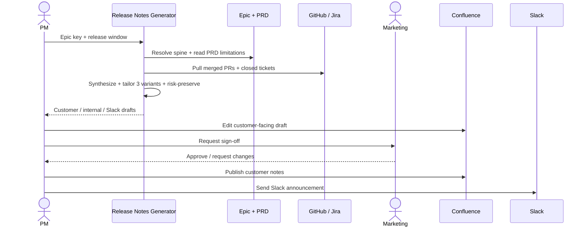

# Release notes generator — Spec

- **Horizon:** Now
- **Stage:** 4 — Release
- **Theme:** writing-docs
- **Owner:** TBD
- **Status:** Draft

## Why this tool, why now

Release notes are the most reliably-procrastinated PM artifact in the lifecycle. They sit between "feature is done" and "users hear about it," they require synthesizing across Jira, GitHub, and Confluence under deadline pressure, and they ship in three formats to three audiences (customers, internal teams, Slack). PMs end up writing them twice — once in a rush before launch and once again after customer feedback reveals what was unclear.

This is also the cleanest test on the roadmap of the **Spine Resolver + Source Synthesizer + Audience Tailor** composition. If we cannot ship release notes from an epic + merged PRs reliably, the rest of the Stage 4 / Stage 5 tools (stakeholder comms, cross-functional launch checklist, drift detection) inherit the same trust problem at a worse scale.

## What we mean by "release notes generation"

This tool synthesizes merged PRs and closed tickets under a Jira epic into **three audience-specific variants of the release note**: customer-facing notes, internal changelog, and a Slack announcement. The synthesis is grounded in the spine; the audience variants are tailored from one source artifact, never re-synthesized per audience.

**In our definition:**
- Epic + release window → structured shipped-feature summary with citations
- One source artifact → three audience variants (customer, internal, Slack)
- Citation back to every PR / ticket / PRD section referenced
- Risk-preservation: if the source surfaces a known limitation, audience variants must too

**Not what this tool does:**
- Authoring new feature copy not grounded in shipped work — that's marketing's job
- Publishing to customer surfaces. The tool produces drafts; PM (and marketing where applicable) publishes.
- Generating notes from a "ship date" rather than an epic. Spine-first; no epic, no notes.
- Cross-epic release-rollup. v1 is one epic at a time. Bundled releases compose multiple tool runs.

## Problem

Release notes are written under deadline by PMs who haven't been close to every PR that merged this sprint. Three failure modes recur:

1. **Forgotten shipped work.** A small PR that fixed a real customer-facing bug never makes it into the notes because the PM was on PTO when it shipped.
2. **Audience-mismatched content.** Customer notes read like engineering changelogs ("refactored the payment processor"), or internal changelogs read like marketing ("we're thrilled to announce…"). PMs rewrite both.
3. **Lost limitations.** Known caveats from the PRD don't survive the trip to the customer note. Users find them in production and file tickets.

The tool's job is to make a **grounded, audience-tailored, risk-preserving** release note set the default, with three drafts ready for review in under five minutes.

## Users & jobs-to-be-done

**Primary:** PMs/POs preparing release notes for a shipped epic.
**Secondary:** Marketing and CS reviewing customer-facing variants before publish.

1. *Show me what actually shipped under this epic in this window* — every PR and ticket grouped, with PRD attribution.
2. *Draft the three audience versions* — customer-facing, internal changelog, Slack announcement.
3. *Preserve the limitations* — if the PRD said "known limitation: X," every variant says so in audience-appropriate language.
4. *Give me a diff between source and variant* — so I can spot reframing that changed substance.

## In scope (v1)

- Spine-resolved input: PM provides an epic key (or PRD URL) and a release window.
- Source Synthesizer pulls merged PRs (linked to the epic via PR description or commit message) and closed tickets in the window.
- Structured shipped-feature summary with citations to every PR / ticket.
- Three audience variants via Audience Tailor: customer-facing, internal changelog, Slack announcement.
- Risk-preservation enforcement: PRD's `known_limitations` section (when present) is carried into all variants.
- Citation Verifier on the customer-facing variant at strict mode before surfacing.
- Confluence draft page for customer-facing notes; Markdown for internal changelog; Slack message preview for the announcement.

## Out of scope (v1)

- Auto-publish to any customer surface (status page, in-product, marketing site).
- Multi-epic rollup releases. PM composes via multiple tool runs.
- Translation into non-English locales.
- Visual assets (screenshots, GIFs, hero images). Notes are text-only in v1.
- Sales-deck slide generation. *Stakeholder comms tailoring* covers downstream audience variants.

## Capabilities

| Capability | Output | Trust gate |
|---|---|---|
| Spine resolution | Epic + linked PRD + release window | Fails loudly on unresolved spine |
| Shipped-work synthesis | Structured list of shipped items with PR / ticket citations | PM reviews source before variants generate |
| Customer-facing variant | Confluence draft in the team's release-notes space | Marketing review + PM sign-off before publish |
| Internal changelog | Markdown body for the internal release log | PM reviews, posts |
| Slack announcement | Slack message preview with channel selector | PM edits, sends |
| Risk preservation | Limitations from PRD carried to all variants | Variant blocked from finalizing if PRD limitation is missing |
| Citation verification | Per-claim source verification on customer-facing variant | Customer variant cannot be sent without `overall_pass: true` |

## Integrations

- **Spine Resolver** ([agent](../governance/agent-library.md#1-spine-resolver)) — epic + linked PRD.
- **Source Synthesizer** ([agent](../governance/agent-library.md#5-source-synthesizer)) — template: `release_notes`.
- **Audience Tailor** ([agent](../governance/agent-library.md#6-audience-tailor)) — three variants: `customer`, `internal`, `slack`.
- **Citation Verifier** ([agent](../governance/agent-library.md#10-citation-verifier)) — strict mode on customer-facing variant.
- **GitHub** — read merged PRs with epic-linked metadata.
- **Jira** — read closed tickets under the epic in the window.
- **Confluence** — read PRD (limitations section especially); write customer-facing draft to the release-notes space.
- **Slack** — output only (Slack variant draft); PM sends.

## UX surfaces

1. **Jira epic action** — "Draft release notes" button on the epic page; opens a modal with release-window selector and audience checkboxes.
2. **Slack slash command** — `/release-notes <epic-key>` returns links to the three variant drafts.
3. **Confluence release-notes space** — draft pages appear under a "Drafts — for review" parent page until the PM publishes.

No standalone app surface (operating principle 5).

## Trust & safety

- Customer-facing variant is **never published** by the tool. It lands as a Confluence draft for marketing + PM sign-off.
- Slack announcement is a **draft message**, not auto-sent. PM clicks send.
- Risk-preservation is a hard bar: any `known_limitations` in the source PRD must appear in every audience variant (in audience-appropriate language). Variants that strip a limitation are blocked from finalizing.
- Citation Verifier runs in strict mode on the customer-facing variant. `overall_pass: false` blocks publish.
- PII Scrubber on every model-call ingress (synthesis input and audience-tailoring input).
- Customer-facing variant is treated as `Public` data class on egress; intermediate synthesis is `Internal`. No customer identifiers in any variant.

## Success metrics

| Metric | Target |
|---|---|
| Time from "epic shipped" to first reviewable note set | -70% |
| Releases with all three variants published from the tool's drafts | >80% within 1 quarter of GA |
| Limitations from PRD appearing in customer variant | 100% (hard bar) |
| Audience-fit rating (per variant, PM-rated) | >75% appropriate |
| Citation verification pass rate on customer variant | >0.99 |

## Rollout phasing

1. **Alpha (internal):** Internal changelog only. 1 team, 3 friendly PMs. Validates Source Synthesizer accuracy on shipped-work extraction before audience variants ship.
2. **Beta:** All three variants. 5 PMs. Marketing review process documented; risk-preservation enforcement live.
3. **GA:** Full UX surfaces, per-team release-notes-template customization, marketing approval workflow integrated.

## Dependencies & open questions

- **Depends on:** Spine Resolver, Source Synthesizer, Audience Tailor, Citation Verifier, PII Scrubber. All in the agent library — Tier A.
- **Depends on:** *PRD drafting assistant* (Now). PRDs need a structured `known_limitations` section for risk-preservation to work; legacy PRDs without it degrade to "no enforcement, but PM warned."
- **Open:** How does the tool know what's "the release window"? Default to "since last published note for this epic"? Or PM picks explicitly? v1 leans on explicit selection with a "since last note" default.
- **Open:** Marketing's role in the customer-facing variant. Is it a hard gate (PM cannot publish without marketing sign-off) or advisory? Per-team config most likely.
- **Open:** Do we generate notes for an in-progress epic on partial PRs? v1 says no — epic must be in a "release-ready" state.
- **Risk:** PR-to-epic linkage hygiene. If PRs aren't consistently linked to epics, the synthesizer misses shipped work. Mitigation: surface "unlinked PRs that merged in this window from these contributors" as a sidecar for PM to triage.
- **Risk:** Marketing rejection cycle. If marketing always rewrites the customer-facing variant, our edit-distance signal will look bad even when the tool is doing its job. Mitigation: separate marketing-rewrite telemetry from PM edits.

## Generation mechanics

### Shipped-work synthesis

1. Spine Resolver returns the epic + linked PRD.
2. Source Synthesizer pulls:
   - Merged PRs in the window with epic-link metadata (description, commit message, or Jira-linked PR).
   - Closed Jira tickets under the epic in the window.
   - PRD's `known_limitations` section.
3. Items are clustered by user-facing impact (bug fix, new capability, UX change, breaking change). Internal-only items (refactors, deps) are filtered from customer variant but kept in internal changelog.
4. Each item carries a citation: PR URL, ticket key, PRD section.
5. Risk-preservation check: extract `known_limitations`. Each must appear in every audience variant.

### Audience tailoring

1. Audience Tailor receives the synthesis output as `source`.
2. Three variants generated in parallel: `customer`, `internal`, `slack`.
3. Tailor's `source_diff` is surfaced in the plugin so PM can see what was emphasized, de-emphasized, or reframed.
4. Risk-preservation rule from the source enforces: every limitation token must appear in each variant.
5. Customer variant goes through Citation Verifier in strict mode. Fail → variant marked "needs revision," surface failures to PM.

### Publishing

1. Customer variant: Confluence draft created, marketing-review label applied per team config.
2. Internal changelog: markdown body returned to PM; PM commits to the internal release log.
3. Slack announcement: draft message returned with channel selector; PM sends.

## Evaluation criteria & metrics

### Layer 1 — Output quality

| Metric | Definition | Alpha | Beta | GA |
|---|---|---|---|---|
| Shipped-work coverage | % of in-window merged-PRs cited in synthesis | >0.90 | >0.95 | >0.98 |
| Factual accuracy (sampled audit) | Claims that check out | >0.95 | >0.98 | >0.99 |
| Citation verification pass rate (customer variant) | Per-claim verification | >0.95 | >0.98 | >0.99 |
| Risk-preservation rate | PRD limitations carried to each variant | 1.0 (hard bar) | 1.0 | 1.0 |
| Audience-fit rating | PM-rated variant appropriateness | >65% | >75% | >85% |

**Datasets:** historical epics paired with their shipped release notes (n>50 across 5 teams), refreshed quarterly. A 30-item adversarial set of epics with deliberate limitations to ensure risk-preservation holds.

### Layer 2 — Product behavior

| Metric | Pass bar |
|---|---|
| Variants published unedited | <10% (high = rubber-stamping; high on customer variant is dangerous) |
| PM edit distance per variant | Tracked; customer variant edit distance < internal variant edit distance (customer should be more polished by tailor) |
| Time-to-three-variants | <8 minutes p50 |
| PM-rated usefulness per variant | >75% useful |

### Layer 3 — Outcomes

| Metric | Target |
|---|---|
| Time from "epic shipped" to first reviewable note set | -70% vs. pre-tool baseline |
| Releases publishing all three variants from tool drafts | >80% |
| Post-release "missing from notes" CS tickets | -50% |
| Marketing rewrite rate on customer variant | Tracked; should decline over time as tailor learns voice |

### Guardrails

| Guardrail | Limit |
|---|---|
| Customer-facing publish without PM action | 0 (never in v1) |
| Citation verification failures on published customer variant | 0 (hard bar) |
| Risk-preservation failures (limitation dropped from a variant) | 0 (hard bar) |
| PII regex matches in any variant | 0 |
| Cost per release | <$1 (GA) |

### Anti-metrics

- **Releases generated.** Volume isn't value.
- **Variants accepted without edit.** Especially on customer variant — non-zero edit distance is healthy.
- **Synthesis recall alone.** A 100%-recall synthesis that nobody reads isn't useful; we measure variant publish rate too.

## Failure modes & mitigations

| Failure | What it looks like | Mitigation |
|---|---|---|
| Missed shipped PR | Important fix not in any variant | Sidecar surfaces in-window merged PRs not epic-linked; PM triages |
| Customer variant strips a limitation | Source said "Safari unsupported," customer variant doesn't | Risk-preservation enforcement; variant blocked from finalizing |
| Audience-mismatched content | Customer variant reads like changelog | Tailor's `source_diff` surfaced; PM-rated audience-fit feeds eval |
| Hallucinated PR / ticket | Synthesizer cites something that doesn't exist | Citation Verifier on all variants; strict mode on customer |
| Marketing rewrites everything | High marketing-rewrite signal | Per-team voice training; partial-template customization at GA |
| Stale PRD | Notes generated from a PRD updated mid-flight | Spine Resolver returns `prd_last_modified`; >30d gap warns PM |
| Cross-epic contamination | PRs linked to two epics counted in both | Synthesizer dedupes by PR URL; cross-epic PRs flagged for PM to assign |
| Customer-identifier leak | Bug-report-derived PR mentions a customer | PII Scrubber on ingress; sample audit on customer variant |

## Cost & latency envelope (rough)

- **Synthesis:** Source Synthesizer call over ~30 PRs / ~50 tickets / PRD. ~$0.20–$0.35 per epic.
- **Audience tailoring:** 3 variants × ~$0.02 each = ~$0.06.
- **Citation Verifier (strict on customer variant):** ~$0.05 for ~50 claims.
- **Per-release total:** ~$0.40 typical.
- **p95 latency:** <25s for synthesis + 3 variants, end-to-end.
- **Per-team monthly cost ceiling:** <$50 (GA, ~10 releases/team/month).

## User-flow walkthroughs

### Persona flow

### Flow A — Epic shipped Friday, notes by Monday

PM closes the last ticket under the "Payment Methods v2" epic on Friday afternoon. Monday 9am, PM opens the epic, clicks *Draft release notes*. Tool synthesizes 22 PRs, 31 tickets, and the PRD's two known limitations (Apple Pay support is iOS-15-plus only; recurring-billing not in v2). Three variants ready in 20 seconds. PM reviews customer variant in Confluence — adds a sentence about the upgrade path, otherwise ships as-is. Internal changelog goes to the team log. Slack announcement gets a tweak to the tone and sends to `#product-announcements`. Total time: ~12 minutes vs. the usual 2 hours.

### Flow B — Risk-preservation catches a dropped limitation

Tool drafts the customer variant for an "Export to CSV" epic. The PRD's limitations section says "exports cap at 100k rows." Audience Tailor's first pass on the customer variant omits the cap (it's polishing for a marketing-leaning audience). Risk-preservation check fires: variant blocked, surface to PM with the missing limitation highlighted. PM accepts the auto-suggested phrasing ("Note: exports include up to 100,000 rows; larger exports paginate.") and the variant unblocks.

### Flow C — Unlinked-PR sidecar

PM drafts notes for an iOS epic. Sidecar surfaces: "5 PRs merged in this window by iOS contributors are not epic-linked. Review?" PM clicks through, recognizes one as a real customer-facing change that the eng team forgot to link, manually attaches it. Re-generate runs, the PR appears in all three variants. Without the sidecar, the change would have shipped silently to customers.

## Anti-goals

- **Won't publish to customers.** Drafts only. PM (and marketing where applicable) publishes.
- **Won't draft from a missing spine.** No epic, no notes.
- **Won't strip limitations.** Risk-preservation is a hard bar.
- **Won't bundle epics.** Cross-epic rollups are multi-run compositions, not a tool feature in v1.
- **Won't generate visuals.** Text-only; visuals stay with marketing.
- **Won't auto-translate.** Locale variants are a deliberate later investment.
