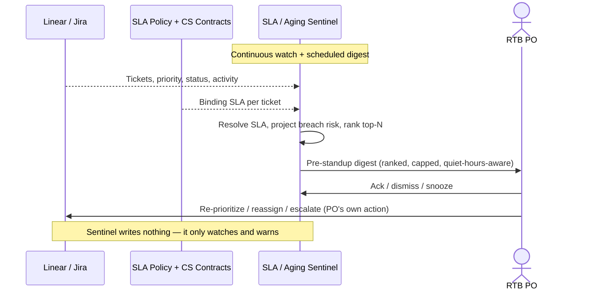

# SLA / aging sentinel — Spec

- **Horizon:** Now
- **Stage:** 3 — Execution
- **Theme:** backlog-delivery
- **Owner:** TBD
- **Status:** Draft

## Why this tool, why now

The Run-The-Business backlog runs on a clock the feature roadmap doesn't have: the **SLA**. A P1 defect has hours; a P2 has days; a customer-reported bug under a support contract has a contractual deadline. The RTB PO ([Jordan](../personas/jordan-rtb-po.md)) doesn't run a sprint he can burn down — he runs an aging queue where the worst outcome is a ticket quietly breaching its SLA and CS opening a complaint *before he knew it was at risk*. "SLA risk visible before it bites" is one of his four core motivations, and today it's invisible until it's a complaint.

The *Proactive sprint agent* ([spec](./proactive-sprint-agent.md)) is the closest tool on the roadmap, but it is **sprint-scoped** — its unit is the active sprint, its signals are PR-stalls and velocity drift, its narrative is "trending behind by 1.5 days." None of that applies to a PO with no fixed sprint and an interrupt-driven queue. The sentinel is the RTB analog: same "surface the risk before standup" instinct, but the clock is the **SLA**, not the sprint.

This is the lowest-effort, highest-immediate-value RTB tool, which is why it sits in **Now**. It is read-only — it watches aging against a known SLA policy and surfaces breach risk. It writes nothing, decides nothing, and so clears the trust bar early while delivering a daily habit (the morning at-risk view) the PO will use every day.

## What we mean by "sentinel"

A **sentinel watches a clock and warns before it runs out** — it does not triage, prioritize, or fix.

**In our definition:**
- Watch every open ticket's age against its priority's SLA.
- Project breach risk *before* the deadline, weighted by how much work the ticket likely still needs.
- Surface a ranked, top-N at-risk view (pull) and a tight pre-standup digest (push).
- Catch SLA-relevant state: a P-bump that shortens the deadline, a reopen that resets nothing, a ticket idling with the clock running.

**Not what this tool does:**
- Triaging arrivals or assigning the initial SLA — that's the *Incoming defect triage copilot* ([spec](./incoming-defect-triage-copilot.md), Next), which starts the clock and hands it here.
- Deciding what to do about a breach — re-prioritizing, escalating, reassigning are PO actions; the sentinel surfaces, the PO acts.
- Backlog maintenance — staleness, duplicates, drift → *Backlog grooming copilot* ([spec](./backlog-grooming-copilot.md), Next).
- Reporting SLA performance up the chain → *Weekly status synthesizer* (Now) consumes the sentinel's data; the sentinel itself is an operational watch, not a report.
- Any autonomous write or notification beyond the PO's own digest.

## Problem

SLA breaches happen for boring, predictable reasons the PO only sees too late:

1. **Silent aging.** A P2 lands Friday, sits over the weekend, and is half a day from breach Monday morning — but nothing surfaced it until CS asked "where is this?"
2. **The deadline moved.** A P3 gets bumped to P1 after a second customer hits it; the SLA window collapses from a week to hours, and the clock nobody reset is now red.
3. **Idle-with-clock-running.** A ticket is "in progress" but untouched for three days; the assignee is on PTO; the SLA keeps ticking.
4. **Breach-by-surprise.** The first signal of a breach is the complaint, not the risk. The PO is explaining a miss instead of preventing it.

The tool's job is to make the **ranked, cited, before-it-bites** at-risk view the easy thing to see — every morning, and ahead of every standup and CS sync.

## Users & jobs-to-be-done

**Primary:** the RTB PO ([Jordan](../personas/jordan-rtb-po.md)) — an aging queue under SLA, no fixed sprint, twice-weekly standups, weekly CS/Support sync, monthly incident review.
**Secondary:** on-call engineers who want to see what's about to breach before standup; CS leads who want fewer "where is this?" surprises.

1. *Show me what's about to breach* — tickets aging past their priority's SLA, ranked by risk, before I'm in standup hearing about it.
2. *Catch the deadline that moved* — a P-bump or reopen that shortened the window, so the clock that quietly went red surfaces.
3. *Give me a tight morning view* — the top-N at-risk, with evidence, not a 312-item firehose.
4. *Don't make me a metrics analyst* — surface the risk; I decide what to do about it.

## SLA-policy and origin grounding

The sentinel is only as honest as the SLA policy it watches against. Its grounding is the **team's priority→SLA table** plus, where present, the **contractual SLA on the originating support ticket**.

| Tier | SLA source | Tool behavior |
|---|---|---|
| **Policy-bound** | Ticket priority maps to a defined SLA in the team policy table | Full watch. Deadline = arrival (or last P-change) + policy window. Breach risk projected against it. |
| **Contract-bound** | Originating CS ticket carries a contractual SLA tighter than policy | Watch against the *tighter* of the two; surface which one is binding. |
| **Unbound** | No priority-to-SLA mapping (e.g., an untriaged or no-priority ticket) | Surfaced as **SLA-unset** with a prompt: "no SLA — triage to set a clock." Aging still shown (raw age), but no breach projection is asserted. |

The sentinel **shares the priority→SLA mapping with the triage copilot** rather than duplicating it — triage starts the clock, the sentinel watches it. An unbound ticket is surfaced, not silently un-watched.

## In scope (v1)

- **SLA resolution** (runs first) — for every open ticket, resolve its binding SLA via the policy table and originating-CS contract; classify into the tier table above.
- Age tracking — time since arrival (or last SLA-relevant state change) against the binding deadline.
- Breach-risk projection — `risk = f(time-to-deadline, remaining-work estimate, recent activity)`; rank descending.
- SLA-relevant state detection — priority changes that move the deadline, reopens, and idle-with-clock-running (in-progress, no activity, deadline approaching).
- Ranked at-risk view (pull) — top-N open tickets by breach risk, each with its deadline, binding SLA source, and the reason it's at risk.
- Pre-standup / pre-CS-sync digest (push) — a tight, ranked, top-N morning summary; cadence and quiet hours per the PO.
- SLA-unset surfacing — tickets with no binding SLA, prompted for triage.
- PO ack/dismiss/snooze on each item; dismissals tune per-area ranking and suppress noise.

## Out of scope (v1)

- Any write to the backlog — re-prioritizing, reassigning, escalating, closing. All PO actions.
- Assigning the initial SLA on arrival — that's the triage copilot's job.
- Sending external escalations or CS-facing notifications. The sentinel's only output surface is the PO's own digest/view.
- SLA *reporting* / dashboards for leadership — the *Weekly status synthesizer* consumes this data; the sentinel is operational, not a report.
- Cross-area aggregation beyond the PO's two adjacent areas.
- Defining or changing the SLA policy itself — the sentinel reads the policy, it doesn't author it.

## Capabilities

| Capability | Scope | Output | Trust gate |
|---|---|---|---|
| SLA resolution | Every open ticket | Tier (policy / contract / unset) + binding deadline + binding source | None — internal; surfaces a prompt for unset |
| Age tracking | Open tickets | Time-to-deadline (or overdue) per ticket | None — display |
| Breach-risk projection | Policy/contract-bound tickets | Risk score + ranked order + reason | None — display; PO acts on it |
| SLA-state detection | Open tickets | P-bump-shortened, reopened, idle-with-clock flags | PO ack / dismiss |
| At-risk view | Top-N, per area | Ranked list + deadline + binding source + reason | PO ack / dismiss / snooze |
| Pre-standup digest | Top-N | Morning summary, ranked, quiet-hours-respecting | PO reads; no downstream write |
| SLA-unset surfacing | Unbound tickets | "no SLA — triage to set" prompt | PO triages / dismisses |

## Integrations

- **Backlog Auditor** ([agent](../governance/agent-library.md#4-backlog-auditor)) — aging/idle signal detection, run SLA-scoped rather than sprint- or epic-scoped.
- **Source Synthesizer** ([agent](../governance/agent-library.md#5-source-synthesizer)) — compile the at-risk reasons and the digest narrative.
- **Citation Verifier** ([agent](../governance/agent-library.md#10-citation-verifier)) — verify every "why it's at risk" reason against the ticket/policy before surfacing.
- **PII Scrubber** ([agent](../governance/agent-library.md#9-pii-scrubber)) — on any customer-derived text in reasons/digests.
- **Linear / Jira** — read tickets, priority, status, activity timestamps, hierarchy. Read-only.
- **SLA policy table** — the team's priority→SLA mapping. Shared with the *Incoming defect triage copilot*; the single source of truth for deadlines.
- **Zendesk / Intercom** — read *linked* contractual-SLA fields on originating CS tickets (no raw-thread crawl).
- **Incident tooling (PagerDuty)** — read-only, for incident-follow-up deadlines where they carry an SLA.
- **Slack** — output only (the PO's digest/DM). No Slack ingest.

## UX surfaces

1. **At-risk view** — a ranked, top-N web view (auth via Linear/Jira) of open tickets by breach risk, with deadline, binding SLA source, and reason. The PO's daily pull surface.
2. **Pre-standup / pre-CS-sync digest** — a tight morning Slack DM, ranked top-N, quiet-hours-respecting, off-by-default for any area the PO hasn't opted in.
3. **Plugin badge** in the Linear/Jira ticket sidebar — on an open ticket: its deadline, time remaining, and at-risk reason if flagged.

No standalone app surface (operating principle 5).

## Trust & safety

- **Read-only.** The sentinel never writes, re-prioritizes, escalates, or notifies anyone but the PO. This is the property that puts it in Now — no write surface, no autonomous-action risk.
- **Cited reasons.** Every "at risk" carries its evidence — the deadline, the binding SLA source, the idle/reopen/P-bump signal — verified before surfacing. No bare "this looks risky."
- **Ranked and capped.** The at-risk view and digest are top-N, not exhaustive. The persona mutes anything that out-pings #ops; the sentinel is silent unless severity warrants and never floods.
- **Freshness shown; degrade if stale.** Every view shows when activity data last refreshed. A sentinel that didn't see the weekend's reopens is worse than useless on a Monday — it says so and degrades rather than asserting an all-clear.
- **SLA-unset is surfaced, not assumed-safe.** A ticket with no binding SLA is flagged for triage, never silently treated as not-at-risk.
- **Quiet hours.** No digests outside the PO's working hours.
- **Dismissals are sticky** and tune per-area ranking so the morning view sharpens over time.
- **PII scrubbed** on any customer-derived text in reasons/digests.

## Success metrics

| Metric | Target |
|---|---|
| Tickets that breach SLA without prior warning | drops noticeably toward zero (persona target) |
| At-risk items surfaced before CS/Support raises them | >80% |
| Lead time on a breach warning (warning → deadline) | enough to act: median >1 SLA-window-fraction ahead |
| Digest open rate | >80% week 1, >60% week 8 (fatigue check) |
| Dismiss-without-review rate | <15% (higher = noise) |
| False-at-risk rate (flagged, PO rates "not actually at risk") | <10% |

## Rollout phasing

1. **Alpha (internal):** read-only at-risk view for one RTB PO, policy-bound tier only. No digest, no contract SLAs. Validates risk-ranking quality and false-at-risk rate before any push surface.
2. **Beta:** pre-standup digest (push), contract-bound SLAs from originating CS tickets, per-area dismissal tuning. 3–5 POs.
3. **GA:** full tier set incl. SLA-unset surfacing, Jira + Linear parity, plugin badge, quiet-hours + cadence config, data feed exposed for the *Weekly status synthesizer*.

## Dependencies & open questions

- **Shares the SLA policy** with the *Incoming defect triage copilot* (Next). Triage starts the clock; the sentinel watches it. The priority→SLA table must be one shared source, not two copies that drift.
- **Feeds** the *Weekly status synthesizer* (Now). SLA performance is something the PO reports up; the synthesizer consumes the sentinel's aging/breach data rather than recomputing it.
- **Depends on** ticket data quality — accurate priorities and status/activity timestamps. Where priorities are wrong, the *Backlog grooming copilot*'s drift detection (Next) is the upstream fix; the sentinel watches against whatever priority is set today.
- **Open:** remaining-work estimation. Breach risk needs some notion of "how much work is left," which RTB tickets rarely size. Start with a coarse proxy (activity recency + comment count + label) and tune; don't pretend to a precise estimate.
- **Open:** contract-vs-policy precedence edge cases. When both exist, the tighter binds — but surface *which* is binding so the PO isn't surprised. Are there cases where policy should win (e.g., an expired contract)? Confirm with the relevant owner.
- **Open:** digest cadence. Pre-standup (twice weekly) + pre-CS-sync (weekly) is the v1 default; some POs may want daily. Per-PO config; resist defaulting to daily given the persona's ping sensitivity.
- **Risk:** false-at-risk erodes trust fast — a sentinel that cries wolf gets muted, and then real breaches go unseen. Mitigation: precision over recall, sticky dismissals, hard false-at-risk guardrail.
- **Risk:** the sentinel becomes a second firehose alongside #ops. Mitigation: top-N cap, ranked, quiet hours, opt-in per area, silent unless severity warrants.
- **Risk:** SLA policy is stale or wrong, so deadlines are wrong. Mitigation: surface the binding SLA source on every item so the PO can spot a bad policy; the sentinel reads policy, it doesn't guarantee it.

## Watch mechanics

### SLA resolution (runs first)

For each open ticket:
1. Map priority to the policy table → policy deadline. If no mapping → **SLA-unset**.
2. Check the originating CS ticket (if linked) for a contractual SLA. If present and tighter → **contract-bound**, binding = the tighter deadline.
3. Otherwise → **policy-bound**.

Deterministic, no LLM. The single point where the [SLA-policy tiers](#sla-policy-and-origin-grounding) take effect.

### Breach-risk projection

`risk = w1·(1 − time_to_deadline_fraction) + w2·remaining_work_proxy + w3·idle_penalty − w4·recent_activity`

- `time_to_deadline_fraction` — how much of the SLA window is left (less left = higher risk).
- `remaining_work_proxy` — coarse: open sub-tasks, recent activity, comment trajectory (see open question).
- `idle_penalty` — in-progress but no activity in K days, deadline approaching.
- `recent_activity` — active work lowers risk.
- Weights tuned per area from PO ack/dismiss feedback. Rank descending; surface top-N above a risk floor.

### SLA-state detection

- **P-bump-shortened:** a priority increase that moved the deadline closer; recompute against the new window and surface if it flipped to red.
- **Reopen:** a closed ticket reopened; SLA clock handling per policy (does it reset? usually not) surfaced explicitly so the PO isn't surprised.
- **Idle-with-clock:** in-progress, no activity in K days, deadline within the window — the highest-value catch.

### Ranking and capping

- Top-N per area (default N small enough to fit a standup glance), above a per-area risk floor.
- Ties broken by binding-deadline proximity, then by linked-customer count (contract impact).
- Dismissed items suppressed for a cooldown and fed to per-area weight tuning.

## Evaluation criteria & metrics

Three layers. A sentinel with perfect risk math nobody opens, or a well-opened digest that cries wolf, both fail.

### Layer 1 — Output quality

| Metric | Definition | Alpha | Beta | GA |
|---|---|---|---|---|
| At-risk precision | Flagged items the PO rates genuinely at risk | >0.80 | >0.88 | >0.92 |
| Breach recall (vs. retro audit) | Real breaches that were warned ahead of time | >0.70 | >0.80 | >0.90 |
| Warning lead time | Median fraction of SLA window remaining at warning | >0.25 | >0.33 | >0.40 |
| SLA-resolution accuracy | Binding-deadline computed correctly vs. policy/contract | >0.95 | >0.98 | >0.99 |
| P-bump catch rate | Deadline-shortening P-changes surfaced | >0.80 | >0.90 | >0.97 |
| Reason fidelity | At-risk reasons that check out against the ticket/policy | >0.90 | >0.95 | >0.98 |

**Datasets:** historical RTB tickets with known breach/no-breach outcomes and SLA-state changes over 6 months (free, large); a hand-labeled set of ~100 "at-risk vs. fine" tickets per area refreshed quarterly; an adversarial set of ~30 "looks idle but isn't / looks fine but about to breach" tickets to test the ceiling.

### Layer 2 — Product behavior

| Metric | What it tells us | Pass bar |
|---|---|---|
| Digest open rate | Is the PO looking | >80% week 1, >60% week 8 |
| At-risk-item review rate | Of surfaced items, how many get opened | >70% |
| Ack/act rate | Of reviewed items, how many get acted on | >40% |
| Dismiss-without-review rate | Items dismissed without opening | <15% |
| Time-to-first-action from digest | Median | <45s |
| In-product rating | useful / noisy / wrong | >70% useful, <10% wrong |

### Layer 3 — Outcomes

| Metric | Target |
|---|---|
| Breaches without prior warning | toward zero |
| CS "where is this?" surprises | -50% |
| PO time spent manually scanning for aging tickets | -70% |
| SLA attainment rate (PO-reported) | +10 points |

### Guardrails

| Guardrail | Limit | Why |
|---|---|---|
| Writes to the backlog | 0 (hard bar) | The sentinel is read-only by design |
| Notifications to anyone but the PO | 0 (hard bar) | No external/CS escalation from this tool |
| False-at-risk rate | <10% | Crying wolf gets the sentinel muted |
| Notifications outside PO working hours | 0 (hard bar) | Quiet hours |
| Per-digest item ceiling | top-N (small) | A capped view, never a firehose |
| PII regex matches in any digest | 0 | Privacy floor |
| Cost per PO per month | <$5 | Read-only watch should be cheap |

### Anti-metrics

- **Items flagged.** Volume isn't value; this number should *fall* as the queue gets healthier.
- **Recall at the expense of precision.** A noisy sentinel is a muted sentinel.
- **Time-on-tool.** The PO wants the at-risk view to take ten seconds, not to live in it.
- **Notifications sent.** Fewer, better, higher-severity — never a per-event firehose.

## Failure modes & mitigations

| Failure | What it looks like | Mitigation |
|---|---|---|
| False-at-risk | Active ticket flagged because work lives off-ticket | Recent-activity term in the risk score; "active off-ticket" ack; per-area tuning; hard false-at-risk guardrail |
| Missed breach | Real breach never warned | Breach-recall audit feeds eval; idle-with-clock detection; per-area weight tuning |
| Stale activity data | Sentinel didn't see weekend reopens, asserts all-clear | Freshness shown; degrade above staleness threshold rather than asserting safety |
| Wrong deadline | SLA policy stale/misconfigured → wrong deadline | Binding SLA source surfaced on every item so the PO can spot a bad policy |
| Firehose | Top-N too large or floor too low; the digest becomes noise | Small N, per-area risk floor, quiet hours, opt-in per area |
| Contract/policy confusion | PO doesn't know which SLA is binding | Always surface which SLA binds and why it won |
| SLA-unset silently safe | No-priority ticket treated as not-at-risk | Unset tier surfaced for triage, never assumed safe |
| Ping fatigue | Daily digest wears the PO out | Pre-standup/pre-sync cadence default, not daily; per-PO config; sticky dismissals |

## Cost & latency envelope (rough)

Sizing target: an RTB queue with ~300 open tickets, watched continuously, digests twice-weekly.

- **SLA resolution + risk scoring:** deterministic, no LLM → negligible compute.
- **At-risk reasons + digest narrative:** Source Synthesizer on top-N items only (~10–20 short calls per digest). ~$0.02–$0.05 per digest.
- **Continuous watch:** event-driven recompute on status/priority changes; cheap.
- **Per-PO monthly cost:** <$5.
- **p95 latency:** at-risk view renders in <2s; digest assembled in <60s; plugin badge in <500ms.

## User-flow walkthroughs

### Persona flow

### Flow A — Pre-standup, breach caught with a day to spare

Tuesday 8:40am, 20 minutes before standup, Jordan gets the digest: *3 at risk (Area: Payments + Exports).
- DEF-2210 (P1, contract-bound to Zendesk #44980): due today 2pm, idle 26h, assignee no activity since Friday. Binding: customer contract (4h, tighter than policy's 8h).
- DEF-2188 (P2, policy-bound): due tomorrow 5pm, in progress, on track — surfaced FYI, low risk.
- DEF-2201 (was P3 → bumped P1 yesterday): deadline collapsed from Friday to today 6pm; clock now red.*
Jordan reassigns DEF-2210 off the PTO'd engineer, walks into standup already knowing DEF-2201's window moved, and neither breaches. CS never had to ask.

### Flow B — The deadline that moved

A P3 export bug gets a second customer overnight; CS bumps it to P1. The SLA window collapses from a week to four hours. The sentinel's continuous watch recomputes on the priority change, flips DEF-2201 to red, and surfaces it with the reason "P3→P1 yesterday shortened deadline to today 6pm." Without the sentinel, the old mental model ("that one's not due till Friday") would have run straight into a breach.

### Flow C — SLA-unset, surfaced for triage

A ticket lands with no priority set (a CS filer skipped the field). The sentinel can't bind a deadline, so it surfaces DEF-2230 as **SLA-unset**: "no priority → no SLA clock; triage to set one. Raw age: 18h." Jordan triages it to P2; the clock starts; it drops into the watched set. It was never silently treated as safe.

## Anti-goals

- **Won't write to the backlog.** Read-only by design; re-prioritizing and escalating are the PO's actions.
- **Won't notify anyone but the PO.** No CS-facing or external escalation from the sentinel.
- **Won't flood.** Top-N, ranked, quiet hours, opt-in per area. Silent unless severity warrants.
- **Won't assert safety from stale data.** Freshness shown; degrade rather than declare all-clear.
- **Won't assume an unset ticket is fine.** SLA-unset is surfaced for triage.
- **Won't define the SLA policy.** It reads the policy; it doesn't author it.
- **Won't be a report.** It's an operational watch; the Weekly status synthesizer does the reporting.
