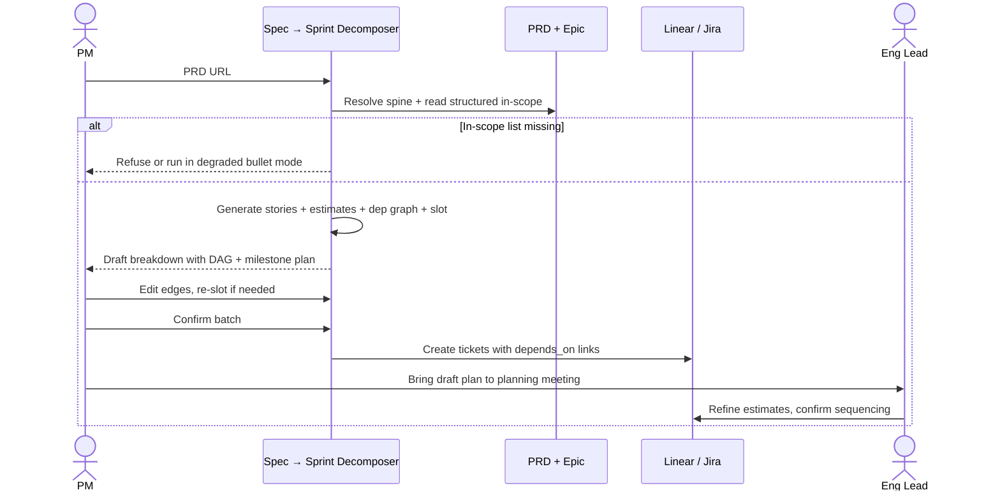

# Spec → sprint decomposer — Spec

- **Horizon:** Next
- **Stage:** 2 — Planning
- **Theme:** backlog-delivery
- **Owner:** TBD
- **Status:** Draft

## Why this tool, why now

Sprint planning is where PMs feel the gap between "we have a PRD" and "we have a plan" most acutely. The PRD says what; the sprint plan says when. In between is a 2–4 hour exercise of breaking the PRD into sprint-shaped tickets, estimating, identifying dependencies, and drafting a milestone plan that eng can argue with. Most teams skip the milestone plan entirely because it's too expensive to redo when scope shifts; sprint planning then runs over because nobody has a candidate breakdown to react to.

This tool ships after Story & Ticket Writer (Now) and PRD Drafting Assistant (Now) because it consumes their output. Without per-story DoR-passing inputs and structured PRDs, the decomposer is reconstructing context — exactly what the spine principle forbids. Building it now would yield a decomposer with shaky inputs.

## What we mean by "spec → sprint decomposition"

This tool takes a PRD (with structured in-scope list) and produces a **sprint-ready ticket breakdown** that includes estimates, dependencies, and a draft milestone plan. The output is **a starting proposal for engineering review**, not a final plan.

**In our definition:**
- PRD → set of stories (composes Story Formatter)
- Per-story estimates (composes Story Formatter's sizing, refined with sprint-shape constraints)
- Dependency graph between stories
- Draft milestone plan (sprint slotting given team velocity)
- Critical-path surfacing

**Not what this tool does:**
- Authoring the PRD (that's the PRD drafting assistant)
- Producing individual well-formed tickets in isolation (that's the Story & Ticket Writer; this tool consumes its output)
- Running planning meetings or owning the planning calendar
- Making the final commitment ("this team will deliver this in 3 sprints"). Eng owns that call.

## Problem

PMs walk into planning with a PRD and a vague sense of "this is two sprints," and eng reverse-engineers the breakdown live. Three failure modes recur:

1. **No candidate breakdown.** Without a draft to argue with, planning becomes a brainstorm. Eng improvises tickets in the meeting; half are wrong.
2. **Dependencies discovered late.** A story that depends on a backend change shipping first gets pulled into sprint 1 without the dependency surfacing until standup-on-sprint-2. Velocity tanks.
3. **Milestone plans absent.** PRDs say "ship by Q3" but never show "what gets into sprint 1, sprint 2, sprint 3." Stakeholders set expectations on rough calendars that crack the moment scope shifts.

The tool's job is to make a **proposed, dependency-aware, milestone-shaped** breakdown the easy path before the planning meeting starts.

## Users & jobs-to-be-done

**Primary:** PMs/POs preparing for a sprint planning or quarterly planning meeting.
**Secondary:** Eng leads who critique the draft and own the final breakdown.

1. *Turn this PRD into the ticket set it implies* — composing Story Formatter, but sprint-sized.
2. *Show me dependencies* — which stories block which, what the critical path looks like.
3. *Slot these into sprints* — given the team's velocity, give me a 3-sprint draft plan.
4. *Show me what I can move* — re-slot when a constraint changes.

## In scope (v1)

- PRD-with-structured-in-scope-list → story set (calls Story Formatter).
- Per-story estimate refinement: take Story Formatter's size suggestion, refine against sprint-shape constraints (e.g., "this 13-point story should split").
- Dependency graph: each story tagged with `depends_on` relationships, surfaced as a DAG.
- Critical-path computation: longest dependency chain through the story set.
- Draft milestone plan: stories slotted into sprints given the team's recent-velocity average.
- Re-slotting: PM removes/adds/re-prioritizes a story; the plan recomputes.
- Export to Jira/Linear: draft tickets created as a batch (PM commits the batch).

## Out of scope (v1)

- Auto-commit to Jira/Linear without PM batch confirmation.
- Cross-team plans. v1 plans for one team at a time.
- Calendar slotting against real dates (sprints are abstract numbered slots; PM aligns to calendar).
- Resource-level assignment ("Alice does story 3"). The tool slots; it doesn't assign people.
- Live re-planning during a sprint. Out of scope; covered by Proactive Sprint Agent (Later).
- Estimation training on team historical data in v1 — heuristic estimates only.

## Capabilities

| Capability | Output | Trust gate |
|---|---|---|
| PRD → story set | Story Formatter output, sized for sprint-shape | PM reviews each story |
| Estimate refinement | Per-story estimate adjusted for sprint constraints | Eng confirms at refinement |
| Dependency graph | Story-to-story `depends_on` edges with confidence | PM accepts / edits edges |
| Critical-path computation | Longest chain through the DAG with timeline implication | Advisory; PM uses in planning |
| Draft milestone plan | Sprint-by-sprint slotting | PM + eng iterate; tool is the starter |
| Re-slotting | Recomputed plan after PM changes | PM re-reviews changed slots |
| Batch ticket export | Draft tickets created as a batch in Jira/Linear | PM confirms batch; nothing writes without confirmation |

## Integrations

- **Spine Resolver** ([agent](../governance/agent-library.md#1-spine-resolver)) — PRD + epic.
- **Story Formatter** ([agent](../governance/agent-library.md#3-story-formatter)) — primary composition.
- **Rubric Scorer** ([agent](../governance/agent-library.md#11-rubric-scorer)) — DoR check on each story; sprint-shape rubric on the breakdown.
- **PII Scrubber** ([agent](../governance/agent-library.md#9-pii-scrubber)) — mandatory on ingress.
- **Jira / Linear** — read (existing tickets under the epic, team velocity), write (batch ticket creation on PM confirmation).
- **Team velocity source** — Jira/Linear's velocity reports for the team's last N completed sprints.

## UX surfaces

1. **Plugin panel on the PRD page** — "Draft a sprint plan" action; opens a panel with the proposed breakdown, DAG, and milestone view.
2. **Confluence sidecar page** — once accepted, the breakdown lands on a "Draft sprint plan" page linked from the PRD.
3. **Jira/Linear batch-create** — PM commits the breakdown; tickets are created as drafts under the epic with the `depends_on` links established.

No standalone app surface (operating principle 5).

## Trust & safety

- **Batch creation requires explicit PM confirmation.** Nothing writes to Jira/Linear without the PM clicking "Create N tickets."
- **Estimates are suggestions.** Eng confirms at refinement; the tool never finalizes velocity-impacting numbers.
- **Sprint slotting is a draft.** The tool's plan is a starting point; eng-team final-says on sequencing.
- **Spine resolution is required.** No PRD with a structured in-scope list, no breakdown. Failing loudly is the spine principle.
- **PII Scrubber on ingress** — PRD content scrubbed before any model call.
- **Dependency edges include confidence.** PM sees confidence per edge so weakly-inferred dependencies don't masquerade as hard constraints.

## Success metrics

| Metric | Target |
|---|---|
| Sprint-planning meeting duration | -30% |
| Stories ready-at-planning (DoR-pass on day-of) | >85% (baseline ~50%) |
| Dependencies discovered post-sprint-start | -60% |
| Re-plan time when scope changes | -70% |
| Milestone plans drafted per PRD (count) | >70% within 1 quarter of GA |

## Rollout phasing

1. **Alpha (internal):** PRD → story set + DAG only, no milestone plan. 1 team, 2 friendly PMs.
2. **Beta:** Milestone plan + re-slotting. 5 PMs. Eng-lead readiness feedback opens.
3. **GA:** Jira parity + Linear support, custom sprint-shape rubric per team, dependency-edge confidence visible.

## Dependencies & open questions

- **Depends on:** *Story & ticket writer* (Now). Decomposer composes Story Formatter; without it the breakdown is hand-rolled.
- **Depends on:** *PRD drafting assistant* (Now). Decomposer reads the structured in-scope list; legacy PRDs without it degrade to a "give me your scope as bullets" mode.
- **Depends on:** Spine Resolver, Rubric Scorer, PII Scrubber — Tier A agent-library components.
- **Open:** Sprint-shape constraints. Hard upper bound per story (e.g., no story >8 points)? Per-team config most likely.
- **Open:** How aggressively to infer dependencies. Overly enthusiastic dependency inference produces false constraints; too conservative misses real ones.
- **Open:** Velocity source ground truth. Some teams have noisy historical velocity. Lean on rolling median, not mean. Skip the calc when n<3 recent sprints.
- **Open:** Multi-PM PRDs. If two PMs share a PRD, who owns the breakdown? Per-team policy.
- **Risk:** Eng pushback on PM-drafted plans that look "presumed-final." Mitigation: explicit "draft for eng review" label on every produced artifact; the tool never claims an estimate as final.
- **Risk:** Over-decomposition. A 1-week PRD generates 18 tiny tickets. Mitigation: sprint-shape rubric penalizes both over- and under-decomposed sets.

## Decomposition mechanics

### PRD → story set

1. Spine Resolver returns PRD + epic.
2. PII Scrubber on PRD.
3. Story Formatter generates a story per in-scope item.
4. Sprint-shape pass: each story's size checked against team's sprint-shape rubric. Over-large stories prompted for split; trivial stories prompted for merge.

### Dependency inference

1. Per-story candidate dependencies generated by an LLM call referencing the story set: "given these N stories, what are the natural dependencies?"
2. Candidates passed through a Rubric Scorer with criteria: "is there a hard sequencing reason?", "is this a UI-on-API dependency?", "is this a shared-component dependency?", etc.
3. Edges with high confidence surfaced as hard `depends_on`; medium-confidence as advisory; low-confidence dropped.
4. PM accepts / edits / removes edges in the DAG view.

### Critical-path computation

1. Topological sort over the DAG.
2. Longest path computed with story-point weight.
3. Critical-path stories highlighted; their slippage = whole-plan slippage.

### Milestone slotting

1. Fetch team velocity from Jira/Linear: rolling 4-sprint median.
2. Slot stories greedily: highest-priority + dependency-satisfied first, respecting per-sprint capacity.
3. Surface "fits in N sprints" + the critical-path implication.
4. Re-slot path: PM removes/adds/re-prioritizes, slotter re-runs.

### Batch export

1. PM confirms the breakdown.
2. Tickets created as a batch in Jira/Linear under the epic.
3. `depends_on` links established.
4. Suggested-size field populated (never the final-size field).
5. Confluence "Draft sprint plan" page created linking the tickets + DAG image.

## Evaluation criteria & metrics

### Layer 1 — Output quality

| Metric | Definition | Alpha | Beta | GA |
|---|---|---|---|---|
| Story-set completeness | % of PRD in-scope items represented | >0.90 | >0.95 | >0.98 |
| DoR pass rate per story | Story Formatter inherited | >0.60 | >0.75 | >0.85 |
| Dependency edge precision | Eng-confirmed real / surfaced as `depends_on` | >0.70 | >0.80 | >0.90 |
| Dependency edge recall | Real deps surfaced / known by eng | >0.50 | >0.65 | >0.80 |
| Sprint-shape compliance | Stories within size band | >0.85 | >0.92 | >0.97 |
| Velocity-fit accuracy | Plan fits within stated sprints when scope holds | >0.70 | >0.80 | >0.90 |

**Datasets:** historical PRDs paired with executed sprint plans (n>30 across 5 teams), refreshed quarterly. A 20-case adversarial set of PRDs with deliberately tangled dependencies the tool must surface.

### Layer 2 — Product behavior

| Metric | Pass bar |
|---|---|
| Breakdowns batch-exported without ticket edits | <25% (high = rubber-stamping) |
| PM time from PRD to draft plan | <10 minutes p50 |
| Re-slot iteration count per breakdown | Tracked; ≤3 is healthy |
| Eng-rated draft usefulness | >70% useful |

### Layer 3 — Outcomes

| Metric | Target |
|---|---|
| Sprint-planning meeting duration | -30% vs. pre-tool baseline |
| Dependencies discovered post-sprint-start | -60% |
| Milestone plans drafted per PRD | >70% |
| Eng readiness score | +15 points |

### Guardrails

| Guardrail | Limit |
|---|---|
| Auto-commit to Jira/Linear without batch confirmation | 0 (never in v1) |
| Estimate auto-fill into final-size field | 0 (suggested-size only) |
| Spine-missing decomposition | 0 (fail loudly) |
| PII regex matches in output | 0 |
| Cost per breakdown | <$1 (GA) |

### Anti-metrics

- **Stories generated per breakdown.** Volume isn't value; over-decomposition is a known failure.
- **Dependencies surfaced.** Surfacing 30 false dependencies erodes the DAG; precision dominates.
- **Velocity-fit alone.** A "fits in 2 sprints" claim that turns out to be off by 60% costs trust badly.

## Failure modes & mitigations

| Failure | What it looks like | Mitigation |
|---|---|---|
| Over-decomposition | 18 trivial tickets from a 1-week PRD | Sprint-shape rubric penalizes; "merge these?" prompt |
| Under-decomposition | One 21-point story shipped as a sprint plan | Per-story size ceiling; auto-split prompt |
| False dependency edges | "Search depends on settings UI" with no real reason | Rubric Scorer on edge candidates; confidence surfaced |
| Missed dependency | UI shipped sprint 1, depended on API not yet built | Eng review surfaces; feedback updates eval set |
| Velocity miscalibration | Plan claims 2 sprints, eng sees 5 | Median (not mean) over last 4 sprints; refuse plan if n<3 |
| Spine missing | PRD has no structured in-scope list | Fail loudly; prompt to use PRD assistant or paste bullets |
| Eng "we'll just redo it" | Draft plan is too far off to be useful, eng starts over | Iterate on the per-team sprint-shape rubric; track eng "rejected entirely" rate |
| Stale velocity | Team had two ramp-up sprints recently | PM-overridable velocity hint; surface "low confidence" if velocity is noisy |
| Re-slot churn | PM re-slots 8 times and trust degrades | Cap re-slots per breakdown at 5 with a "save your draft" prompt |

## Cost & latency envelope (rough)

- **PRD → story set:** Story Formatter composition. ~$0.15–$0.30 per PRD.
- **Dependency inference:** 1 long-context LLM call + N rubric calls. ~$0.10.
- **Slotting + critical-path:** deterministic, no model calls.
- **Per-breakdown total:** ~$0.30–$0.50 typical.
- **p95 latency:** <20s for full breakdown end-to-end.
- **Per-PM monthly cost ceiling:** <$15 (GA).

## User-flow walkthroughs

### Persona flow

### Flow A — PRD → planning-ready breakdown

PM finishes the "Bulk Actions" PRD on a Wednesday, planning is Friday. Plugin in Confluence: clicks *Draft a sprint plan*. Within 30 seconds: 12 stories with sizes (Story Formatter composition), a DAG showing two parallel tracks (read paths and write paths) joining at a "permission checks" story, and a 2-sprint milestone slot using the team's rolling-4-sprint velocity. PM reviews the DAG, accepts most edges, edits one (the "permission checks" actually only blocks write paths, not reads), re-slots. Friday's planning meeting opens with the breakdown on screen; eng critiques specific stories rather than improvising the whole plan. Meeting wraps in 35 minutes vs. the usual 75.

### Flow B — Re-slot when scope shrinks

Mid-week, PM realizes one of the bulk-action types ("Bulk archive") is descoped. PM removes the 2 stories associated with archive from the breakdown. Re-slot recomputes: plan now fits in 1.5 sprints, critical path shortens. PM updates the milestone communication to stakeholders before standup.

### Flow C — Spine-missing refusal

PM tries to invoke the decomposer on a Notion page that was supposed to be a PRD but never landed structured in-scope items. Tool refuses: "no structured `in_scope` list found on the source. Run the PRD drafting assistant first or provide the in-scope items as bullets." PM provides bullets, breakdown runs in degraded mode (no `out_of_scope` constraint, no PRD-anchored citations), and the result is flagged as "drafted from bullets — re-run when PRD is structured."

## Anti-goals

- **Won't author the PRD.** Upstream tool's job.
- **Won't make the final commitment.** Eng owns sequencing and sizing.
- **Won't auto-create tickets.** Batch export requires PM confirmation.
- **Won't run without spine.** PRD with structured in-scope or refuse.
- **Won't assign people.** Slotting is sprint-level, not person-level.
- **Won't re-plan mid-sprint.** Proactive Sprint Agent (Later) covers that.
