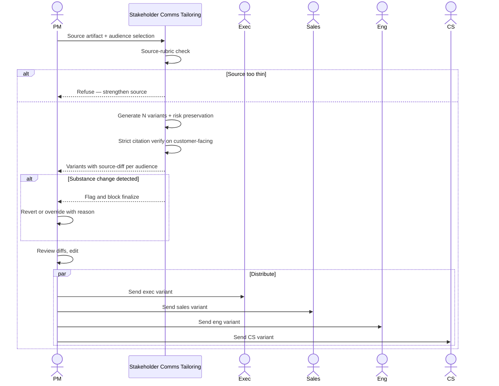

# Stakeholder comms tailoring — Spec

- **Horizon:** Next
- **Stage:** 4 — Release
- **Theme:** writing-docs
- **Owner:** TBD
- **Status:** Draft

## Why this tool, why now

PMs write one update and re-write it four times. Sales wants customer-impact framing. Eng wants the technical reasoning. CS wants the support implications. Exec wants outcome + risk. The content is the same; the framing changes. The re-writing happens under deadline, the framings drift over time, and the audience-mismatched copy that escapes erodes trust in PM communication broadly.

This tool sits one quarter behind release notes because the Audience Tailor agent is already shipping there (customer / internal / Slack variants). Once the tailor is proven on the simpler 3-audience case, generalizing to N audiences with PM-defined audience profiles becomes a small extension. Building this in Now would over-extend the tailor's trust bar before it's earned.

## What we mean by "stakeholder comms tailoring"

This tool takes **one PM-authored or PM-approved source update** and produces N **audience-tailored variants** that reframe the same facts for different consumers. It is a reframer, not a re-synthesizer — every variant ships from the same source artifact.

**In our definition:**
- One source artifact → N variants (exec, sales, eng, CS, custom)
- Tone, detail level, and length tuned per audience
- Risk preservation: if the source mentions a risk, every variant mentions it
- Source-diff view: what was added, removed, or reframed per variant

**Not what this tool does:**
- Synthesizing the source itself (that's the Source Synthesizer's job, used by Weekly Status Synthesizer and Release Notes Generator)
- Translating into other languages
- Generating sales-deck slides, formal customer collateral, or marketing assets
- Inventing facts not in the source — additions are flagged and refused unless the audience template explicitly requires them

## Problem

PMs ship the same update everywhere, and three failure modes follow:

1. **Audience mismatch.** Exec gets the eng-channel paragraph and drowns in technical detail; sales gets the exec paragraph and has nothing to put in a customer note.
2. **Hand-rewrite drift.** When PMs do tailor by hand, the framings vary by week and by PM. The exec version this week emphasizes risks; next week's omits them. Stakeholders can't predict what they'll get.
3. **Risk strip-out.** Optimizing the exec variant for "confidence" leads to risk understatement. Optimizing the sales variant for "excitement" buries known limitations. Both routes cost trust later.

The tool's job is to make a **risk-preserving, audience-appropriate, source-grounded** set of variants the easy path — one source in, N reviewable variants out.

## Users & jobs-to-be-done

**Primary:** PMs/POs sending a single update to multiple audiences.
**Secondary:** Sales, CS, and exec consumers of the variants (downstream).

1. *Take this update and reframe it for these audiences* — same facts, audience-tuned framing.
2. *Show me what each variant changed* — so I can spot reframing that altered substance.
3. *Make sure the limitations made it into every variant* — risk-preservation is a hard bar.
4. *Let me tune the per-audience tone* — exec is concise, sales is impact-leaning, eng is technical detail.

## In scope (v1)

- One source artifact (PM-authored or PM-approved) → N variants.
- Built-in audience profiles: `exec`, `sales`, `eng`, `cs`. Custom audience profiles configurable per team.
- Per-audience tone defaults: tone, length target, technical depth, customer-facing or internal.
- Source-diff per variant: what was added, removed, reframed.
- Risk-preservation enforcement: any risk-flag tokens in the source MUST appear in every variant.
- Citation Verifier on customer-facing variants (`sales`, `cs` where used externally) in strict mode.
- PM sign-off before variants leave the tool surface; no auto-distribute.

## Out of scope (v1)

- Synthesizing the source from raw activity. Use Weekly Status Synthesizer or Release Notes Generator upstream.
- Auto-posting to Slack channels, email lists, or any distribution surface.
- Translation into other languages.
- Sales-collateral formats (decks, one-pagers, customer emails). v1 produces text bodies; downstream surfaces are PM-controlled.
- Multi-source compositing (combining two updates into one tailored set).

## Capabilities

| Capability | Output | Trust gate |
|---|---|---|
| Audience-profile selection | Per-variant config: tone, length, depth | PM picks or customizes profile |
| Variant generation | N variants from one source | PM reviews each, edits, sends |
| Source-diff per variant | Added / removed / reframed token spans | Surfaced inline in the plugin |
| Risk preservation | Risk tokens carried into every variant | Variant blocked from finalizing if risk dropped |
| Citation verification (customer-facing variants) | Strict-mode pass on `sales` / customer-facing `cs` | Blocks finalize if citations fail |
| Audience-template customization | Per-team custom profiles | Saved per team, versioned |

## Integrations

- **Audience Tailor** ([agent](../governance/agent-library.md#6-audience-tailor)) — the core component.
- **Citation Verifier** ([agent](../governance/agent-library.md#10-citation-verifier)) — strict on customer-facing variants.
- **PII Scrubber** ([agent](../governance/agent-library.md#9-pii-scrubber)) — mandatory on every model-call ingress.
- **Source artifacts** read-only from Confluence, Notion, Slack message permalinks, plain text paste.
- **No outbound posting in v1.** PM copies variant body to the target surface (Slack, email, doc) themselves.

## UX surfaces

1. **Plugin panel in Confluence / Notion** — invoked on a source page; opens with audience checkboxes and tone overrides.
2. **Slack slash command** — `/tailor <source-url-or-paste>` returns a UI with variant tabs.
3. **Right-click on a Slack message** — "Tailor this for…" action that opens the variant panel pre-filled with the message content.

No standalone app surface (operating principle 5).

## Trust & safety

- **Tailor never invents new facts.** The `source_diff` makes additions visible. Additions are refused unless the audience template explicitly requires them (e.g., "sales variant must include a CTA") and they are flagged.
- **Risk preservation is a hard bar.** Source tokens matching the risk lexicon (`risk`, `blocker`, `delay`, `known limitation`, `caveat`, configurable per team) MUST appear in every variant. Variants that drop a risk are blocked from finalizing.
- **Customer-facing variants require strict-mode Citation Verifier.** No green on the verifier, no finalize.
- **No auto-distribute.** PM copies variant body to the target surface.
- **PII Scrubber on ingress.** Bodies are scrubbed before any model call; redaction map returned to PM so they know what was masked.
- **Tone changes that alter meaning** ("risk" → "success") are detected by a substance-change check and flagged as "framing changed substance — refusing to ship without review."

## Success metrics

| Metric | Target |
|---|---|
| Time from source artifact to N reviewable variants | <90s p50 |
| Variants finalized from tool drafts | >80% within 1 quarter of GA |
| Risk-preservation rate | 1.0 (hard bar) |
| PM-rated audience-fit per variant | >75% appropriate |
| Substance-change flag false-positive rate | <0.15 (high = annoying; low = trustworthy) |

## Rollout phasing

1. **Alpha (internal):** Two built-in profiles (`exec`, `eng`) only. 3 PMs. Validates tailor behavior on the simpler case.
2. **Beta:** All four built-in profiles, source-diff view, risk preservation. 10 PMs.
3. **GA:** Custom audience profiles per team, plugin in Confluence + Notion + Slack, citation verification on customer-facing variants.

## Dependencies & open questions

- **Depends on:** Audience Tailor, Citation Verifier, PII Scrubber — Tier A agent-library components.
- **Depends on:** *Release notes generator* (Now). The tailor first proves itself on the 3-audience release-notes case; this tool generalizes once that trust bar is earned.
- **Depends on:** *Weekly status synthesizer* (Now). The most common upstream source is a weekly status; if it ships structured, tailoring is cleaner.
- **Open:** Custom audience definition. PM-authored YAML, plugin-form config, or "show me an example variant and I'll learn the style"? Lean toward YAML + few-shot examples in v1.
- **Open:** How to handle multi-source updates. Out of scope for v1; PM composes a single source by hand and re-tails. Revisit if this is the dominant request post-GA.
- **Open:** Do `sales` and `cs` variants need approval from those teams before they go out (PM sign-off + sales/CS sign-off)? Per-team policy.
- **Risk:** Tone over-correction. Exec variant may strip context that exec actually needed. Mitigation: per-audience golden samples + per-PM tuning over time.
- **Risk:** PMs use this to ship four versions of an update without thinking about whether the content is the right starting point. Mitigation: the tool refuses thin sources; PM is required to provide a source artifact that meets a minimum-content rubric.

## Tailoring mechanics

### Audience profiles

Each profile carries:
- `tone`: concise / impact-leaning / technical / supportive
- `length_target`: short (<150 words) / medium (150–400) / long (400+)
- `depth`: outcome-only / outcome + headline detail / full detail
- `customer_facing`: bool — engages strict Citation Verifier when true
- `framing_emphasis`: list of token classes to emphasize ("risk", "metric", "customer-impact")
- `framing_de_emphasis`: list of token classes to compress ("internal-process", "technical-detail")

Built-in profiles:
- **`exec`:** concise + outcome-only + non-customer-facing + emphasize risk + metric
- **`sales`:** impact-leaning + medium + customer-facing + emphasize customer-impact
- **`eng`:** technical + medium + non-customer-facing + emphasize technical-detail
- **`cs`:** supportive + medium + customer-facing-where-used + emphasize support-implication + known-limitation

### Variant generation

1. PII Scrubber on source.
2. Source-content rubric check: length, structure, presence of identifiable facts. Below threshold → refuse with "source too thin to tailor."
3. Audience Tailor produces N variants in parallel.
4. Risk-preservation: extract risk tokens from source. For each variant, confirm presence in audience-appropriate language. Missing → block.
5. Substance-change check: scan for tone changes that alter meaning. Flag.
6. Citation Verifier in strict mode for `customer_facing: true` variants. Fail → block.

### Source-diff surfacing

Per variant, the plugin shows three spans: `added`, `removed`, `reframed`. PM reviews and either accepts, edits, or rejects.

## Evaluation criteria & metrics

### Layer 1 — Output quality

| Metric | Definition | Alpha | Beta | GA |
|---|---|---|---|---|
| Fact-additions per variant (audit) | New facts not in source | 0 (hard bar) | 0 | 0 |
| Risk-preservation rate | Source risks present in every variant | 1.0 (hard bar) | 1.0 | 1.0 |
| Substance-change detection precision | Flagged changes that really altered substance | >0.70 | >0.80 | >0.90 |
| Audience-fit rating (PM-rated) | Variant matches profile expectations | >65% | >75% | >85% |
| Length-target compliance | Variants within target band | >0.90 | >0.95 | >0.98 |
| Citation verification pass (customer-facing variants) | Strict-mode pass | >0.95 | >0.98 | >0.99 |

**Datasets:** historical source-to-variant pairs from PM channels (n>100, scrubbed of customer data), refreshed quarterly. A 30-case adversarial set where the tailor must catch a stripped risk to pass.

### Layer 2 — Product behavior

| Metric | Pass bar |
|---|---|
| Variants finalized unedited | <15% (high = rubber-stamping) |
| PM edit distance per variant | Tracked; healthy non-zero per audience |
| Time-to-N-variants | <90s p50 for 4 variants |
| Substance-change-flag override rate | <30% (high = check is too sensitive) |
| Per-audience PM-rated usefulness | >75% useful |

### Layer 3 — Outcomes

| Metric | Target |
|---|---|
| PM hours/week on hand-tailoring updates | -60% vs. pre-tool baseline |
| Stakeholder-reported clarity of updates (qtly survey) | +15 points per audience |
| "Risk dropped in translation" incidents | 0 (hard bar) |
| Custom-audience profile adoption | >50% of teams define ≥1 custom profile within 2 quarters of GA |

### Guardrails

| Guardrail | Limit |
|---|---|
| Auto-distribute | 0 (never in v1) |
| Fact-additions per variant | 0 (hard bar) |
| Risk-preservation failures | 0 (hard bar) |
| Citation verification failures on customer-facing variants finalized | 0 (hard bar) |
| PII regex matches in any variant | 0 |
| Cost per source-to-N-variants | <$0.20 (GA) |

### Anti-metrics

- **Variants generated.** Volume isn't value.
- **Tone-uniformity across variants.** Variants should differ noticeably; if four "feel the same," the tool isn't earning its keep.
- **Finalized-unedited rate.** Especially on customer-facing variants — non-zero edit distance is healthy.

## Failure modes & mitigations

| Failure | What it looks like | Mitigation |
|---|---|---|
| Risk dropped from exec variant | Source says "delay risk on auth flow," exec variant doesn't | Risk-preservation hard bar; variant blocks |
| Fact added to sales variant | "Generally available" appears when source said "limited beta" | Hard schema: no additions unless template requires; surfaced in `source_diff` |
| Tone over-correction | Exec variant reads as "all clear" when source flagged risk | Substance-change check; flagged for PM review |
| Audience confusion | Eng variant reads like CS variant | Per-audience golden samples in eval; PM-tuned profiles over time |
| Thin source → confident variants | PM pastes one sentence and gets four | Source-rubric check refuses below threshold |
| Customer identifier leak | Source mentions a customer by name, variant carries it | PII Scrubber on ingress; sample audit |
| Custom-profile drift | PM tweaks profile in one direction, accumulates over months | Profile versioning; quarterly review surfaced in dashboard |
| Substance-change false flag | PM rephrases legitimately, tool refuses | Override path with reason; overrides feed eval to tune threshold |

## Cost & latency envelope (rough)

- **Per variant:** ~$0.02 (Audience Tailor) + ~$0.001 per claim if customer-facing (Citation Verifier).
- **N=4 variants total:** ~$0.10 with two customer-facing.
- **p95 latency:** <3s per variant, <8s for 4 variants in parallel.
- **Per-PM monthly cost ceiling:** <$10 (GA, heavy users).

## User-flow walkthroughs

### Persona flow

### Flow A — Weekly status fan-out

PM finishes the weekly exec status update in Confluence. Plugin panel: clicks `Tailor` with `exec` + `sales` + `cs` + `eng` checked. 6 seconds later, four variants in tabs. Source-diff on the sales variant shows "added: customer-impact framing"; PM accepts. Exec variant kept "auth flow shipping risk" — risk-preservation worked. Eng variant pulled in the technical-detail blocks the exec version compressed. PM copies each into its target surface: exec doc, `#sales-product`, `#cs-pm`, `#eng-leads`. Total time: ~10 minutes vs. the usual 60+.

### Flow B — Substance-change flag

PM authors a release update mentioning "known issue on Safari." Tailor's exec variant compresses this to "broad browser support shipped." Substance-change check fires: source said "known issue," variant said "shipped" — that's a substance change. Variant blocked from finalizing. PM either reverts to "shipping with known Safari issue tracked separately" or overrides with reason. Audit retains the override for review.

### Flow C — Custom audience profile

A team that ships into a regulated industry defines a `compliance` audience profile (concise, full-citation, formal tone, customer-facing-true). PM tailors a release update; the `compliance` variant generates with stricter citation verification and a formal-language tone. The PM forwards the variant to legal for sign-off; legal approves it as-is, saving 20 minutes of formality re-writing.

## Anti-goals

- **Won't synthesize the source.** Upstream tool does that.
- **Won't auto-distribute.** PM copies and sends.
- **Won't translate.** Locale variants are a separate investment.
- **Won't invent facts.** Hard bar.
- **Won't drop risks.** Hard bar.
- **Won't tailor from a thin source.** Source rubric refuses.
