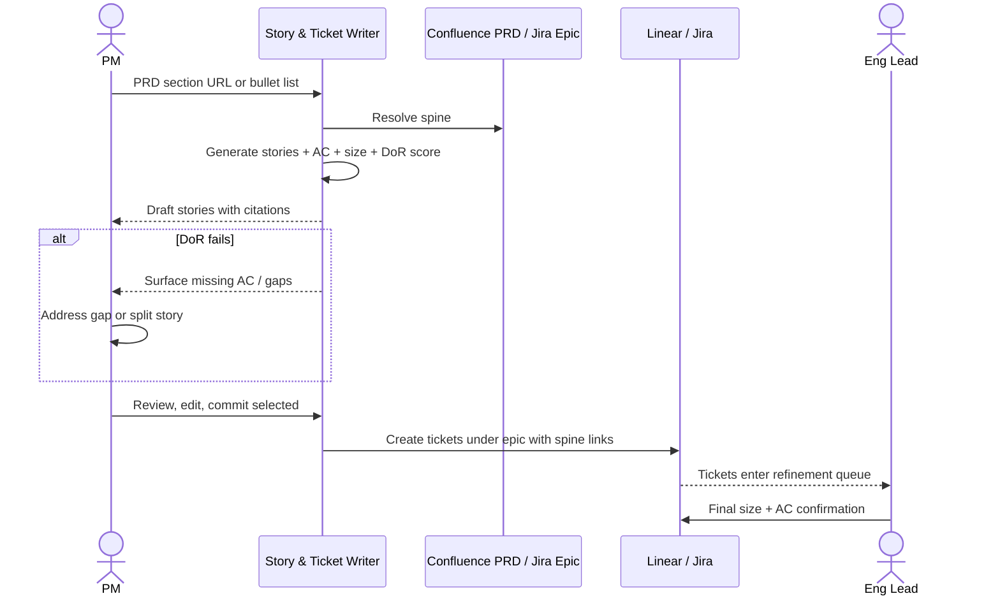

# Story & ticket writer — Spec

- **Horizon:** Now
- **Stage:** 2 — Planning
- **Theme:** writing-docs
- **Owner:** TBD
- **Status:** Draft

## Why this tool, why now

Story writing is the highest-frequency authoring task on the roadmap. Every active feature generates 5–30 stories across its lifecycle; every PRD becomes a planning bottleneck the day after kickoff because turning narrative scope into well-formed tickets is the slowest, most-skipped step in the PM workflow. The default outcome is tickets shipped under-specified, eng pushes back, the PM rewrites, and Definition of Ready becomes Definition of Eventually.

This tool also unblocks the rest of the roadmap. Backlog grooming (Next) only generates useful signal if tickets are well-structured. Spec → sprint decomposer (Next) needs story-level inputs. Living spec sync (Later) needs structured stories to compare against PRD intent. **Story quality is the gating dependency for trust-building in Stages 3–5.**

## What we mean by "story writing"

This tool drafts well-formed work items from upstream context — primarily a PRD section or PM bullet points — and produces tickets that pass the team's Definition of Ready. The narrow scope: **structured-input → structured-output**, where the structure is the team's story format and DoR.

**In our definition:**
- PRD section → story set (multi-output)
- Bullet list → properly-formatted stories (1:1)
- Acceptance criteria generation for under-specified stories
- Size suggestion (input to eng refinement, never final)
- Relationship proposals (parent/sub-issue, depends-on)

**Not what this tool does (and where each lives):**
- Generating net-new product ideas → *PRD drafting assistant* (Stage 1)
- Splitting epics into sprint-shaped milestones → *Spec → sprint decomposer* (Stage 2, Next)
- Rewriting tickets already in flight → *Living spec sync* (Stage 5, Later)
- Making the final size call — eng owns the estimate at refinement; the tool only suggests

## Problem

PMs draft tickets inconsistently because they're context-switching from PRD authoring into a different format under time pressure. Three failure modes recur:

1. **Under-specified.** Acceptance criteria missing or vague. Eng asks clarifying questions in standup instead of in the ticket. Sprint velocity drops.
2. **Format inconsistent.** The same team writes stories four different ways depending on PM and day. Refinement meetings become reformatting meetings.
3. **Disconnected from PRD.** Ticket says "X must work" without referencing the PRD section that justifies it. When scope changes mid-sprint, no one knows which tickets to update.

The tool's job is to make a well-formed, spine-linked, DoR-passing ticket the path of least resistance, not the exception.

## Users & jobs-to-be-done

**Primary:** PMs/POs drafting tickets from a PRD or refinement bullet list.
**Secondary:** Eng leads who receive the tickets and rate readiness at refinement.

1. *Turn this PRD section into the tickets it implies* — break narrative scope into appropriately-sized stories.
2. *Format this bullet list as proper stories* — keep my judgment on what to ship, just format it.
3. *Add acceptance criteria to this rough story* — fill in what I'm too rushed to write out.
4. *Suggest a size* — give me a starting point eng can adjust.

## In scope (v1)

- PRD-section → story set, with parent epic auto-linked to the spine.
- Bullet-list → formatted stories (1:1), preserving PM intent and order.
- Acceptance criteria in the team's preferred format (user-story bullets OR Gherkin Given/When/Then — configurable).
- Size suggestion in the team's estimation system (story points / Fibonacci default; t-shirt sizing alternative).
- Spine linkage: every story carries a reference to the PRD section it derives from.
- DoR check: scored output against team-configurable DoR checklist; below-threshold drafts surface what's missing.
- Multi-story relationships: when splitting a PRD section, propose parent/sub-issue or depends-on links.

## Out of scope (v1)

- Direct write into Linear/Jira without PM review. Plugin → review → commit, always.
- Rewriting tickets already in flight.
- Epic-level decomposition into milestones.
- Voice/audio input (defer until Meeting → artifact pipeline lands).
- Cross-team story dependencies.

## Capabilities

| Capability | Output | Trust gate |
|---|---|---|
| PRD section → story set | Multiple draft stories with parent epic, AC, size, spine link, relationship graph | PM reviews each, commits selected |
| Bullet list → stories | 1:1 formatted stories preserving order and intent | PM reviews, commits |
| AC for existing story | AC list appended to draft | PM accepts / edits before save |
| DoR scoring | Per-story checklist with pass/fail per item | PM sees red items before commit |
| Size suggestion | Estimate + 1-line rationale | Eng adjusts at refinement |
| Relationship proposals | Parent/sub-issue / depends-on graph for the story set | PM accepts / dismisses links |

## Integrations

- **Linear** (primary) and **Jira** (parity by v1.1) — write API, project/epic structure, label taxonomy, DoR config.
- **Confluence PRD** — read access; every generated story cites the PRD section it derives from.
- **Team DoR config** — initially a YAML file or Linear project-description block; long term a custom field.
- **No Slack ingest in v1.** Bullet input is text in the plugin, not parsed from threads.

## UX surfaces

1. **Plugin panel** in Linear/Jira's "create issue" flow — paste bullets or PRD URL, get draft stories alongside, commit selectively.
2. **PRD-side action** — Confluence button "Generate stories from this section" → opens the plugin panel pre-populated with that section's context.
3. **Refinement-meeting mode** — bulk view: paste a refinement-list dump, get one ticket per item, batch-commit at end of meeting.

No standalone app surface (operating principle 5).

## Trust & safety

- Every AC ships with confidence and a citation to the PRD line it derives from. Confidence <0.6 marked "draft — needs review."
- DoR-failing drafts cannot be one-click committed; PM must explicitly override the warning.
- Size suggestions never auto-fill the final estimate field — they populate a "suggested size" alongside, eng confirms at refinement.
- Plugin shows a diff between PRD source lines and generated AC so PM can spot hallucination at a glance.
- No auto-write to Linear/Jira. v1 is plugin → review → commit, always.
- PII scrubbing on PRD content before any model call.

## Success metrics

| Metric | Target |
|---|---|
| Time from "I need tickets for this PRD section" to committed stories | -70% |
| Stories that pass eng DoR review on first refinement | >85% (baseline ~50%) |
| Refinement-meeting time spent on format/AC vs. judgment | -60% on format; judgment time flat-or-up |
| PM weekly active usage | >70% within 1 quarter of GA |
| Eng-reported readiness score (quarterly survey) | +20 points |

## Rollout phasing

1. **Alpha (internal):** Bullet-list → story conversion only. 3 friendly PMs, 1 team. No PRD ingest, no plugin yet. Validates story format quality.
2. **Beta:** PRD ingest, Linear plugin, DoR scoring. 10 PMs. Eng readiness signal opens.
3. **GA:** Jira parity, refinement-meeting bulk mode, full DoR config customization.

## Dependencies & open questions

- **Unblocks:** *Backlog grooming copilot* (Next), *Spec → sprint decomposer* (Next), *Living spec sync* (Later). Quality here gates the trust bar for all three.
- **Depends on:** *PRD drafting assistant* (Now). If PRDs ship with the structured in-scope list the spine principle requires, story generation gets dramatically easier. Worth coordinating release order — PRD assistant first, story writer one sprint behind.
- **Open:** DoR config at team or project level? Project adds flexibility, multiplies maintenance.
- **Open:** When a generated story splits a PRD line into multiple tickets, who owns the relationship — PM (manual) or tool (auto-propose, PM accepts)?
- **Open:** Sizing model — train per-team on historical (size, actual-velocity) data, or stay heuristic? Per-team training needs sustained telemetry we may not have at GA.
- **Risk:** Eng pushback on "templated" stories that read like AI output. Mitigation: tone variance, train on team's historical accepted tickets, PM tone customization.

## Generation mechanics

### PRD section → story set

1. Identify candidate work items from the PRD section via LLM with structured-output schema: `{title, user_role, behavior, rationale, ac_candidates[], parent_epic}`.
2. For each candidate, run a sizing heuristic (LLM-scored complexity + historical-comparable lookup if available).
3. Run DoR check: each item scored against the team's DoR checklist via LLM rubric.
4. Bundle results with relationship graph (parent epic, sub-issue suggestions, depends-on).

### Bullet list → stories

1. Parse bullets — preserve order, infer structure (top-level = story, indented = AC candidate).
2. Reformat each into team's story format. **Do not invent AC not implied by the bullets** — flag thin bullets as under-specified instead.
3. DoR check + size suggestion as above.

### AC generation

1. Read the story's user-role + behavior fields.
2. Pull the cited PRD section.
3. Generate AC bullets in configured format, each tied to a PRD line.
4. Confidence per AC, surfaced in the plugin.

## Evaluation criteria & metrics

Three layers, same framework as the grooming copilot.

### Layer 1 — Output quality

| Metric | Definition | Alpha | Beta | GA |
|---|---|---|---|---|
| DoR pass rate (model self-score) | Stories the model scores as DoR-passing | >0.85 | >0.90 | >0.95 |
| DoR pass rate (eng confirms at refinement) | Ground truth from eng acceptance | >0.60 | >0.75 | >0.85 |
| AC hallucination rate | False AC / total AC, sampled audit | <0.05 | <0.03 | <0.02 |
| Size suggestion bias | Mean (suggested − final eng size) | Within ±0.5 Fib step | ±0.3 | ±0.2 |

**Datasets:** historical PRDs paired with tickets eventually filed against them (n>300 per pilot team), refreshed quarterly. Plus a 50-pair adversarial set of PRDs that are deliberately under-specified — the tool should flag the gaps, not paper over them.

### Layer 2 — Product behavior

| Metric | Pass bar |
|---|---|
| Drafts committed without any edit | <20% (high = templated/unreviewed) |
| Edit distance per committed story | Tracked; stable-to-declining over time |
| PM-rated usefulness per draft | >70% useful |
| Time-to-commit per story | <90s median |

### Layer 3 — Outcomes

| Metric | Target |
|---|---|
| Eng readiness score (qtly survey) | +20 points |
| Refinement-meeting duration | -30% |
| Stories sent back as "not ready" at refinement | -60% |

### Guardrails

| Guardrail | Limit |
|---|---|
| AC hallucination rate | <0.03 (hard bar at GA) |
| Auto-commit without review | 0 (never in v1) |
| PII regex matches in output | 0 |
| Cost per PM per month | <$10 (GA) |

### Anti-metrics

- **Stories generated.** Volume isn't value.
- **Acceptance rate alone.** Maximizing it pushes us to safe templated output and kills the value-add on hard splits.
- **Edit distance = 0.** That would mean PMs aren't reviewing. Non-zero edit distance is a healthy signal.

## Failure modes & mitigations

| Failure | What it looks like | Mitigation |
|---|---|---|
| Hallucinated AC | Plausible criteria not actually in the PRD | Per-AC PRD citation, confidence scoring, sampled audits |
| Over-splitting | One PRD line yields 6 trivial tickets | Sizing floor; "merge these?" prompt at review |
| Under-splitting | A multi-week behavior shipped as one P2 story | Sizing ceiling; DoR-fail triggers a split prompt |
| Template stickiness | All output reads identically; eng tunes it out | Tone variance + per-team training on accepted tickets |
| Stale PRD read | Stories generated from a PRD updated since | Show PRD last-modified at generation; refuse if >30d stale without confirmation |
| Spine-link miss | Generated story not linked to parent epic | Spine resolution is a hard precondition — fail loudly (per the roadmap's spine principle) |

## Cost & latency envelope (rough)

- **PRD section → 5-story set:** 1 long-context LLM call + 5 short per-story calls (DoR + sizing). ~$0.10–$0.25 per generation.
- **Bullet list → stories:** small per-bullet call. ~$0.02 per story.
- **AC generation only:** ~$0.01 per story.
- **p95 latency:** <8s for full PRD-section generation, <2s for AC-only.
- **Per-PM monthly cost ceiling:** <$5 (alpha), <$10 (GA).

## User-flow walkthroughs

### Persona flow

### Flow A — PRD section → tickets

PM finishes the "Authentication" section of a PRD. Clicks *Generate stories from this section* in Confluence. Plugin opens with 7 draft stories: AC, sizes, parent epic auto-linked. PM reviews — commits 5 as-is, merges 2 trivial ones into a single P3, edits one AC where the model misread a constraint. Total time: ~6 minutes for 5 committed tickets, vs. the usual ~30.

### Flow B — Refinement bulk mode

The team's refinement meeting produces a 12-item bullet list. PM pastes into plugin and gets 12 draft stories in the team's format with DoR scores. Two are flagged *missing AC*. PM addresses them during the meeting rather than after; all 12 commit by meeting end.

### Flow C — DoR fail surfaces a real gap

PM writes a bullet *"users can reset password."* Tool generates a story but DoR-fails it: *"no AC specified for failure modes."* PM realizes the PRD never defined what "successful reset" means. Pings the PRD owner before committing. The DoR check caught a spec gap, not just a format gap.

## Anti-goals

- **Won't replace eng refinement.** Stories ship to refinement; eng final-says on size and AC.
- **Won't write tickets without a spine reference.** No orphan tickets. If the spine can't be resolved, refuse and tell the PM why.
- **Won't auto-commit to Linear/Jira.** Plugin → review → commit, always, in v1.
- **Won't generate net-new requirements.** Only restructures what's in the PRD/bullets. New behavior = new PRD section first.
- **Won't optimize for eng "just accepting" stories.** That's a bad trust bar — we want eng to push back where appropriate, and only see polished-format, well-cited input when they do.
