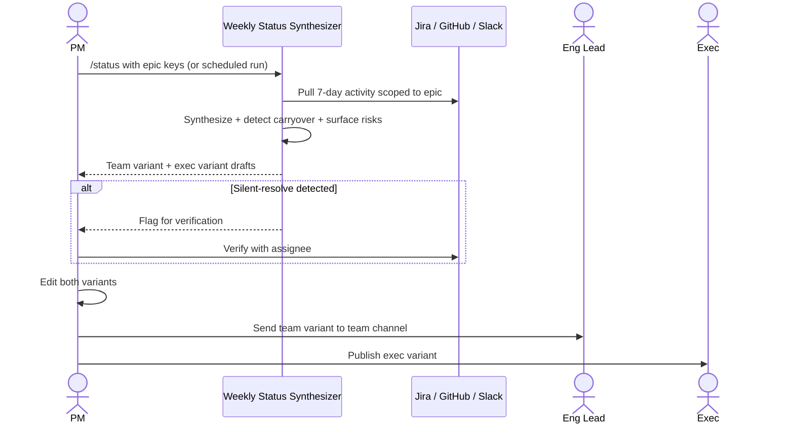

# Weekly status synthesizer — Spec

- **Horizon:** Now
- **Stage:** 3 — Execution
- **Theme:** writing-docs
- **Owner:** TBD
- **Status:** Draft

## Why this tool, why now

The weekly status update is the most repetitive PM-authoring task in the lifecycle. Every active epic generates one or two updates a week — team-facing in Slack on Friday, exec-facing in a doc the following Monday. The content is largely a faithful synthesis of activity that already lives in Jira, GitHub, and linked Slack threads, and yet PMs spend 60–90 minutes per epic re-reading those surfaces by hand because no tool draws across them. The synthesis is necessary; the manual reading is not.

This tool is also a low-risk pilot on the Source Synthesizer composition. Status updates land in PM-controlled surfaces (team channel, exec doc), not customer surfaces. The trust gate is internal-only, which makes this the right place to validate the synthesizer before release notes (Stage 4, customer-facing) and meeting → artifact pipeline (Stage 3, attribution-sensitive) inherit the same component.

## What we mean by "weekly status synthesis"

This tool pulls activity from Jira, GitHub, and Slack scoped to an epic in the last 7 days, and produces a **structured weekly status draft** in the team's format. Two variants: team-facing (Slack-ready) and exec-facing (doc-ready). The tool drafts; the PM edits and sends.

**In our definition:**
- Epic + 7-day window → shipped / in-progress / blocked / decisions summary, with citations
- Team and exec variants from one source synthesis (not two synthesis passes)
- Carryover detection: items that appeared in last week's update and are still open
- Risk flags surfaced from blockers, slipped dates, and customer-signal volume

**Not what this tool does:**
- Producing status for an unscoped project (no epic). Spine-first.
- Authoring sentiment, opinion, or recommendations. The tool reports; the PM editorializes.
- Posting the update. Drafts only.
- Multi-epic rollups in v1. PM composes via multiple runs.

## Problem

Status updates ship inconsistently — formats vary week to week, items get forgotten, blockers from two weeks ago re-appear as new, and exec audiences get the team-channel version with minimal reframing. Three failure modes recur:

1. **Activity blindness.** PM was in meetings all week, missed a PR that landed Wednesday, and the update reads as "in progress" for work that's actually merged.
2. **Carryover decay.** A blocker flagged three weeks ago has been silently solved, but it keeps appearing in the status because the PM is copy-pasting last week's template.
3. **Audience flattening.** Exec gets the same paragraph as the team Slack channel. Exec needs outcomes and risks; the team needs detail. Re-tailoring takes another 20 minutes the PM doesn't have.

The tool's job is to make a **grounded, carryover-aware, audience-appropriate** status draft the easy path, with both variants ready before the PM's coffee.

## Users & jobs-to-be-done

**Primary:** PMs/POs writing weekly status updates for one or more active epics.
**Secondary:** Eng leads who consume the team-facing version; execs who consume the exec-facing version.

1. *Show me what shipped, what's in flight, what's blocked* — grounded in Jira, GitHub, and Slack, not my memory.
2. *Tell me what carried over from last week* — so I can mark it resolved, in-progress-still, or escalate.
3. *Give me both variants* — team Slack and exec doc, from one synthesis.
4. *Flag the risks I haven't noticed yet* — slipped dates, customer-signal spikes, blocker age.

## In scope (v1)

- Spine-resolved input: PM selects one or more epics.
- 7-day default window (configurable); "since last published update" mode.
- Source Synthesizer pulls Jira, GitHub, Slack scoped to the epic.
- Structured output: shipped, in-progress (with blockers), decisions, risks.
- Carryover detection against the previous published update for the same epic.
- Two audience variants via Audience Tailor: `team` (Slack-tuned), `exec` (doc-tuned).
- Citation Verifier on every claim; failures surface but do not block (internal use).
- Risk surfacing: slipped tickets, blocker age >5 days, customer-signal volume spike on linked items.
- Confluence or Notion draft for the exec variant; Slack message preview for the team variant.

## Out of scope (v1)

- Auto-posting to Slack or publishing the exec doc. Drafts only.
- Cross-epic rollups in a single run. PM composes manually.
- Custom audiences beyond `team` and `exec`. *Stakeholder comms tailoring* covers further variants (sales, CS, etc.) in Next.
- Sentiment language ("good week, "behind schedule"). PM editorializes; the tool reports.
- Burndown charts or visualizations. Text-only.

## Capabilities

| Capability | Output | Trust gate |
|---|---|---|
| Spine resolution | One or more epics + linked PRDs | Fails loudly on unresolved spine |
| Activity synthesis | Structured shipped / in-progress / blocked / decisions summary | PM reviews before variants generate |
| Carryover detection | List of items carried from last published update with state-change diff | PM marks each: resolved / in-progress / escalate |
| Risk surfacing | Slipped tickets, aged blockers, signal spikes | Surfaced as a "watch list" the PM can edit |
| Team variant | Slack-ready message body | PM edits, sends |
| Exec variant | Doc-ready markdown for Confluence/Notion | PM edits, publishes |
| Citation verification | Per-claim source verification | Failures surface; do not block (internal-only) |

## Integrations

- **Spine Resolver** ([agent](../governance/agent-library.md#1-spine-resolver)).
- **Source Synthesizer** ([agent](../governance/agent-library.md#5-source-synthesizer)) — template: `weekly_status`.
- **Audience Tailor** ([agent](../governance/agent-library.md#6-audience-tailor)) — `team` + `exec` variants.
- **Citation Verifier** ([agent](../governance/agent-library.md#10-citation-verifier)).
- **Jira** — read tickets under the epic, including status changes and comments in the window.
- **GitHub** — read merged + open PRs linked to the epic.
- **Slack** — read threads linked from tickets or the epic (PM's access only, not service-account scope).
- **Confluence/Notion** — write exec-doc draft.
- **PII Scrubber** mandatory on ingress.

## UX surfaces

1. **Slack slash command** — `/status <epic-keys>` returns links to both variant drafts.
2. **Plugin panel in Jira epic** — "Draft this week's status" button on the epic page.
3. **Weekly scheduler** — opt-in cadence: PM configures a day/time, scheduler runs the synthesis and DMs the PM with draft links.

No standalone app surface (operating principle 5).

## Trust & safety

- **Drafts only.** No auto-post to Slack, no auto-publish to the exec doc. PM sends/publishes.
- **No editorial language.** The tool reports activity and surfaces risk signals; "good week / behind schedule" framing belongs to the PM.
- **Carryover is computed, not invented.** Items appear in the carryover list only if they were in last week's published update and remain open; the diff between then and now is explicit.
- **Slack scope** respects the PM's own channel access, not a service-account fanout. PMs cannot synthesize from channels they cannot read.
- **PII Scrubber** runs on every ingress to a model call.
- **Citation Verifier** runs but is advisory in v1 (internal use); customer-facing inheritors (release notes) tighten to strict mode.
- Carryover state changes that look like "silently resolved" (item moved to done without a comment) are surfaced explicitly so the PM can verify before claiming it shipped.

## Success metrics

| Metric | Target |
|---|---|
| Weekly hours per PM on status updates and release notes | -50% (matches roadmap goal) |
| Status updates published from tool drafts | >80% within 1 quarter of GA |
| Carryover items correctly flagged | >0.90 |
| Variant audience-fit rating (PM-rated) | >75% appropriate |
| Risk signals flagged that PM marks "useful" | >0.60 |

## Rollout phasing

1. **Alpha (internal):** Team variant only, manual invocation, 1 team, 3 friendly PMs. Validates synthesizer accuracy on activity coverage.
2. **Beta:** Both variants, plugin panel in Jira, carryover detection, risk surfacing. 10 PMs.
3. **GA:** Slack slash command + weekly scheduler; per-team template customization for both variants; cross-tool publication of risk signals to the proactive sprint agent (Later).

## Dependencies & open questions

- **Depends on:** Spine Resolver, Source Synthesizer, Audience Tailor, Citation Verifier, PII Scrubber — all Tier A agent-library components.
- **Depends on:** *PRD drafting assistant* (Now). Risk-signal accuracy benefits when the PRD's stated success metrics and known limitations are structured; without them, risk-surfacing is coarser.
- **Depends on:** *Story & ticket writer* (Now). Carryover detection is only as clean as the tickets being tracked — DoR-passing tickets with epic links are the floor.
- **Open:** Per-team status-update template variance. Single template with optional sections or per-team config?
- **Open:** Does the exec variant need a fixed top-line summary format ("This week we shipped X, the team is on track for Y")? Some exec audiences want a one-liner; others want a structured table. v1 ships both; PM picks per epic.
- **Open:** Carryover horizon — do we look only at last week's update or the last N weeks? Multi-week is expensive but catches blockers that survived weeks.
- **Risk:** Slack ingest scope. If the PM's access is narrow, the synthesis misses cross-team discussions. Mitigation: surface "you may be missing context — N threads in channels you don't read mention this epic" without revealing the content.
- **Risk:** Editorializing creep. The team will ask for "make it sound positive" prompts. Resist — risk-surfacing depends on neutral reporting.

## Synthesis mechanics

### Activity synthesis

1. Spine Resolver returns epic(s) + linked PRD(s).
2. Source Synthesizer pulls in the window:
   - Jira tickets under the epic with status changes, new comments, or new assignee.
   - GitHub PRs linked to the epic (merged + opened + closed-unmerged).
   - Slack threads referenced from tickets or the epic, scoped to the PM's access.
3. Items clustered into `shipped`, `in_progress` (with `blocker` field where applicable), `blocked`, `decisions`.
4. Each item carries a citation: ticket key, PR URL, Slack thread URL.

### Carryover detection

1. Fetch last published update for the same epic (Slack message permalink or Confluence/Notion page id, depending on where it was published).
2. Diff items in last update vs. current synthesis.
3. For each carryover item, compute a state diff: still-blocked / now-shipped / new-blocker / status-unchanged.
4. Flag silently-resolved items (no comment trail, just moved to done) for PM verification.

### Risk surfacing

1. Slipped tickets: due-date moved out in the window.
2. Aged blockers: blocker label or "Blocked" status >5 days without state change.
3. Customer-signal spikes: linked Zendesk/Productboard volume on epic tickets up >2x vs. prior 4-week mean.
4. Surface as "watch list" alongside the synthesis; PM edits before variants generate.

### Audience tailoring

1. Audience Tailor receives the synthesis + watch list as `source`.
2. `team` variant: Slack-length, detail-leaning, eng-team appropriate.
3. `exec` variant: doc-length, outcome- and risk-leaning, executive framing.
4. `source_diff` surfaced per variant.

## Evaluation criteria & metrics

### Layer 1 — Output quality

| Metric | Definition | Alpha | Beta | GA |
|---|---|---|---|---|
| Activity coverage | % of in-window activity correctly synthesized | >0.85 | >0.92 | >0.97 |
| Factual accuracy (sampled audit) | Claims that check out | >0.95 | >0.98 | >0.99 |
| Carryover accuracy | % carryover items correctly flagged | >0.85 | >0.90 | >0.95 |
| Risk signal precision | PM-rated useful risk signals / surfaced | >0.50 | >0.60 | >0.75 |
| Audience-fit rating | PM-rated appropriateness per variant | >65% | >75% | >85% |

**Datasets:** historical epics + published status updates (n>50 across 5 teams), refreshed quarterly. A 20-item adversarial set with deliberately ambiguous carryover (silent resolves, late state changes) the tool must surface correctly.

### Layer 2 — Product behavior

| Metric | Pass bar |
|---|---|
| Variants sent unedited | <15% (high = rubber-stamping) |
| Edit distance per variant | Tracked; healthy non-zero |
| Time-to-two-variants | <90s p50 |
| PM-rated usefulness per variant | >75% useful |
| Risk-signal action rate | >40% of surfaced risks acted on within a week |

### Layer 3 — Outcomes

| Metric | Target |
|---|---|
| PM hours/week on status updates | -50% vs. pre-tool baseline |
| Updates published from tool drafts | >80% |
| "Forgotten this week" items in retro feedback | -60% |
| Exec-reported clarity of weekly updates (qtly survey) | +15 points |

### Guardrails

| Guardrail | Limit |
|---|---|
| Auto-post / auto-publish | 0 (never in v1) |
| PII regex matches in any variant | 0 |
| Editorializing language detected (sentiment lexicon) | 0 (hard bar in source synthesis; PM can add to variants) |
| Cost per PM per week | <$2 (GA) |

### Anti-metrics

- **Updates generated.** Volume isn't value.
- **Sent-unedited rate.** Especially on the exec variant — non-zero edit distance is healthy.
- **Synthesis recall alone.** A 100%-recall summary nobody reads is wasted.

## Failure modes & mitigations

| Failure | What it looks like | Mitigation |
|---|---|---|
| Missed activity | A PR merged Wednesday absent from update | Sidecar: in-window epic-linked items the synthesizer dropped, with reason |
| Stale carryover | "Still investigating X" repeats weekly when X was resolved | Silent-resolution detection; PM verifies before claiming carryover |
| Editorializing creep | Variants drift toward "great week!" language | Sentiment-lexicon check on synthesis output; flagged at audit |
| Slack scope blind spot | Cross-team conversations missed | "You may be missing context" advisory without revealing content |
| Risk-signal noise | Every update has 8 "risks" PM ignores | Per-PM risk-action rate feeds threshold tuning; ceiling per update |
| Wrong-spine activity | PRs labeled to epic A but actually for epic B | Spine Resolver is the only entry point; PRD-linkage mismatch surfaces |
| Customer identifier leak | Bug-thread synthesis surfaces a customer name | PII Scrubber on ingress; sample audit on both variants |
| Carryover misattribution | Item from last week's update wasn't actually about this epic | Carryover diff requires same epic-link, not just title similarity |

## Cost & latency envelope (rough)

- **Synthesis:** Source Synthesizer over ~30 tickets / ~15 PRs / ~10 Slack threads per epic. ~$0.10–$0.20.
- **Carryover diff:** small LLM call. ~$0.01.
- **Audience tailoring:** 2 variants × ~$0.02 = ~$0.04.
- **Citation Verifier (advisory):** ~$0.02.
- **Per-epic total:** ~$0.20 typical.
- **p95 latency:** <15s for synthesis + two variants.
- **Per-PM monthly cost ceiling:** <$10 (GA, ~3 epics × 4 updates/month).

## User-flow walkthroughs

### Persona flow

### Flow A — Friday afternoon team update

PM has 30 minutes before EOD and needs to ship Friday status for 2 active epics. Slash command `/status MOB-EPIC-12 MOB-EPIC-14` in the team channel. Within 20 seconds, two epic synthesis bundles return with team variant drafts. PM scans: epic 12 shipped 3 PRs, has 1 aged blocker on tablet UI; epic 14 has a customer-signal spike on payments. PM edits the blocker line to add "PM-to-eng sync Monday 10am to unstick," sends both Slack drafts to `#team-mobile`. Total: ~8 minutes vs. the usual 50.

### Flow B — Monday morning exec update with carryover catch

PM opens the epic page for "Search Relevance v3" Monday 8am, clicks *Draft this week's status*. Carryover detection: 2 items from last week. One ("indexing latency on Spanish locale") is now marked silent-resolved — tool surfaces "this moved to done without a comment trail; was it really resolved, or did someone close it inadvertently?" PM pings eng lead, learns it was a true resolution but the team forgot to update, and the variant updates to "Shipped" with that fix cited. Exec variant publishes to Confluence at 8:20am, well before the 9am exec sync.

### Flow C — Risk-signal escalation

Tool flags a risk: 7 new Zendesk tickets linked to MOB-3211 in the last 5 days, up from a baseline of 1. The watch list shows this as a customer-signal spike. PM reads through the linked tickets, realizes a regression slipped past QA, and the Friday update reframes from "Login work continues" to "Login regression discovered; mitigation prioritized; details in MOB-3211." Without the spike-surfacing, that regression might have surfaced first via an exec ping the following week.

## Anti-goals

- **Won't post or publish.** Drafts only; PM sends.
- **Won't editorialize.** No "good week" language; PM owns sentiment.
- **Won't synthesize without a spine.** No epic, no synthesis.
- **Won't fanout across channels the PM can't read.** Access scope = PM's own.
- **Won't roll up multiple epics into a meta-summary.** One epic at a time; PM composes manually.
- **Won't make recommendations.** Risks are surfaced; what to do about them is PM judgment.
